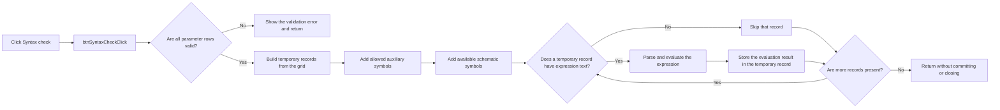

# Syntax check

> Analysis status: Reviewed from recovered source.

## Control

| Property | Recovered value |
| --- | --- |
| Form | frmParamEditor |
| Component path | frmParamEditor.pnlButtons.btnSyntaxCheck |
| Control class | TButton |
| Caption | Syntax check |
| Hint | Not present in the recovered resource. |
| Text | Not present in the recovered resource. |
| Handler name | btnSyntaxCheckClick |
| Handler address | 0143c210 |
| Graph node | `resource:dfm:frmParamEditor/frmParamEditor.pnlButtons.btnSyntaxCheck` |
| Handler node | `function:0143c210` |
| Graph layer | UI |

## What happens when clicked

The handler first runs the same row validator as OK and Add to schematic. On a
validation error, the validator displays the applicable message and the handler
returns without a partial check.

After successful validation, the handler clears a form-owned temporary syntax
list. For each grid row, it creates an expression record from the parameter name
and value. It also builds records from a form-owned auxiliary name-and-value
list when the current editor context allows them. The handler then asks the
application to prepare the current schematic expression environment. When a
current analysis object and its expression collection are available, it adds
those symbols too.

Finally, it creates a parser/evaluator object for each temporary parameter that
has expression text, evaluates the expression against the complete temporary
list and the collected context, and stores the returned result in that
parameter record. The click does not copy these temporary records to the global
parameter list, modify the grid, save the schematic, or close the editor. The
recovered handler contains no explicit success message. Parser errors can leave
the handler through the called parser path; no local recovery branch is present.

## Click flow

## Handler evidence

- Source: [DecompiledSources/Tina16/functions/000000000143C210__FUN_0143c210.c](../../../DecompiledSources/Tina16/functions/000000000143C210__FUN_0143c210.c)
- Recovered role: Validates and evaluates parameter expressions in a temporary context.
- Current graph summary: Handles 1 Delphi UI event: frmParamEditor.pnlButtons.btnSyntaxCheck.OnClick.
- Current graph behavior: Validates the grid, builds temporary parameter records, adds auxiliary and schematic symbols, and evaluates each non-empty expression without committing the records.
- Current graph evidence: `FUN_0143c210` gates the path on `FUN_0143ca80`, clears the list at form offset `+0x720`, builds records from grid columns 0 and 1, adds entries from the list at `+0x710`, and asks `FUN_013fd880` to prepare the current schematic context. It adds symbols from an available current analysis object, then creates `FUN_016a6a40` parser objects and stores the `FUN_016a9290` result at record offset `+0x28`.
- Complexity: complex
- Distinct outgoing calls: 28

## Direct calls

- `function:00410f20` — Nil-safe Delphi object destruction helper
- `function:00414480` — Delphi UnicodeString clear and finalization helper
- `function:004144d0` — FUN_004144d0
- `function:00414560` — Delphi UnicodeString array finalization helper
- `function:00415dd0` — FUN_00415dd0
- `function:00416880` — FUN_00416880
- `function:00416910` — FUN_00416910
- `function:0043e130` — FUN_0043e130
- `function:00456a50` — FUN_00456a50
- `function:004b3cf0` — Delphi string-list name getter
- `function:004b5390` — Delphi string-list value getter
- `function:004b6930` — FUN_004b6930
- `function:0084e320` — FUN_0084e320
- `function:013fd880` — FUN_013fd880
- `function:0143ca80` — FUN_0143ca80
- `function:016a61f0` — FUN_016a61f0
- `function:016a6a40` — FUN_016a6a40
- `function:016a9290` — FUN_016a9290
- `function:01779a20` — FUN_01779a20
- `function:0177aa70` — FUN_0177aa70
- `function:0177ae90` — FUN_0177ae90
- `function:0177aee0` — FUN_0177aee0
- `function:0177b033` — FUN_0177b033
- `function:01c8a330` — FUN_01c8a330
- `function:01d04d50` — FUN_01d04d50
- `function:01d34560` — FUN_01d34560
- `function:01d347d0` — FUN_01d347d0
- `function:01d34d40` — FUN_01d34d40

## Resource evidence

- Kind: Not present in the recovered resource.
- Modal result: Not present in the recovered resource.
- Checked state: Not present in the recovered resource.
- List items: Not present in the recovered resource.
- Image reference: Not present in the recovered resource.
- Extracted glyph: None.

## Nearby label candidates

Nearby labels are layout candidates only. They are not proof of behavior.

- No same-parent label candidate is available.

## Analysis limits

- The recovered source does not identify the exact user-visible form of a parser error.
- The business name of the form-owned auxiliary list at `+0x710` is not recovered.
- No glyph or nearby-label evidence is available for this control.
