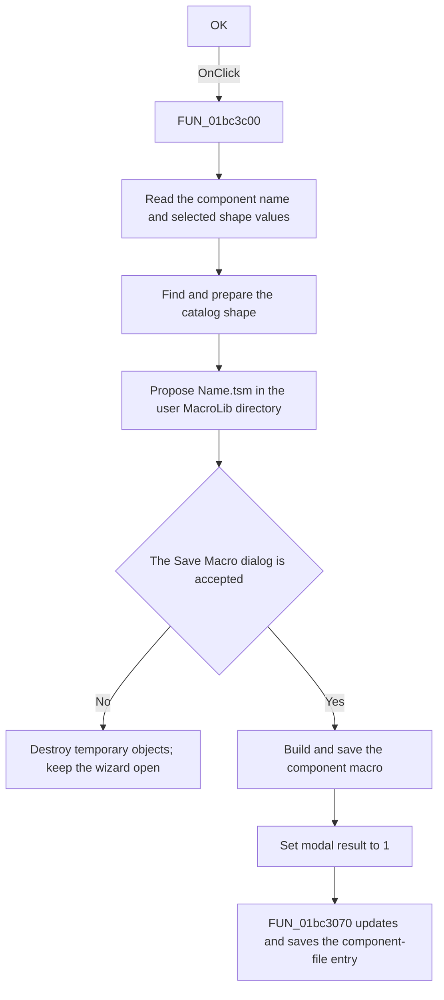

# OK

> Analysis status: Source reviewed. The save, cancel, and component-file update
> paths are supported by the recovered handler and its application callees.

## Control

| Property | Recovered value |
| --- | --- |
| Form | frmPCBOnlyCompWizard |
| Component path | frmPCBOnlyCompWizard.btnOK |
| Control class | TBitBtn |
| Caption | OK |
| Hint | Not present in the recovered resource. |
| Text | Not present in the recovered resource. |
| Handler name | btnOKClick |
| Handler address | 01bc3c00 |
| Graph node | `resource:dfm:frmPCBOnlyCompWizard/frmPCBOnlyCompWizard.btnOK` |
| Handler node | `function:01bc3c00` |
| Graph layer | UI |

## What happens when clicked

The OK click prepares a PCB component macro from the wizard fields and then
shows the configured `Save Macro` dialog. It reads the visible `Shape` edit,
the associated shape string stored by the browse handler, and the component
`Name` edit. It uses the two shape values to find the source shape in the
loaded component catalog and creates working objects for the export.

The handler proposes this output path:

`<user macro directory>\MacroLib\<component name>.tsm`

If the user cancels the save dialog, the handler destroys its temporary
objects and makes no component-file update. It also does not set the form's
success result.

If the user accepts a file name, the handler creates a macro object, applies
the component name and selected shape data, assigns the accepted file name,
and invokes the recovered save method. It then sets the form modal result to
`1` and calls `FUN_01bc3070`.

`FUN_01bc3070` updates the selected component-file text. In existing-group
mode, it inserts or replaces the macro record below the selected group. In
new-group mode, it writes a new group header and macro record. The record uses
the component name, macro type `0x39`, the accepted file name, and the
catalog-derived component identifier. The helper then saves the component-file
text through its recovered writer method.

The button is enabled by the form validation handler only when the required
shape and name fields are not empty and the selected group mode has a usable
group target. Conversion, catalog lookup, object construction, and file-save
errors are not caught in this handler.

## Click flow

## Handler evidence

- Source: [DecompiledSources/Tina16/functions/0000000001BC3C00__FUN_01bc3c00.c](../../../DecompiledSources/Tina16/functions/0000000001BC3C00__FUN_01bc3c00.c)
- Recovered role: PCB component macro save and component-file update handler.
- Current graph summary: Handles 1 Delphi UI event: frmPCBOnlyCompWizard.btnOK.OnClick.
- Current graph behavior: The checked-in graph does not yet contain a curated behavior description for this function.
- Current graph evidence: The resource trigger resolves directly to this handler. Its call tree reads VCL text, resolves catalog entries, configures the save dialog, builds the macro object, and calls the component-file updater only on the accepted branch.
- Complexity: complex
- Distinct outgoing calls: 19

## Direct calls

- `function:00410f20` — Nil-safe Delphi object destruction helper
- `function:00414480` — Delphi UnicodeString clear and finalization helper
- `function:00414560` — Delphi UnicodeString array finalization helper
- `function:00416cd0` — FUN_00416cd0
- `function:00418590` — FUN_00418590
- `function:004aeac0` — FUN_004aeac0
- `function:0064dd90` — VCL control Unicode text reader
- `function:0065b870` — FUN_0065b870
- `function:00724270` — FUN_00724270
- `function:00724380` — FUN_00724380
- `function:00c3f320` — FUN_00c3f320
- `function:00c40790` — FUN_00c40790
- `function:01768da0` — FUN_01768da0
- `function:0176a5d0` — FUN_0176a5d0
- `function:0176a870` — FUN_0176a870
- `function:0198b200` — FUN_0198b200
- `function:019a3a90` — FUN_019a3a90
- `function:01bc3070` — FUN_01bc3070
- `function:01cf1750` — FUN_01cf1750

The application-relevant calls are:

- [FUN_00c40790](../../../DecompiledSources/Tina16/functions/0000000000C40790__FUN_00c40790.c)
  finds the selected shape entry in the loaded catalog from the stored and
  visible shape strings.
- [FUN_00c3f320](../../../DecompiledSources/Tina16/functions/0000000000C3F320__FUN_00c3f320.c)
  creates a working copy of the catalog object used by the macro builder.
- [FUN_01768da0](../../../DecompiledSources/Tina16/functions/0000000001768DA0__FUN_01768da0.c)
  assigns the selected catalog object to the macro builder and clones its
  shape data.
- [FUN_01bc3070](../../../DecompiledSources/Tina16/functions/0000000001BC3070__FUN_01bc3070.c)
  inserts or replaces the macro record in the selected component-file text and
  invokes its save method.

## Resource evidence

- Kind: Not present in the recovered resource.
- Modal result: Not present in the recovered resource.
- Checked state: Not present in the recovered resource.
- List items: Not present in the recovered resource.
- Image reference: Not present in the recovered resource.
- Extracted glyph: [`0186_frmPCBOnlyCompWizard_frmPCBOnlyCompWizard_btnOK_Glyph_Data.png`](../../../glyph/0186_frmPCBOnlyCompWizard_frmPCBOnlyCompWizard_btnOK_Glyph_Data.png)

## Nearby label candidates

Nearby labels are layout candidates only. They are not proof of behavior.

- No same-parent label candidate is available.

## Analysis limits

- The source does not expose the Delphi class names for the catalog objects,
  macro builder, or component-file writer. This article describes only their
  proven data flow and method effects.
- The delimiter at `DAT_01bc40fc` is not decoded in the recovered source. It is
  used only to form the catalog lookup key and is not described as a user path.
- The direct save-method body is reached through a virtual call and is not a
  named recovered function. The accepted file name and the following modal
  result and component-file update are explicit in the handler.
- The OK glyph confirms acceptance, but it does not prove the export behavior.
