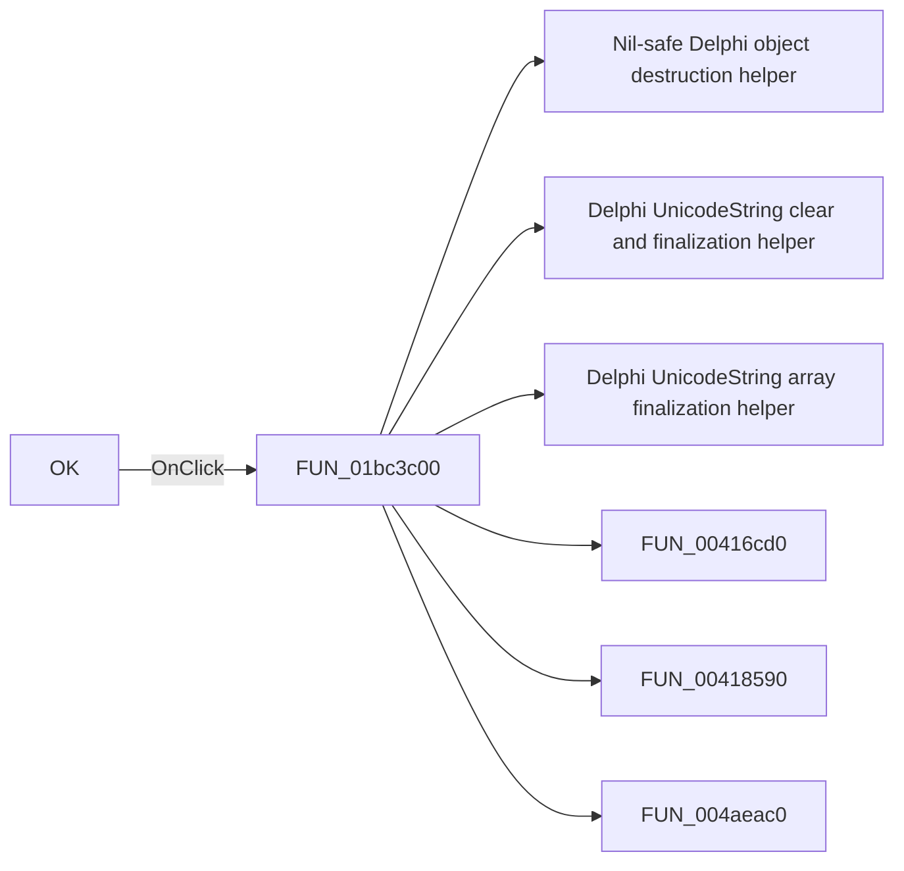

# OK

> Analysis status: Pending individual source review.

## Control

| Property | Recovered value |
| --- | --- |
| Form | frmPCBOnlyCompWizard |
| Component path | frmPCBOnlyCompWizard.btnOK |
| Control class | TBitBtn |
| Caption | OK |
| Hint | Not present in the recovered resource. |
| Text | Not present in the recovered resource. |
| Handler name | btnOKClick |
| Handler address | 01bc3c00 |
| Graph node | `resource:dfm:frmPCBOnlyCompWizard/frmPCBOnlyCompWizard.btnOK` |
| Handler node | `function:01bc3c00` |
| Graph layer | UI |

## What happens when clicked

Pending individual analysis. An agent must read the recovered handler source and its relevant callees before it replaces this text.

## Click flow

## Handler evidence

- Source: [DecompiledSources/Tina16/functions/0000000001BC3C00__FUN_01bc3c00.c](../../../DecompiledSources/Tina16/functions/0000000001BC3C00__FUN_01bc3c00.c)
- Recovered role: Not present in the recovered resource.
- Current graph summary: Handles 1 Delphi UI event: frmPCBOnlyCompWizard.btnOK.OnClick.
- Current graph behavior: Not present in the recovered resource.
- Current graph evidence: Not present in the recovered resource.
- Complexity: complex
- Distinct outgoing calls: 19

## Direct calls

- `function:00410f20` — Nil-safe Delphi object destruction helper
- `function:00414480` — Delphi UnicodeString clear and finalization helper
- `function:00414560` — Delphi UnicodeString array finalization helper
- `function:00416cd0` — FUN_00416cd0
- `function:00418590` — FUN_00418590
- `function:004aeac0` — FUN_004aeac0
- `function:0064dd90` — VCL control Unicode text reader
- `function:0065b870` — FUN_0065b870
- `function:00724270` — FUN_00724270
- `function:00724380` — FUN_00724380
- `function:00c3f320` — FUN_00c3f320
- `function:00c40790` — FUN_00c40790
- `function:01768da0` — FUN_01768da0
- `function:0176a5d0` — FUN_0176a5d0
- `function:0176a870` — FUN_0176a870
- `function:0198b200` — FUN_0198b200
- `function:019a3a90` — FUN_019a3a90
- `function:01bc3070` — FUN_01bc3070
- `function:01cf1750` — FUN_01cf1750

## Resource evidence

- Kind: Not present in the recovered resource.
- Modal result: Not present in the recovered resource.
- Checked state: Not present in the recovered resource.
- List items: Not present in the recovered resource.
- Image reference: Not present in the recovered resource.
- Extracted glyph: [`0186_frmPCBOnlyCompWizard_frmPCBOnlyCompWizard_btnOK_Glyph_Data.png`](../../../glyph/0186_frmPCBOnlyCompWizard_frmPCBOnlyCompWizard_btnOK_Glyph_Data.png)

## Nearby label candidates

Nearby labels are layout candidates only. They are not proof of behavior.

- No same-parent label candidate is available.

## Analysis limits

- Do not infer behavior from the control class, caption, hint, glyph, or nearby label alone.
- Do not replace the pending status until the handler source and relevant call path provide enough evidence.
