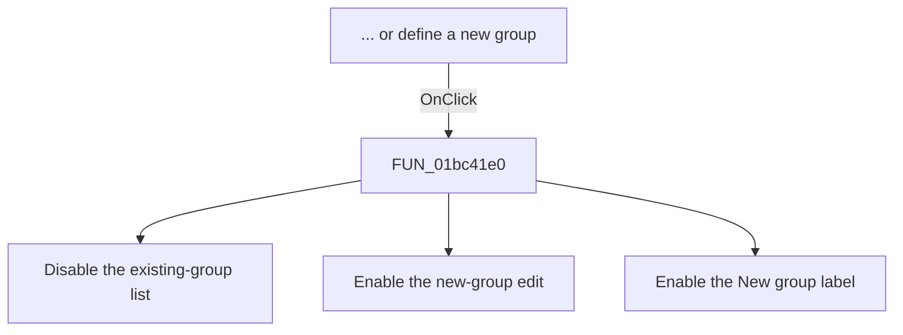

# ... or define a new group

> Analysis status: Source reviewed. The enabled-state changes are supported by
> the recovered handler and the form field consumers.

## Control

| Property | Recovered value |
| --- | --- |
| Form | frmPCBOnlyCompWizard |
| Component path | frmPCBOnlyCompWizard.gbxGroups.rbNewGroup |
| Control class | TRadioButton |
| Caption | ... or define a new group |
| Hint | Not present in the recovered resource. |
| Text | Not present in the recovered resource. |
| Handler name | rbNewGroupClick |
| Handler address | 01bc41e0 |
| Graph node | `resource:dfm:frmPCBOnlyCompWizard/frmPCBOnlyCompWizard.gbxGroups.rbNewGroup` |
| Handler node | `function:01bc41e0` |
| Graph layer | UI |

## What happens when clicked

The click selects the new-group input mode. The handler disables the existing
group list at form offset `+0x720`. It enables the new-group edit at `+0x6D8`
and its `New group:` label at `+0x6D0`.

The click does not clear the list, validate the new name, or save the
component. The form's validation path later requires a non-empty new-group
name when this radio button is selected.

## Click flow

## Handler evidence

- Source: [DecompiledSources/Tina16/functions/0000000001BC41E0__FUN_01bc41e0.c](../../../DecompiledSources/Tina16/functions/0000000001BC41E0__FUN_01bc41e0.c)
- Recovered role: New-group mode selector.
- Current graph summary: Handles 1 Delphi UI event: frmPCBOnlyCompWizard.gbxGroups.rbNewGroup.OnClick.
- Current graph behavior: The checked-in graph does not yet contain a curated behavior description for this function.
- Current graph evidence: The resource trigger resolves directly to this handler. Its three virtual calls set enabled states to false, true, and true.
- Complexity: simple
- Distinct outgoing calls: 0

## Direct calls

- No direct call edge is present in the recovered graph.

## Resource evidence

- Kind: Not present in the recovered resource.
- Modal result: Not present in the recovered resource.
- Checked state: Not present in the recovered resource.
- List items: Not present in the recovered resource.
- Image reference: Not present in the recovered resource.
- Extracted glyph: None.

## Nearby label candidates

Nearby labels are layout candidates only. They are not proof of behavior.

- Rank 1: New group: at distance 22.
- Rank 2: Select component file: at distance 242.

## Analysis limits

- The recovered source does not expose the original Delphi field names. The
  list, edit, and label identities follow from their other proven consumers and
  the form resource layout.
- This handler only changes enabled states. The later validation and OK paths
  use the selected mode and field values.
