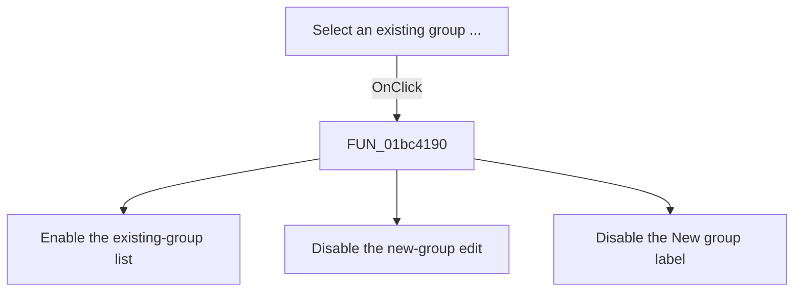

# Select an existing group ...

> Analysis status: Source reviewed. The enabled-state changes are supported by
> the recovered handler and the form field consumers.

## Control

| Property | Recovered value |
| --- | --- |
| Form | frmPCBOnlyCompWizard |
| Component path | frmPCBOnlyCompWizard.gbxGroups.rbOldGroup |
| Control class | TRadioButton |
| Caption | Select an existing group ... |
| Hint | Not present in the recovered resource. |
| Text | Not present in the recovered resource. |
| Handler name | rbOldGroupClick |
| Handler address | 01bc4190 |
| Graph node | `resource:dfm:frmPCBOnlyCompWizard/frmPCBOnlyCompWizard.gbxGroups.rbOldGroup` |
| Handler node | `function:01bc4190` |
| Graph layer | UI |

## What happens when clicked

The click selects the existing-group input mode. The handler enables the group
list at form offset `+0x720`. It disables the new-group edit at `+0x6D8` and
its `New group:` label at `+0x6D0`.

The recovered form initialization calls this same handler after it loads the
available group rows. Thus, the initially checked radio button starts with the
existing-group list enabled and the new-group fields disabled. The click does
not change a group row and does not save the component.

## Click flow

## Handler evidence

- Source: [DecompiledSources/Tina16/functions/0000000001BC4190__FUN_01bc4190.c](../../../DecompiledSources/Tina16/functions/0000000001BC4190__FUN_01bc4190.c)
- Recovered role: Existing-group mode selector.
- Current graph summary: Handles 1 Delphi UI event: frmPCBOnlyCompWizard.gbxGroups.rbOldGroup.OnClick.
- Current graph behavior: The checked-in graph does not yet contain a curated behavior description for this function.
- Current graph evidence: The UI trigger and the form initialization both call this handler. Its three virtual calls set enabled states to true, false, and false.
- Complexity: simple
- Distinct outgoing calls: 0

## Direct calls

- No direct call edge is present in the recovered graph.

## Resource evidence

- Kind: Not present in the recovered resource.
- Modal result: Not present in the recovered resource.
- Checked state: true
- List items: Not present in the recovered resource.
- Image reference: Not present in the recovered resource.
- Extracted glyph: None.

## Nearby label candidates

Nearby labels are layout candidates only. They are not proof of behavior.

- Rank 1: Select component file: at distance 26.
- Rank 2: New group: at distance 238.

## Analysis limits

- The recovered source does not expose the original Delphi field names. The
  list, edit, and label identities follow from their other proven consumers and
  the form resource layout.
- This handler only changes enabled states. The later OK path performs the
  component-file update.
