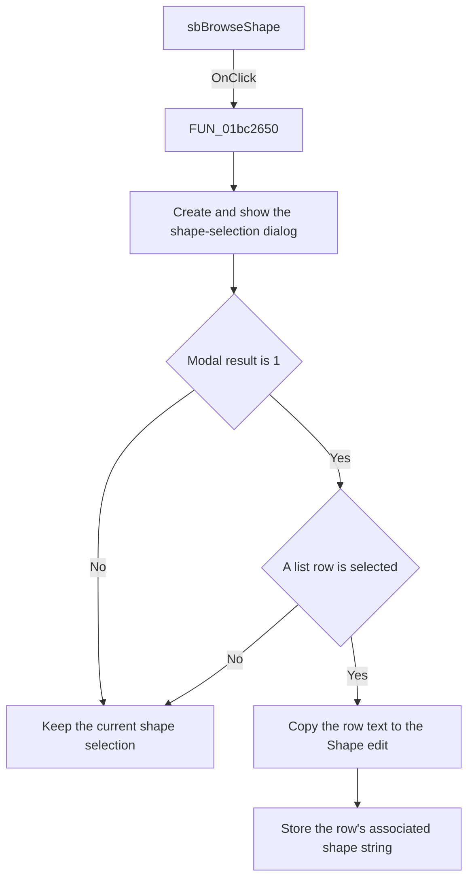

# sbBrowseShape

> Analysis status: Source reviewed. The selection and cancel paths are
> supported by the recovered handler and form state.

## Control

| Property | Recovered value |
| --- | --- |
| Form | frmPCBOnlyCompWizard |
| Component path | frmPCBOnlyCompWizard.gbxComponent.sbBrowseShape |
| Control class | TSpeedButton |
| Caption | Not present in the recovered resource. |
| Hint | Not present in the recovered resource. |
| Text | Not present in the recovered resource. |
| Handler name | sbBrowseShapeClick |
| Handler address | 01bc2650 |
| Graph node | `resource:dfm:frmPCBOnlyCompWizard/frmPCBOnlyCompWizard.gbxComponent.sbBrowseShape` |
| Handler node | `function:01bc2650` |
| Graph layer | UI |

## What happens when clicked

The click creates and shows the recovered shape-selection dialog. If the user
cancels the dialog, the handler does not change the wizard.

If the dialog returns modal result `1`, the handler checks the selected row. A
row index of `-1` also leaves the wizard unchanged. For a valid row, the
handler reads two values from the selected list item:

- It copies the displayed value to the read-only `Shape` edit.
- It copies the selected item's associated string at offset `0x20` to the
  wizard field at `+0x768`.

The OK handler later uses both values to find the selected shape in the
component catalog. The browse handler does not create or save a component.

## Click flow

## Handler evidence

- Source: [DecompiledSources/Tina16/functions/0000000001BC2650__FUN_01bc2650.c](../../../DecompiledSources/Tina16/functions/0000000001BC2650__FUN_01bc2650.c)
- Recovered role: Shape-selection dialog handler.
- Current graph summary: Handles 1 Delphi UI event: frmPCBOnlyCompWizard.gbxComponent.sbBrowseShape.OnClick.
- Current graph behavior: The checked-in graph does not yet contain a curated behavior description for this function.
- Current graph evidence: The resource trigger resolves directly to this handler. The recovered body calls the dialog constructor and VCL text and string setters.
- Complexity: complex
- Distinct outgoing calls: 4

## Direct calls

- `function:00414480` — Delphi UnicodeString clear and finalization helper
- `function:00414ad0` — Delphi UnicodeString assignment helper
- `function:0064de00` — VCL control text setter with change suppression
- `function:00c86a90` — FUN_00c86a90

`FUN_00c86a90` constructs the dialog class identified by
`PTR_FUN_00c85fc8`. The handler calls its modal method and reads the selected
row and its associated object only after result `1`.

## Resource evidence

- Kind: Not present in the recovered resource.
- Modal result: Not present in the recovered resource.
- Checked state: Not present in the recovered resource.
- List items: Not present in the recovered resource.
- Image reference: Not present in the recovered resource.
- Extracted glyph: [`0187_frmPCBOnlyCompWizard_frmPCBOnlyCompWizard_gbxComponent_sbBrowseShape_Glyph_Data.png`](../../../glyph/0187_frmPCBOnlyCompWizard_frmPCBOnlyCompWizard_gbxComponent_sbBrowseShape_Glyph_Data.png)

## Nearby label candidates

Nearby labels are layout candidates only. They are not proof of behavior.

- Rank 1: Icon: at distance 62.
- Rank 2: &Shape: at distance 218.
- Rank 3: &Name: at distance 237.

## Analysis limits

- The recovered class name for the selection dialog is not available. The
  handler data flow and the `Shape` edit prove its purpose.
- The associated value stored at wizard offset `0x768` is a string from the
  selected row's object. The source does not expose its original Delphi field
  name.
- The ellipsis glyph agrees with a browse action, but it is not used as the
  implementation evidence.
