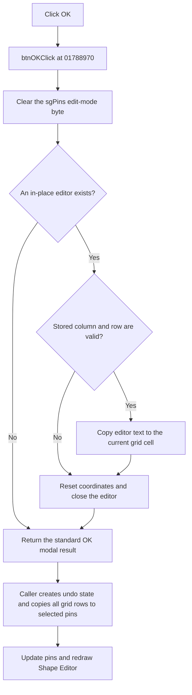

# btnOK

> Analysis status: Evidence-backed source review complete.

## Control

| Property | Recovered value |
| --- | --- |
| Form | frmPinPropEditor |
| Component path | frmPinPropEditor.pnlButtons.btnOK |
| Control class | TBitBtn |
| Caption | Supplied by the recovered `bkOK` button kind. |
| Hint | Not present in the recovered resource. |
| Text | Not present in the recovered resource. |
| Handler name | btnOKClick |
| Handler address | 01788970 |
| Graph node | `resource:dfm:frmPinPropEditor/frmPinPropEditor.pnlButtons.btnOK` |
| Handler node | `function:01788970` |
| Graph layer | UI |

## What happens when clicked

The click finalizes the current edit in `sgPins` before the modal form returns
an OK result. `btnOKClick` ignores `Sender`. It calls the custom grid edit-mode
helper with `sgPins` and the constant value `false`.

The false branch clears the grid's edit-mode byte at `+0x525`. If an in-place
editor exists at grid field `+0x510`, the grid gets the editor text. When its
stored column at `+0x518` and row at `+0x51c` are both valid, it passes the
text, column, and row to the grid's dynamic cell-text setter. It then resets
both stored coordinates to `-1`, closes the editor, and requests a grid repaint
when the recovered repaint flag is set.

If no in-place editor exists, the click only clears the edit-mode byte. If an
editor exists but either coordinate is `-1`, it closes the editor without a
cell-text write. The handler has no other state branch, no value validation,
and no error message.

The control has kind `bkOK`. After the click handler completes, the standard
VCL path returns modal result `1`. The Shape Editor caller then creates its
undo state and copies the accepted grid rows to the selected pin objects. It
copies the `Name`, `Show`, `Size`, `Shape`, `Length`, `Direction`,
`Elec. type`, and `Color` fields. It runs the pin post-update path and redraws
the editor. A Cancel result does not copy the grid values.

The cell-text setter is an indirect dynamic call. The inspected path has no
local exception handler, retry, fallback, or rollback. If that call raises,
the source does not establish that the modal form returns result `1` or that
the caller updates the pins.

## Click flow

## Handler evidence

- Click handler: [FUN_01788970](../../../DecompiledSources/Tina16/functions/0000000001788970__FUN_01788970.c)
- Grid edit-mode dispatcher: [FUN_00848870](../../../DecompiledSources/Tina16/functions/0000000000848870__FUN_00848870.c)
- Grid editor finalizer: [FUN_00848db0](../../../DecompiledSources/Tina16/functions/0000000000848DB0__FUN_00848db0.c)
- Cell-text transfer: [FUN_008490a0](../../../DecompiledSources/Tina16/functions/00000000008490A0__FUN_008490a0.c)
- Editor-text reader: [FUN_00835150](../../../DecompiledSources/Tina16/functions/0000000000835150__FUN_00835150.c)
- Form initialization: [FUN_01788190](../../../DecompiledSources/Tina16/functions/0000000001788190__FUN_01788190.c)
- Shape Editor modal caller: [FUN_0179ee00](../../../DecompiledSources/Tina16/functions/000000000179EE00__FUN_0179ee00.c)
- Recovered role: Finalize the active pin-grid cell before modal acceptance.
- Complexity: simple.
- Distinct outgoing calls: 1.

`FUN_01788970` passes the form field at `+0x6d0` and constant zero to
`FUN_00848870`. `FormCreate` uses the same field as the grid and creates the
eight recovered columns. The modal caller also uses this field to populate one
row for each selected pin before `ShowModal` and to read the rows only after
result `1`. These shared field accesses identify the data boundary.

`FUN_00848870` has a separate true branch that opens or refreshes an in-place
editor. `btnOKClick` passes false, so the OK path does not execute that branch.

## Direct calls

- `function:00848870` changes the custom grid edit mode. For the false value
  used here, it selects the editor-finalization path.

Relevant calls below the direct callee are:

- `function:0083f790` clears the edit-mode byte and dispatches editor closure.
- `function:00848db0` checks for an active editor, commits it, clears its stored
  coordinates, and closes it.
- `function:008490a0` reads the editor text and invokes the grid's dynamic
  cell-text setter for the stored column and row.

## Resource evidence

- Form caption: `Pin Properties`.
- Kind: `bkOK`.
- `NumGlyphs`: `2`; no custom extracted glyph is present.
- `sgPins` is a `TImpStringgrid` aligned to the form's client area.
- The button has no recovered hint or explicit modal-result property.
- Hidden list boxes provide recovered values for visibility, direction, shape,
  length, font size, and electrical type. The parent and form-create source,
  not these list items alone, establish the grid-column meaning.

## Nearby label candidates

No same-parent label candidate is available. `btnOK` is inside the right-side
button panel, while `sgPins` is a separate child of the form.

## Analysis limits

- The dynamic cell-text setter target is not a direct graph edge. The recovered
  source proves that it receives the editor text and stored cell coordinates,
  but it does not expose any validation inside that target.
- The click handler does not copy fields to pin objects. The caller performs
  that operation after modal result `1`.
- If there is no active editor, the handler does not change a grid cell. The
  standard OK result can still cause the caller to accept all existing rows.
