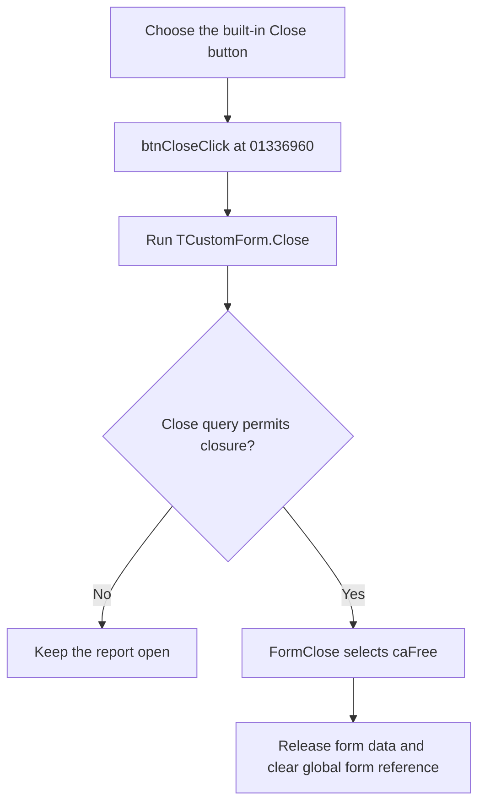

# btnClose

> Analysis status: Evidence-backed source review complete.

## Control

| Property | Recovered value |
| --- | --- |
| Form | frmPowerDissipationReport |
| Component path | frmPowerDissipationReport.pnlButtons.btnClose |
| Control class | TBitBtn |
| Caption | Not present in the recovered resource. |
| Hint | Not present in the recovered resource. |
| Text | Not present in the recovered resource. |
| Handler name | btnCloseClick |
| Handler address | 01336960 |
| Graph node | `resource:dfm:frmPowerDissipationReport/frmPowerDissipationReport.pnlButtons.btnClose` |
| Handler node | `function:01336960` |
| Graph layer | UI |

## What happens when clicked

`TfrmPowerDissipationReport.btnCloseClick` calls the shared VCL `TCustomForm.Close` routine. It does not save or export the report before it requests closure.

The Power Dissipation Report is shown as a modeless form. The shared close routine runs the normal close-query and close-action pipeline. If closure is permitted, this form's [`FormClose`](../../../DecompiledSources/Tina16/functions/0000000001335860__FUN_01335860.c) handler sets the action to `2`, the VCL `caFree` action. The VCL therefore releases the form instead of only hiding it.

During destruction, [`FormDestroy`](../../../DecompiledSources/Tina16/functions/0000000001335BB0__FUN_01335bb0.c) clears the form-owned component list, releases it, clears the sort-state array, and sets the global report-form reference to null. A later report request can create a new form.

## Click flow

## Handler evidence

- Source: [DecompiledSources/Tina16/functions/0000000001336960__FUN_01336960.c](../../../DecompiledSources/Tina16/functions/0000000001336960__FUN_01336960.c)
- Recovered role: Close and release the modeless Power Dissipation Report form.
- Current graph summary: Handles 1 Delphi UI event: frmPowerDissipationReport.pnlButtons.btnClose.OnClick.
- Current graph behavior: The checked-in graph does not yet contain the annotation prepared by this review.
- Current graph evidence: The handler consists of one call to the shared VCL close pipeline. The form's OnClose handler selects `caFree`, and its destroy handler clears the report form's owned state and global reference.
- Complexity: simple
- Distinct outgoing calls: 1

## Direct calls

- [`function:00805200`](../../../DecompiledSources/Tina16/functions/0000000000805200__FUN_00805200.c) — runs the VCL close-query and close-action pipeline.

## Resource evidence

- Kind: bkClose
- Modal result: Not present in the recovered resource.
- Checked state: Not present in the recovered resource.
- List items: Not present in the recovered resource.
- Image reference: Not present in the recovered resource.
- Extracted glyph: None.

## Nearby label candidates

Nearby labels are layout candidates only. They are not proof of behavior.

- No same-parent label candidate is available.

## Analysis limits

- The form has no recovered `OnCloseQuery` event binding. The shared VCL routine still honors its virtual close-query result; a rejected query keeps the report open.
- Close does not export, commit, or copy report data. Unsaved sort, checkbox, and grid display state is discarded when the form is released.
- The handler has no local message, retry, or exception branch. VCL application-level handling remains the error boundary.
- The `bkClose` resource kind supports the visible intent. No separate glyph, hint, or nearby label supplies behavior evidence.
