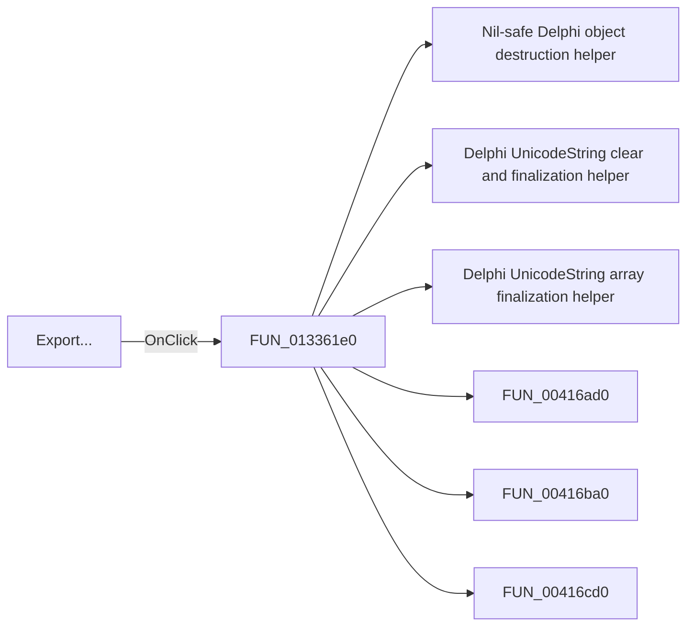

# Export...

> Analysis status: Pending individual source review.

## Control

| Property | Recovered value |
| --- | --- |
| Form | frmPowerDissipationReport |
| Component path | frmPowerDissipationReport.pnlMain.btnExport |
| Control class | TButton |
| Caption | Export... |
| Hint | Not present in the recovered resource. |
| Text | Not present in the recovered resource. |
| Handler name | btnExportClick |
| Handler address | 013361e0 |
| Graph node | `resource:dfm:frmPowerDissipationReport/frmPowerDissipationReport.pnlMain.btnExport` |
| Handler node | `function:013361e0` |
| Graph layer | UI |

## What happens when clicked

Pending individual analysis. An agent must read the recovered handler source and its relevant callees before it replaces this text.

## Click flow

## Handler evidence

- Source: [DecompiledSources/Tina16/functions/00000000013361E0__FUN_013361e0.c](../../../DecompiledSources/Tina16/functions/00000000013361E0__FUN_013361e0.c)
- Recovered role: Not present in the recovered resource.
- Current graph summary: Handles 1 Delphi UI event: frmPowerDissipationReport.pnlMain.btnExport.OnClick.
- Current graph behavior: Not present in the recovered resource.
- Current graph evidence: Not present in the recovered resource.
- Complexity: complex
- Distinct outgoing calls: 12

## Direct calls

- `function:00410f20` — Nil-safe Delphi object destruction helper
- `function:00414480` — Delphi UnicodeString clear and finalization helper
- `function:00414560` — Delphi UnicodeString array finalization helper
- `function:00416ad0` — FUN_00416ad0
- `function:00416ba0` — FUN_00416ba0
- `function:00416cd0` — FUN_00416cd0
- `function:0041ddd0` — FUN_0041ddd0
- `function:004485a0` — FUN_004485a0
- `function:004b6930` — FUN_004b6930
- `function:005b85d0` — FUN_005b85d0
- `function:00724270` — FUN_00724270
- `function:00b8fd60` — FUN_00b8fd60

## Resource evidence

- Kind: Not present in the recovered resource.
- Modal result: Not present in the recovered resource.
- Checked state: Not present in the recovered resource.
- List items: Not present in the recovered resource.
- Image reference: Not present in the recovered resource.
- Extracted glyph: None.

## Nearby label candidates

Nearby labels are layout candidates only. They are not proof of behavior.

- Rank 1: Efficiency: %s%% Total input: %s W Total load: %s W at distance 1115.

## Analysis limits

- Do not infer behavior from the control class, caption, hint, glyph, or nearby label alone.
- Do not replace the pending status until the handler source and relevant call path provide enough evidence.
