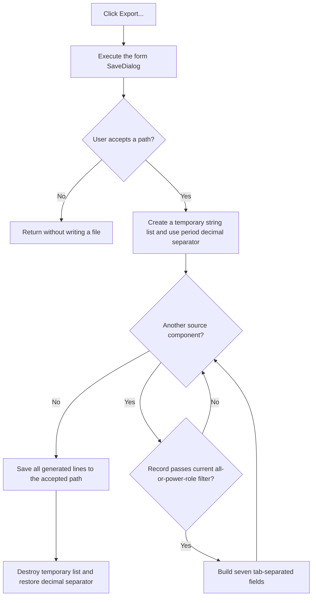

# Export...

> Analysis status: Evidence-backed source review complete.

## Control

| Property | Recovered value |
| --- | --- |
| Form | frmPowerDissipationReport |
| Component path | frmPowerDissipationReport.pnlMain.btnExport |
| Control class | TButton |
| Caption | Export... |
| Hint | Not present in the recovered resource. |
| Text | Not present in the recovered resource. |
| Handler name | btnExportClick |
| Handler address | 013361e0 |
| Graph node | `resource:dfm:frmPowerDissipationReport/frmPowerDissipationReport.pnlMain.btnExport` |
| Handler node | `function:013361e0` |
| Graph layer | UI |

## What happens when clicked

`TfrmPowerDissipationReport.btnExportClick` first executes the form-owned `TSaveDialog`. Cancel stops the operation before the handler reads a file name or creates an output file.

After acceptance, the handler creates a temporary `TStringList` and generates one tab-separated line for each component that passes the current report filter. Checked **Show all/selected components** includes every source record. Unchecked includes only records whose power-role byte at `+0x540` is nonzero.

Each output line contains seven fields in this order:

1. component display name;
2. localized power-role text from byte `+0x540`;
3. formatted numeric value from record slot `3`;
4. `record slot 3 / report total input * 100`, or an empty field when total input is zero;
5. localized text selected from the record's three-state value;
6. formatted numeric value from record slot `2`;
7. `(1 - record slot 3 / record slot 2) * 100`, or an empty field when record slot `2` is zero.

The recovered separator at `LAB_01336940` is Unicode tab `U+0009`. The handler does not write a heading line. It visits the source collection directly, so the file follows collection order and does not export the current sorted grid-row order.

Before it formats the rows, the handler saves the global decimal-separator character and temporarily sets it to a period. Normal and exception cleanup restore the previous separator. The numeric precision comes from the form byte at `+0x728`.

Finally, the handler reads `SaveDialog.FileName`, calls the temporary list's one-argument `SaveToFile` method, and destroys the list. It does not store the selected path in a separate report setting.

## Click flow

## Handler evidence

- Source: [DecompiledSources/Tina16/functions/00000000013361E0__FUN_013361e0.c](../../../DecompiledSources/Tina16/functions/00000000013361E0__FUN_013361e0.c)
- Recovered role: Export filtered power-report records as tab-separated text.
- Current graph summary: Handles 1 Delphi UI event: frmPowerDissipationReport.pnlMain.btnExport.OnClick.
- Current graph behavior: The checked-in graph does not yet contain the annotation prepared by this review.
- Current graph evidence: The handler gates all work on `SaveDialog.Execute`, builds a temporary string list from the component collection, reads the accepted file name, calls the list's virtual `SaveToFile`, and restores its temporary decimal-separator override.
- Complexity: complex
- Distinct outgoing calls: 12

## Direct calls

- [`function:00410f20`](../../../DecompiledSources/Tina16/functions/0000000000410F20__FUN_00410f20.c) — destroys the temporary string list on the normal path.
- [`function:00414480`](../../../DecompiledSources/Tina16/functions/0000000000414480__FUN_00414480.c) and [`function:00414560`](../../../DecompiledSources/Tina16/functions/0000000000414560__FUN_00414560.c) — finalize temporary Delphi strings.
- [`function:00416ad0`](../../../DecompiledSources/Tina16/functions/0000000000416AD0__FUN_00416ad0.c), [`function:00416ba0`](../../../DecompiledSources/Tina16/functions/0000000000416BA0__FUN_00416ba0.c), and [`function:00416cd0`](../../../DecompiledSources/Tina16/functions/0000000000416CD0__FUN_00416cd0.c) — assemble the numeric mask and seven-field output line.
- [`function:0041ddd0`](../../../DecompiledSources/Tina16/functions/000000000041DDD0__FUN_0041ddd0.c) — loads localized power-role and three-state text.
- [`function:004485a0`](../../../DecompiledSources/Tina16/functions/00000000004485A0__FUN_004485a0.c) — formats the derived percentage values with the generated mask.
- [`function:004b6930`](../../../DecompiledSources/Tina16/functions/00000000004B6930__FUN_004b6930.c) — constructs the temporary `TStringList`.
- [`function:005b85d0`](../../../DecompiledSources/Tina16/functions/00000000005B85D0__FUN_005b85d0.c) — repeats the optional-digit marker for the numeric mask.
- [`function:00724270`](../../../DecompiledSources/Tina16/functions/0000000000724270__FUN_00724270.c) — reads `SaveDialog.FileName`.
- [`function:00b8fd60`](../../../DecompiledSources/Tina16/functions/0000000000B8FD60__FUN_00b8fd60.c) — formats the two stored power values with the report precision.

## Resource evidence

- Kind: Not present in the recovered resource.
- Modal result: Not present in the recovered resource.
- Checked state: Not present in the recovered resource.
- List items: Not present in the recovered resource.
- Image reference: Not present in the recovered resource.
- Extracted glyph: None.

## Nearby label candidates

Nearby labels are layout candidates only. They are not proof of behavior.

- Rank 1: Efficiency: %s%% Total input: %s W Total load: %s W at distance 1115.

## Analysis limits

- The recovered DFM does not preserve a file filter, default extension, initial directory, title, or dialog options. The handler does not assign them. File extension selection and overwrite prompting are therefore not established.
- The handler uses the list's one-argument VCL [`SaveToFile`](../../../DecompiledSources/Tina16/functions/00000000004B4900__FUN_004b4900.c) path. It supplies no explicit text encoding or byte-order-mark option, so those details depend on the new list's VCL default encoding.
- An accepted export with no included components writes an empty list. There is no minimum-row test.
- A file-system or serialization error has no local message, retry, rollback, or alternate path. Recovered cleanup helper [`FUN_01336880`](../../../DecompiledSources/Tina16/functions/0000000001336880__FUN_01336880.c) releases the temporary list and restores the decimal separator during unwinding. Normal exception handling remains the boundary. A failed write can leave a partial file.
- The nearby efficiency label supports the report context but does not establish the export format. No hint or glyph supplies more behavior evidence.
