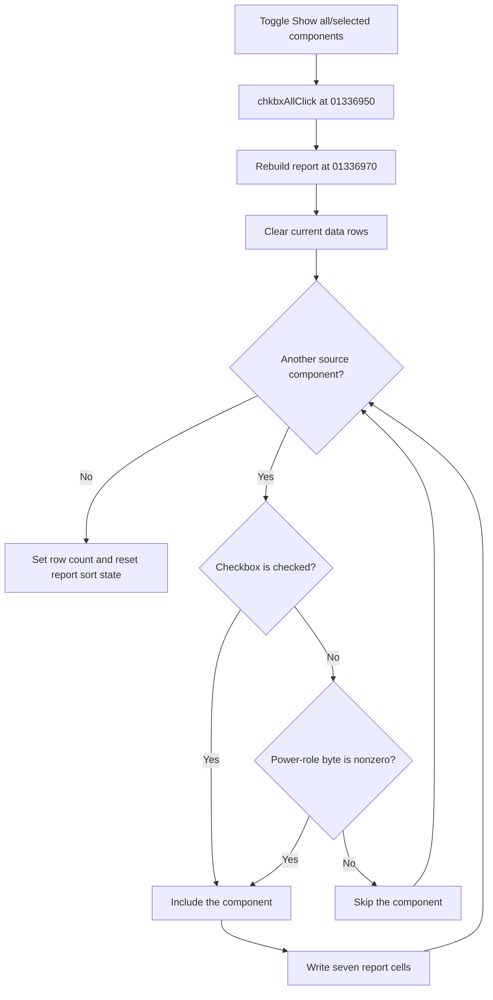

# Show all/selected components

> Analysis status: Evidence-backed source review complete.

## Control

| Property | Recovered value |
| --- | --- |
| Form | frmPowerDissipationReport |
| Component path | frmPowerDissipationReport.pnlMain.chkbxAll |
| Control class | TCheckBox |
| Caption | Show all/selected components |
| Hint | Not present in the recovered resource. |
| Text | Not present in the recovered resource. |
| Handler name | chkbxAllClick |
| Handler address | 01336950 |
| Graph node | `resource:dfm:frmPowerDissipationReport/frmPowerDissipationReport.pnlMain.chkbxAll` |
| Handler node | `function:01336950` |
| Graph layer | UI |

## What happens when clicked

`TfrmPowerDissipationReport.chkbxAllClick` rebuilds the report grid from the form's source component collection. It does not only hide existing rows.

The checked state controls the filter:

- Checked includes every component record in the source collection.
- Unchecked includes only records whose power-role byte at object offset `+0x540` is nonzero. The sibling schematic power commands write this byte for the **Power loss**, **Power sink**, and **Power source** modes; **None** writes zero.

The rebuild clears the current data rows and visits the source collection in order. For each included record, it writes seven grid values: the component display name, localized power-role text, two formatted power values, two derived percentage values, and localized three-state text. A zero total-input denominator leaves the first derived percentage cell empty. A zero per-component denominator leaves the last derived percentage cell empty.

After population, the routine sets the data-row count, invokes the report sorter with fixed arguments, resets stored sort state, and updates the checkbox enabled state from whether any record has a nonzero power role. The click changes only report-view state. It does not change a component's power role or calculated power values.

## Click flow

## Handler evidence

- Source: [DecompiledSources/Tina16/functions/0000000001336950__FUN_01336950.c](../../../DecompiledSources/Tina16/functions/0000000001336950__FUN_01336950.c)
- Recovered role: Rebuild the power report for all components or only components with a power role.
- Current graph summary: Handles 1 Delphi UI event: frmPowerDissipationReport.pnlMain.chkbxAll.OnClick.
- Current graph behavior: The checked-in graph does not yet contain the annotations prepared by this review.
- Current graph evidence: The click handler delegates to the report rebuild. That routine reads the checkbox state and each record's `+0x540` power-role byte, then reconstructs the grid and its derived percentage cells.
- Complexity: simple
- Distinct outgoing calls: 1

## Direct calls

- [`function:01336970`](../../../DecompiledSources/Tina16/functions/0000000001336970__FUN_01336970.c) — filters the component collection, rebuilds the seven-column grid, handles zero denominators, and resets report sort state.

## Resource evidence

- Kind: Not present in the recovered resource.
- Modal result: Not present in the recovered resource.
- Checked state: Not present in the recovered resource.
- List items: Not present in the recovered resource.
- Image reference: Not present in the recovered resource.
- Extracted glyph: None.

## Nearby label candidates

Nearby labels are layout candidates only. They are not proof of behavior.

- Rank 1: Efficiency: %s%% Total input: %s W Total load: %s W at distance 296.

## Analysis limits

- The resource caption uses the word “selected.” The recovered filter is specifically the nonzero power-role byte at `+0x540`; it is not the current grid row selection.
- The localized column headings and three power-role strings are loaded at run time. Their exact translated text depends on the active language resource.
- A source collection with no records produces only the fixed header row. Unchecking the box can also produce no data rows when all power-role bytes are zero.
- The rebuild has no local message, retry, or rollback branch. Formatting or grid errors remain subject to the VCL application error path.
- The nearby efficiency label describes the report as a whole. Proximity alone does not establish the checkbox implementation. No hint or glyph supplies more evidence.
