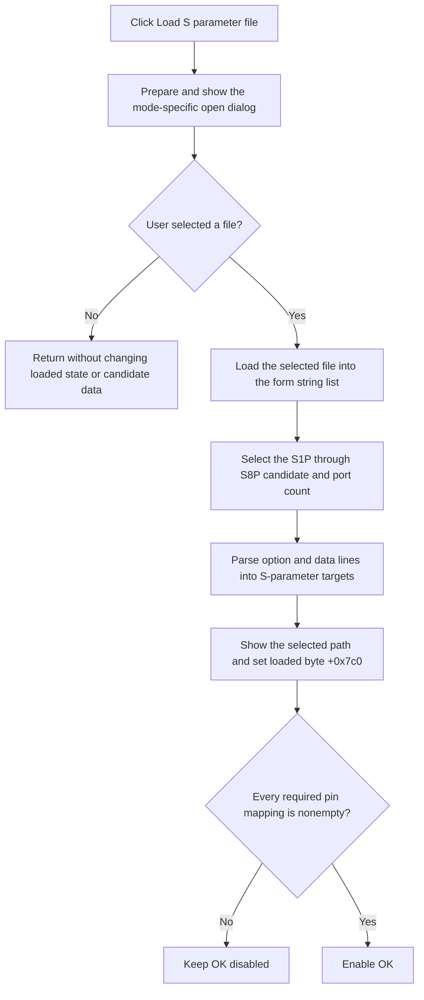

# Load the selected S-parameter file

> Analysis status: Complete. The recovered DFM, file-dialog handler, line-list load, Touchstone parser, mode-specific candidate state, and readiness handler support this explanation.

## Control

| Property | Recovered value |
| --- | --- |
| Form | frmSBlockWizard |
| Form caption | S block wizard |
| Component path | frmSBlockWizard.pnlMain.btnLoad |
| Control class | TButton |
| Resource caption | Load S parameter file (%s)... |
| Display caption | The selected mode replaces `%s`, for example `Load S parameter file (S2P)...`. |
| Hint | Not present in the recovered resource. |
| Handler name | btnLoadClick |
| Handler address | 01ba7870 |
| Graph node | `resource:dfm:frmSBlockWizard/frmSBlockWizard.pnlMain.btnLoad` |
| Handler node | `function:01ba7870` |
| Graph layer | UI |

The DFM has no action, image, glyph, or custom hint for this button. The mode handler also sets the open dialog's default extension and filter from the selected S1P through S8P item.

## What happens when clicked

The handler ignores `Sender`, prepares the form's `TOpenDialog`, and shows it.

If the user cancels the file dialog, the handler finalizes its temporary strings and returns. It does not change the status label, loaded-state byte, candidate data, pin grid, or OK state in this branch.

If the user selects a file, the handler performs these operations:

1. It reads the selected path from `OpenDialog`.
2. It loads the file into the form-owned string-list object at `+0x7b8`.
3. It selects the S1P through S8P candidate from `cbxMode.ItemIndex`.
4. It calls the S-parameter parser with that candidate, the line list, and the expected port count `ItemIndex + 1`.
5. It writes the selected path to `lblStatus`.
6. It changes the status label from the initial red text color to the normal window-text color.
7. It sets loaded-state byte `+0x7c0` to `1`.

The mode selection has an explicit fallback: indexes `0` through `6` select S1P through S7P, while index `7` or another value selects the S8P candidate and passes port count `8`.

## S-parameter parsing

The parser prepares `N * N` S-parameter data targets and `N` port targets for the supplied port count `N`. It reads the loaded text line by line.

- It skips supported blank, comment, and separator lines.
- A line that starts with `#` updates the frequency multiplier, complex-value format, and reference data used by later rows.
- A data record reads one frequency followed by `N * N` complex pairs.
- It converts magnitude-angle or decibel-angle input to rectangular values when the option line requests those formats.
- It writes each recovered complex value to the matching S-parameter target.
- For S2P input, it swaps the two middle target positions before it writes the data. This accounts for the recovered S2P ordering.
- It assigns the recovered reference value to each port target after the line scan.

The parser returns no success value, and `btnLoadClick` does not make a separate completeness test. If the file load or a parsing helper raises an exception, the handler has no local catch, retry, fallback, or rollback block. The final status-label and loaded-byte writes occur only after the parser returns normally.

## Effect on OK readiness

The Load action does not enable OK directly. The application idle handler later enables OK only when byte `+0x7c0` is set and every required pin-mapping row is nonempty. A successfully returned Load action can therefore leave OK disabled until the user completes the shape-pin mapping.

The handler does not add a block to the schematic, change the selected shape, or accept the wizard. Those actions belong to the later OK path.

## Click flow

## Source evidence

- [Load handler `FUN_01ba7870`](../../../DecompiledSources/Tina16/functions/0000000001BA7870__FUN_01ba7870.c) proves the dialog result branch, line-list load, eight-way candidate selection, expected port count, status update, and loaded-byte write.
- [S-parameter parser `FUN_017002a0`](../../../DecompiledSources/Tina16/functions/00000000017002A0__FUN_017002a0.c) proves the `N * N` target allocation, S2P reordering, option-line branch, frequency and complex-pair scan, target writes, and port reference assignment.
- [Option-line parser `FUN_017000a0`](../../../DecompiledSources/Tina16/functions/00000000017000A0__FUN_017000a0.c) proves the frequency multiplier, complex format, and reference-data extraction. [Complex-pair parser `FUN_016ffe90`](../../../DecompiledSources/Tina16/functions/00000000016FFE90__FUN_016ffe90.c) proves the magnitude-angle and decibel-angle conversion path.
- [Open-dialog path getter `FUN_00724270`](../../../DecompiledSources/Tina16/functions/0000000000724270__FUN_00724270.c) returns the selected path. [Dialog path setter `FUN_00724420`](../../../DecompiledSources/Tina16/functions/0000000000724420__FUN_00724420.c) prepares the dialog path field.
- [Form-create handler `FUN_01ba67e0`](../../../DecompiledSources/Tina16/functions/0000000001BA67E0__FUN_01ba67e0.c) creates the eight candidates, string list, initial red status state, and mode-dependent controls.
- [Mode handler `FUN_01ba7bb0`](../../../DecompiledSources/Tina16/functions/0000000001BA7BB0__FUN_01ba7bb0.c) formats this button caption and the dialog extension and filter from the selected mode.
- [Idle handler `FUN_01ba8a80`](../../../DecompiledSources/Tina16/functions/0000000001BA8A80__FUN_01ba8a80.c) combines the loaded byte with all required grid mappings to control OK.
- [Recovered Delphi resource evidence](../../../DecompiledSources/Tina16/resources/dfm/ui-evidence.json) supplies the button caption, form labels, open-dialog component, mode items, and event binding.

## Analysis limits and ownership

- This Bead owns the Load handler and S-parameter parser.
- The option and complex-value parsers, mode handler, form initializer, and idle readiness handler are shared evidence.
- The source does not recover a separate parser result or an explicit user message for incomplete data.
- The exact higher-level exception handling for file-system or conversion failures is not recovered.
