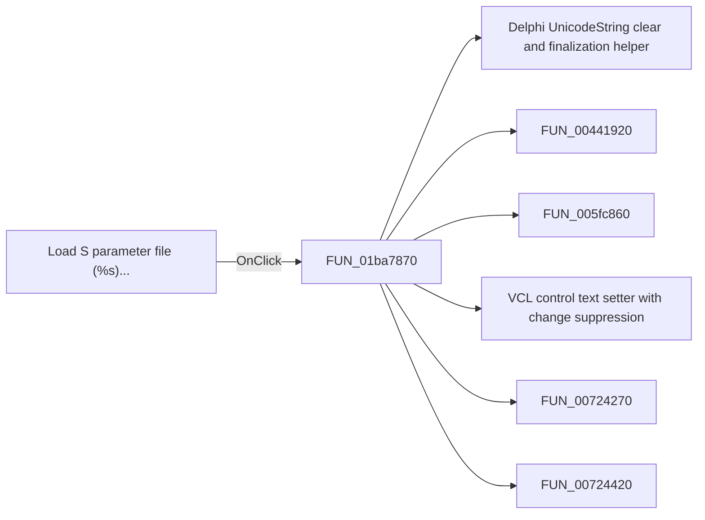

# Load S parameter file (%s)...

> Analysis status: Pending individual source review.

## Control

| Property | Recovered value |
| --- | --- |
| Form | frmSBlockWizard |
| Component path | frmSBlockWizard.pnlMain.btnLoad |
| Control class | TButton |
| Caption | Load S parameter file (%s)... |
| Hint | Not present in the recovered resource. |
| Text | Not present in the recovered resource. |
| Handler name | btnLoadClick |
| Handler address | 01ba7870 |
| Graph node | `resource:dfm:frmSBlockWizard/frmSBlockWizard.pnlMain.btnLoad` |
| Handler node | `function:01ba7870` |
| Graph layer | UI |

## What happens when clicked

Pending individual analysis. An agent must read the recovered handler source and its relevant callees before it replaces this text.

## Click flow

## Handler evidence

- Source: [DecompiledSources/Tina16/functions/0000000001BA7870__FUN_01ba7870.c](../../../DecompiledSources/Tina16/functions/0000000001BA7870__FUN_01ba7870.c)
- Recovered role: Not present in the recovered resource.
- Current graph summary: Handles 1 Delphi UI event: frmSBlockWizard.pnlMain.btnLoad.OnClick.
- Current graph behavior: Not present in the recovered resource.
- Current graph evidence: Not present in the recovered resource.
- Complexity: complex
- Distinct outgoing calls: 8

## Direct calls

- `function:00414480` — Delphi UnicodeString clear and finalization helper
- `function:00441920` — FUN_00441920
- `function:005fc860` — FUN_005fc860
- `function:0064de00` — VCL control text setter with change suppression
- `function:00724270` — FUN_00724270
- `function:00724420` — FUN_00724420
- `function:017002a0` — FUN_017002a0
- `function:01b22c50` — FUN_01b22c50

## Resource evidence

- Kind: Not present in the recovered resource.
- Modal result: Not present in the recovered resource.
- Checked state: Not present in the recovered resource.
- List items: Not present in the recovered resource.
- Image reference: Not present in the recovered resource.
- Extracted glyph: None.

## Nearby label candidates

Nearby labels are layout candidates only. They are not proof of behavior.

- Rank 1: S parameter file:  at distance 28.
- Rank 2: not loaded at distance 118.
- Rank 3: Number of pins at distance 234.

## Analysis limits

- Do not infer behavior from the control class, caption, hint, glyph, or nearby label alone.
- Do not replace the pending status until the handler source and relevant call path provide enough evidence.
