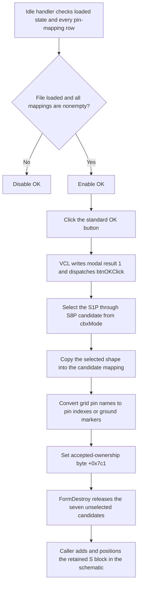

# Accept the configured S block

> Analysis status: Complete. The recovered DFM, readiness handler, OK handler, shape-and-pin mapper, form destroy path, and schematic insertion caller support this explanation.

## Control

| Property | Recovered value |
| --- | --- |
| Form | frmSBlockWizard |
| Form caption | S block wizard |
| Component path | frmSBlockWizard.pnlBottom.btnOK |
| Control class | TBitBtn |
| Caption | Supplied by `Kind = bkOK`; no custom caption is present. |
| Hint | Not present in the recovered resource. |
| Handler name | btnOKClick |
| Handler address | 01ba7720 |
| Graph node | `resource:dfm:frmSBlockWizard/frmSBlockWizard.pnlBottom.btnOK` |
| Handler node | `function:01ba7720` |
| Graph layer | UI |

`btnOK` uses the standard VCL `bkOK` kind. This kind supplies the OK caption, stock glyph, default-button state, and modal result `1`. The DFM has no custom caption, hint, image, or extracted glyph for this button.

## When the button is enabled

The form idle handler controls `btnOK.Enabled`. It requires both conditions:

1. byte `+0x7c0` shows that the Load action completed; and
2. every data row in column `1` of `sgPinMatch` has a nonempty pin name.

The selected mode determines how many mapping rows exist. The user normally cannot click OK until the file and all pin mappings are present. The OK handler does not repeat these checks. A programmatic click can therefore call it with incomplete state.

## What happens when clicked

The inherited VCL button path writes modal result `1` to the form and then dispatches `btnOKClick`. The handler ignores `Sender` and selects one of eight S-block candidates from `cbxMode.ItemIndex`:

| Item index | Resource item | Candidate field |
| ---: | --- | --- |
| 0 | S1P | `+0x778` |
| 1 | S2P | `+0x780` |
| 2 | S3P | `+0x788` |
| 3 | S4P | `+0x790` |
| 4 | S5P | `+0x798` |
| 5 | S6P | `+0x7a0` |
| 6 | S7P | `+0x7a8` |
| 7 or another value | S8P fallback | `+0x7b0` |

It passes the selected candidate to the shared accept helper. That helper:

1. creates or resets the candidate's shape-and-pin mapping object;
2. gets the shape object selected in `cbDevices` and copies it into that mapping object;
3. configures the candidate for the selected shape's recovered pin count;
4. reads every pin name from column `1` of `sgPinMatch`;
5. stores `-1` for the special `*GND*` value;
6. otherwise finds the selected pin name in the shape's pin-name list and stores its zero-based index; and
7. packs the first four and next four indexes into the candidate mapping fields that start at offset `+0x518`.

After the helper returns, `btnOKClick` sets accepted-ownership byte `+0x7c1` to `1`. It does not load a file, reparse S-parameter data, check empty mappings, save a file, or add the block to the schematic itself.

## Ownership and schematic insertion

`FormCreate` creates eight separate mode-specific S-block candidates. `FormDestroy` uses byte `+0x7c1` to decide their ownership:

- before acceptance, it destroys all eight candidates;
- after acceptance, it destroys the seven candidates that do not match the selected mode and leaves the selected candidate alive.

The schematic insertion caller opens the wizard for component code `900`, reads the selected candidate, and destroys the form. Only modal result `1` adds the retained candidate to the current schematic, positions it, selects it, and completes the surrounding insertion action. Modal result `2` cancels the insertion path. Thus, this click prepares and transfers one S block, while the caller performs the actual schematic change.

## Click flow

## Source evidence

- [OK handler `FUN_01ba7720`](../../../DecompiledSources/Tina16/functions/0000000001BA7720__FUN_01ba7720.c) proves the eight-way mode selection, accept-helper call, and accepted-ownership write.
- [Shape-and-pin accept helper `FUN_01ba5ef0`](../../../DecompiledSources/Tina16/functions/0000000001BA5EF0__FUN_01ba5ef0.c) proves the selected-shape copy, pin-count configuration, grid scan, `*GND*` handling, name lookup, and packed pin-index writes.
- [Pin-name lookup `FUN_01ba5e20`](../../../DecompiledSources/Tina16/functions/0000000001BA5E20__FUN_01ba5e20.c) compares one grid value with each name in the selected shape's pin list and returns its index.
- [Idle handler `FUN_01ba8a80`](../../../DecompiledSources/Tina16/functions/0000000001BA8A80__FUN_01ba8a80.c) enables OK only when byte `+0x7c0` is set and all grid mapping cells are nonempty.
- [Selected-candidate getter `FUN_01ba66d0`](../../../DecompiledSources/Tina16/functions/0000000001BA66D0__FUN_01ba66d0.c) returns the candidate that matches `cbxMode.ItemIndex`.
- [Form-create handler `FUN_01ba67e0`](../../../DecompiledSources/Tina16/functions/0000000001BA67E0__FUN_01ba67e0.c) creates the eight S-block candidates and initializes the form state. [Form-destroy handler `FUN_01ba6e80`](../../../DecompiledSources/Tina16/functions/0000000001BA6E80__FUN_01ba6e80.c) proves the accepted and unaccepted ownership branches.
- [Schematic insertion caller `FUN_01c6ec30`](../../../DecompiledSources/Tina16/functions/0000000001C6EC30__FUN_01c6ec30.c) opens this wizard for component code `900`, gets the selected candidate, tests the modal result, and adds an accepted candidate to the schematic.
- [TBitBtn kind setter `FUN_0082bc30`](../../../DecompiledSources/Tina16/functions/000000000082BC30__FUN_0082bc30.c) maps `bkOK` to modal result `1`, the default state, caption, and stock glyph. [The inherited click path](../../../DecompiledSources/Tina16/functions/0000000000687F30__FUN_00687f30.c) writes that result before it dispatches `OnClick`.
- [Recovered Delphi resource evidence](../../../DecompiledSources/Tina16/resources/dfm/ui-evidence.json) supplies the form caption, controls, mode items, labels, event bindings, and button kind.

## Analysis limits and ownership

- This Bead owns the OK handler, shape-and-pin accept helper, selected-candidate getter, and form ownership path.
- The VCL button path, idle handler, pin-name lookup, and schematic insertion caller are shared evidence.
- The original Delphi field names for the candidate objects and packed pin map are not recovered. This article uses proven form and object offsets.
- The OK handler does not report an error if it is invoked while the normal readiness conditions are false.
