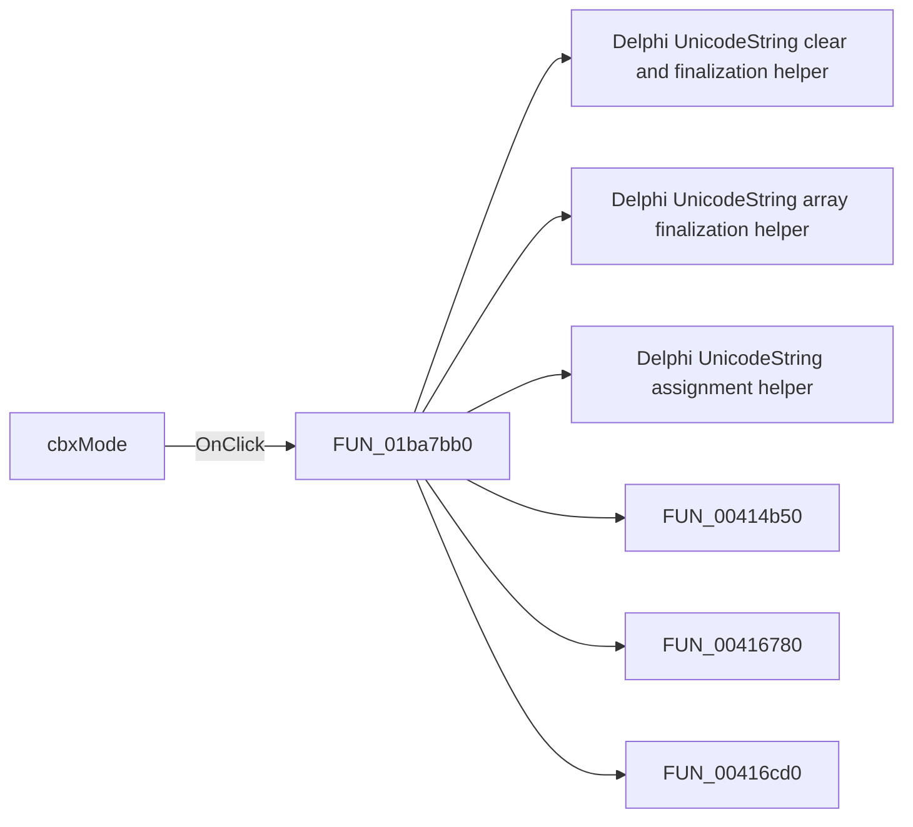

# cbxMode

> Analysis status: Pending individual source review.

## Control

| Property | Recovered value |
| --- | --- |
| Form | frmSBlockWizard |
| Component path | frmSBlockWizard.pnlMain.cbxMode |
| Control class | TComboBox |
| Caption | Not present in the recovered resource. |
| Hint | Not present in the recovered resource. |
| Text | S1P |
| Handler name | cbxModeClick |
| Handler address | 01ba7bb0 |
| Graph node | `resource:dfm:frmSBlockWizard/frmSBlockWizard.pnlMain.cbxMode` |
| Handler node | `function:01ba7bb0` |
| Graph layer | UI |

## What happens when clicked

Pending individual analysis. An agent must read the recovered handler source and its relevant callees before it replaces this text.

## Click flow

## Handler evidence

- Source: [DecompiledSources/Tina16/functions/0000000001BA7BB0__FUN_01ba7bb0.c](../../../DecompiledSources/Tina16/functions/0000000001BA7BB0__FUN_01ba7bb0.c)
- Recovered role: Not present in the recovered resource.
- Current graph summary: Handles 1 Delphi UI event: frmSBlockWizard.pnlMain.cbxMode.OnClick.
- Current graph behavior: Not present in the recovered resource.
- Current graph evidence: Not present in the recovered resource.
- Complexity: complex
- Distinct outgoing calls: 16

## Direct calls

- `function:00414480` — Delphi UnicodeString clear and finalization helper
- `function:00414560` — Delphi UnicodeString array finalization helper
- `function:00414ad0` — Delphi UnicodeString assignment helper
- `function:00414b50` — FUN_00414b50
- `function:00416780` — FUN_00416780
- `function:00416cd0` — FUN_00416cd0
- `function:0041ddd0` — FUN_0041ddd0
- `function:0043f750` — FUN_0043f750
- `function:00442f70` — FUN_00442f70
- `function:0064de00` — VCL control text setter with change suppression
- `function:00848a70` — FUN_00848a70
- `function:0084e370` — FUN_0084e370
- `function:0084e3e0` — FUN_0084e3e0
- `function:00b89270` — FUN_00b89270
- `function:00b8e650` — FUN_00b8e650
- `function:01ba64e0` — FUN_01ba64e0

## Resource evidence

- Kind: Not present in the recovered resource.
- Modal result: Not present in the recovered resource.
- Checked state: Not present in the recovered resource.
- List items: ("S1P", "S2P", "S3P", "S4P", "S5P", "S6P", "S7P", "S8P")
- Image reference: Not present in the recovered resource.
- Extracted glyph: None.

## Nearby label candidates

Nearby labels are layout candidates only. They are not proof of behavior.

- Rank 1: Mode at distance 25.
- Rank 2: Shape library at distance 39.
- Rank 3: Shape at distance 79.

## Analysis limits

- Do not infer behavior from the control class, caption, hint, glyph, or nearby label alone.
- Do not replace the pending status until the handler source and relevant call path provide enough evidence.
