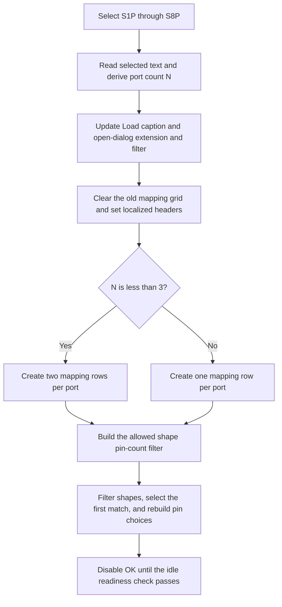

# Select the S1P through S8P mode

> Analysis status: Complete. The recovered DFM, mode handler, grid builder, pin-count filter, shape refresh, load path, and readiness handler support this explanation.

## Control

| Property | Recovered value |
| --- | --- |
| Form | frmSBlockWizard |
| Form caption | S block wizard |
| Component path | frmSBlockWizard.pnlMain.cbxMode |
| Control class | TComboBox |
| Style | csDropDownList |
| Initial text | S1P |
| Items | S1P; S2P; S3P; S4P; S5P; S6P; S7P; S8P |
| Nearby direct label | Mode |
| Handler name | cbxModeClick |
| Handler address | 01ba7bb0 |
| Graph node | `resource:dfm:frmSBlockWizard/frmSBlockWizard.pnlMain.cbxMode` |
| Handler node | `function:01ba7bb0` |
| Graph layer | UI |

The resource has no action, image, glyph, or custom hint for this combo box.

## What happens when clicked

The handler ignores `Sender`, reads the selected item text and index, and derives port count `N = ItemIndex + 1`. It then rebuilds the mode-dependent form state.

First, it uses the selected text, such as `S2P`, to update:

- the Load button caption template `Load S parameter file (%s)...`;
- the open dialog's default extension; and
- the open dialog filter template.

Next, it clears the old pin-mapping grid content, resets its two header cells with localized S-block and shape text, and creates new row labels from localized Port and Pin terms.

## Recovered row and pin-count rules

| Selected mode | Port count `N` | Mapping data rows | `cbxPinFilter` items | Filter enabled |
| --- | ---: | ---: | --- | --- |
| S1P | 1 | 2 | 2 | No |
| S2P | 2 | 4 | 2, 3, 4 | Yes |
| S3P | 3 | 3 | 3 | No |
| S4P | 4 | 4 | 4 | No |
| S5P | 5 | 5 | 5 | No |
| S6P | 6 | 6 | 6 | No |
| S7P | 7 | 7 | 7 | No |
| S8P | 8 | 8 | 8 | No |

S1P and S2P use two mapping rows per port. Modes S3P through S8P use one row per port. The grid also has one header row, so its total row count is the listed data-row count plus one.

After it selects the first pin-count filter row, the handler calls the shared shape refresh. That refresh:

1. parses the selected pin-count text;
2. clears `cbDevices`;
3. scans the available shape list;
4. keeps shapes whose recovered pin count matches the filter and whose library matches the optional library filter;
5. selects the first matching shape;
6. rebuilds the available pin-name list and clears old grid mappings; and
7. disables OK until the later idle readiness check succeeds.

For S2P only, the shape-change path also adds the special `*GND*` pin choice.

## State that is not reset

The mode handler does not clear loaded-state byte `+0x7c0` and does not restore the `not loaded` status label. If the user changes mode after a previous Load action, the recovered source keeps that loaded marker while it rebuilds the grid and selects a different mode-specific candidate. It disables OK during the rebuild, but the idle handler can enable OK again when every new mapping row is nonempty.

The source does not automatically load the previous file into the new mode-specific candidate. This article reports that recovered state boundary without assuming the intended product rule.

## Click flow

## Source evidence

- [Mode handler `FUN_01ba7bb0`](../../../DecompiledSources/Tina16/functions/0000000001BA7BB0__FUN_01ba7bb0.c) proves the selected-text formatting, dialog updates, grid reset, localized headers, row-count branches, pin-count choices, S2P-only filter enablement, and shape-refresh call.
- [Shape refresh `FUN_01ba64e0`](../../../DecompiledSources/Tina16/functions/0000000001BA64E0__FUN_01ba64e0.c) proves the numeric pin-count filter, optional library match, matching-shape list rebuild, first-row selection, pin-list refresh, and OK disable operation.
- [Shape-change handler `FUN_01ba83f0`](../../../DecompiledSources/Tina16/functions/0000000001BA83F0__FUN_01ba83f0.c) copies the selected shape's pin names to `cbxPins`, adds `*GND*` only for S2P, and clears prior mapping cells.
- [Load handler `FUN_01ba7870`](../../../DecompiledSources/Tina16/functions/0000000001BA7870__FUN_01ba7870.c) proves that the later file import selects a mode-specific candidate and passes port count `ItemIndex + 1`.
- [Idle handler `FUN_01ba8a80`](../../../DecompiledSources/Tina16/functions/0000000001BA8A80__FUN_01ba8a80.c) proves that the persistent loaded byte and nonempty new mapping rows can enable OK.
- [Form-create handler `FUN_01ba67e0`](../../../DecompiledSources/Tina16/functions/0000000001BA67E0__FUN_01ba67e0.c) saves the Load caption and dialog filter templates, initializes the mode, and calls this handler.
- [Recovered Delphi resource evidence](../../../DecompiledSources/Tina16/resources/dfm/ui-evidence.json) supplies the eight ordered mode items, initial S1P text, drop-down-list style, related controls, labels, and event bindings.

## Analysis limits and ownership

- This Bead owns the mode handler, shape refresh, and mode-dependent grid and pin-count behavior.
- The shape-change, Load, form-create, and idle handlers are shared evidence.
- The row-label separator strings are not recovered as readable text. Their Port and Pin terms come from named localized resources used at the proven formatting sites.
- The source does not prove whether keeping byte `+0x7c0` after a mode change is intentional.
