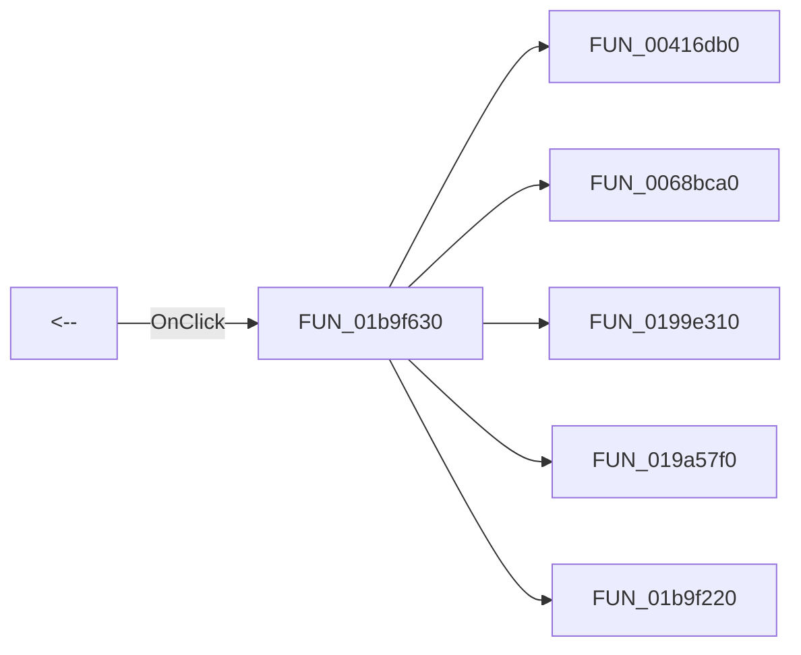

# <--

> Analysis status: Pending individual source review.

## Control

| Property | Recovered value |
| --- | --- |
| Form | frmSchematicReconciliation |
| Component path | frmSchematicReconciliation.CopyBtn |
| Control class | TButton |
| Caption | <-- |
| Hint | Not present in the recovered resource. |
| Text | Not present in the recovered resource. |
| Handler name | CopyBtnClick |
| Handler address | 01b9f630 |
| Graph node | `resource:dfm:frmSchematicReconciliation/frmSchematicReconciliation.CopyBtn` |
| Handler node | `function:01b9f630` |
| Graph layer | UI |

## What happens when clicked

Pending individual analysis. An agent must read the recovered handler source and its relevant callees before it replaces this text.

## Click flow

## Handler evidence

- Source: [DecompiledSources/Tina16/functions/0000000001B9F630__FUN_01b9f630.c](../../../DecompiledSources/Tina16/functions/0000000001B9F630__FUN_01b9f630.c)
- Recovered role: Not present in the recovered resource.
- Current graph summary: Handles 1 Delphi UI event: frmSchematicReconciliation.CopyBtn.OnClick.
- Current graph behavior: Not present in the recovered resource.
- Current graph evidence: Not present in the recovered resource.
- Complexity: complex
- Distinct outgoing calls: 5

## Direct calls

- `function:00416db0` — FUN_00416db0
- `function:0068bca0` — FUN_0068bca0
- `function:0199e310` — FUN_0199e310
- `function:019a57f0` — FUN_019a57f0
- `function:01b9f220` — FUN_01b9f220

## Resource evidence

- Kind: Not present in the recovered resource.
- Modal result: Not present in the recovered resource.
- Checked state: Not present in the recovered resource.
- List items: Not present in the recovered resource.
- Image reference: Not present in the recovered resource.
- Extracted glyph: None.

## Nearby label candidates

Nearby labels are layout candidates only. They are not proof of behavior.

- No same-parent label candidate is available.

## Analysis limits

- Do not infer behavior from the control class, caption, hint, glyph, or nearby label alone.
- Do not replace the pending status until the handler source and relevant call path provide enough evidence.
