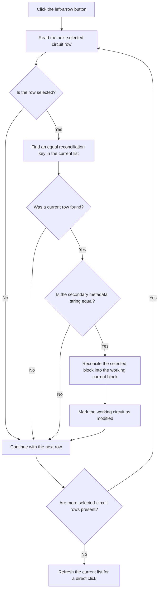

# <--

> Analysis status: Reviewed from the recovered handler, row-matching helpers, form lifecycle, and OK commit path.

## Control

| Property | Recovered value |
| --- | --- |
| Form | frmSchematicReconciliation |
| Component path | frmSchematicReconciliation.CopyBtn |
| Control class | TButton |
| Caption | <-- |
| Hint | Not present in the recovered resource. |
| Text | Not present in the recovered resource. |
| Handler name | CopyBtnClick |
| Handler address | 01b9f630 |
| Graph node | `resource:dfm:frmSchematicReconciliation/frmSchematicReconciliation.CopyBtn` |
| Handler node | `function:01b9f630` |
| Graph layer | UI |

## What happens when clicked

This button transfers selected block data from the selected-circuit list on the right to the working current-circuit copy on the left. It does not write directly to the live circuit.

The handler reads each row in `lbSelected`. It continues only when the row is selected. It builds the reconciliation key for that row and searches `lbCurrent` for an equal key. It then requires equality for a second block metadata string at nested offset `+0x30`. If both tests pass, it calls the selected block's virtual reconciliation method with the matching current block. It marks the working current-circuit object at form offset `+0x700` as modified.

For a direct button click, the event supplies a nonzero sender argument. The handler then clears and repopulates `lbCurrent` from the modified working object. The OK handler also reuses this function with a zero second argument during final commit. That call does not refresh the list.

An unselected row, a missing key match, or unequal secondary metadata is a no-op for that row. A list-box selection query can raise the recovered VCL indexed-list exception. The handler has no local catch, rollback, or user-message path for an exception from the row query, comparison, or virtual reconciliation call. Earlier successful rows stay changed in the working copy if a later row fails.

## Click flow

## Handler evidence

- Source: [DecompiledSources/Tina16/functions/0000000001B9F630__FUN_01b9f630.c](../../../DecompiledSources/Tina16/functions/0000000001B9F630__FUN_01b9f630.c)
- Recovered role: Reconcile selected rows into the working current-circuit copy.
- Current graph summary: Handles 1 Delphi UI event: frmSchematicReconciliation.CopyBtn.OnClick.
- Current graph behavior: Tests selection and two recovered identity values before it reconciles each matching block and marks the working circuit as modified.
- Current graph evidence: The handler reads `lbSelected` at `+0x6f0`, uses `FUN_01b9f220` to find a row in `lbCurrent` at `+0x6e8`, compares nested strings at `+0x30`, calls the selected block's virtual slot `+0x48` with the current block, and calls `FUN_0199e310` for the object at `+0x700`.
- Complexity: complex
- Distinct outgoing calls: 5

## Direct calls

- `function:00416db0` — FUN_00416db0
- `function:0068bca0` — FUN_0068bca0
- `function:0199e310` — FUN_0199e310
- `function:019a57f0` — FUN_019a57f0
- `function:01b9f220` — FUN_01b9f220

## Related source evidence

- [Form creation](../../../DecompiledSources/Tina16/functions/0000000001B9F0F0__FUN_01b9f0f0.c) clones the live current circuit into form field `+0x700` and populates `lbCurrent` from that clone.
- [Reconciliation-key formatter](../../../DecompiledSources/Tina16/functions/0000000001B9F160__FUN_01b9f160.c) combines the block's virtual name result and nested field `+0x38` into the key that the match helper uses.
- [Current-row match helper](../../../DecompiledSources/Tina16/functions/0000000001B9F220__FUN_01b9f220.c) compares that key against all current-list rows and returns the first equal row index.
- [List population helper](../../../DecompiledSources/Tina16/functions/00000000019A57F0__FUN_019a57f0.c) clears the target list and adds the eligible blocks from the supplied circuit object.
- [Modified-state setter](../../../DecompiledSources/Tina16/functions/000000000199E310__FUN_0199e310.c) writes the circuit modified flag and sends its recovered change notification.
- [OK handler](../../../DecompiledSources/Tina16/functions/0000000001B9F800__FUN_01b9f800.c) reuses this handler with all source rows selected to commit the working copy to the live circuit.

## Resource evidence

- Kind: Not present in the recovered resource.
- Modal result: Not present in the recovered resource.
- Checked state: Not present in the recovered resource.
- List items: Not present in the recovered resource.
- Image reference: Not present in the recovered resource.
- Extracted glyph: None.

## Nearby label candidates

Nearby labels are layout candidates only. They are not proof of behavior.

- No same-parent label candidate is available.

## Analysis limits

- The virtual reconciliation method at block slot `+0x48` has no recovered Delphi name. Its call direction, the modified target object, the two list headings, and the left-arrow caption establish the transfer direction. They do not identify each block field that the method copies.
