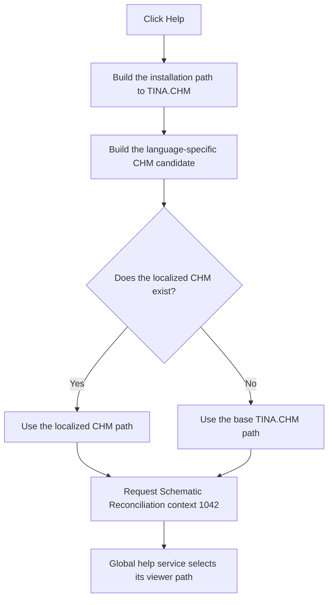

# Help

> Analysis status: Reviewed from the recovered handler, form help-context initialization, localized-help resolver, and global help dispatcher.

## Control

| Property | Recovered value |
| --- | --- |
| Form | frmSchematicReconciliation |
| Component path | frmSchematicReconciliation.HelpBtn |
| Control class | TButton |
| Caption | Help |
| Hint | Not present in the recovered resource. |
| Text | Not present in the recovered resource. |
| Handler name | HelpBtnClick |
| Handler address | 01b9f920 |
| Graph node | `resource:dfm:frmSchematicReconciliation/frmSchematicReconciliation.HelpBtn` |
| Handler node | `function:01b9f920` |
| Graph layer | UI |

## What happens when clicked

The handler builds the installation-folder path to `TINA.CHM`. It passes that path to the shared localized-help resolver. The resolver uses an existing `TINA_<language>.CHM` file when it is available. If that file does not exist, it returns the original `TINA.CHM` path.

The handler sends the resolved path and help context `1042` (`0x412`) to the process-wide application help interface. The form-create handler assigns the same value to the form's VCL `HelpContext`, so the number is the recovered Schematic Reconciliation context.

The missing localized file is an expected fallback and causes no control-specific message. The resolver does not prove that the base CHM file exists. The final help dispatcher owns external or internal viewer errors. This handler has no local catch, alternate topic, retry, or result test.

## Click flow

## Handler evidence

- Source: [DecompiledSources/Tina16/functions/0000000001B9F920__FUN_01b9f920.c](../../../DecompiledSources/Tina16/functions/0000000001B9F920__FUN_01b9f920.c)
- Recovered role: Open the Schematic Reconciliation topic in the TINA help file.
- Current graph summary: Handles 1 Delphi UI event: frmSchematicReconciliation.HelpBtn.OnClick.
- Current graph behavior: Resolves an existing localized TINA help file or the base file and requests context `0x412`.
- Current graph evidence: The handler concatenates the application help directory with the recovered separator and `TINA.CHM`, calls `FUN_01b1def0`, and invokes the global help interface with `0x412`. Form creation also assigns `0x412` to this form.
- Complexity: complex
- Distinct outgoing calls: 3

## Direct calls

- `function:00414560` — Delphi UnicodeString array finalization helper
- `function:00416cd0` — FUN_00416cd0
- `function:01b1def0` — FUN_01b1def0

## Related source evidence

- [Form creation](../../../DecompiledSources/Tina16/functions/0000000001B9F0F0__FUN_01b9f0f0.c) passes `0x412` to the VCL help-context setter.
- [Localized-help resolver](../../../DecompiledSources/Tina16/functions/0000000001B1DEF0__FUN_01b1def0.c) selects an existing language-specific file or returns the original path.
- [Global help dispatcher](../../../DecompiledSources/Tina16/functions/0000000001D46890__FUN_01d46890.c) owns the external and internal help-viewer paths. This handler reaches it through the global application help interface.

## Resource evidence

- Kind: Not present in the recovered resource.
- Modal result: Not present in the recovered resource.
- Checked state: Not present in the recovered resource.
- List items: Not present in the recovered resource.
- Image reference: Not present in the recovered resource.
- Extracted glyph: None.

## Nearby label candidates

Nearby labels are layout candidates only. They are not proof of behavior.

- No same-parent label candidate is available.

## Analysis limits

- The recovered handler does not test the help request result. Viewer-specific failure behavior is outside this control handler.
