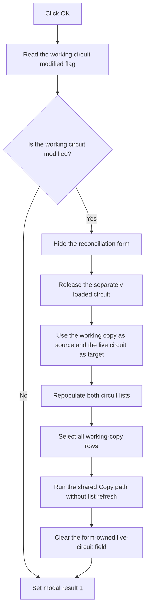

# OK

> Analysis status: Reviewed from the recovered handler, modified-state functions, form ownership, and shared reconciliation path.

## Control

| Property | Recovered value |
| --- | --- |
| Form | frmSchematicReconciliation |
| Component path | frmSchematicReconciliation.OKBtn |
| Control class | TButton |
| Caption | OK |
| Hint | Not present in the recovered resource. |
| Text | Not present in the recovered resource. |
| Handler name | OKBtnClick |
| Handler address | 01b9f800 |
| Graph node | `resource:dfm:frmSchematicReconciliation/frmSchematicReconciliation.OKBtn` |
| Handler node | `function:01b9f800` |
| Graph layer | UI |

## What happens when clicked

This button commits the form's working current-circuit copy when that copy is modified. It then accepts the dialog.

The handler first reads the modified flag from the working object at form offset `+0x700`. If the flag is clear, it does not copy block data. It only sets modal result 1.

If the flag is set, the handler hides the form and destroys the separately loaded selected-circuit object at `+0x708`. It moves the modified working copy to the selected side and places the live current-circuit object at `+0x700`. It repopulates both lists for those two objects, selects every row in the working-copy list, and calls the shared Copy handler with list refresh disabled. This transfers each matching working block into the live circuit and marks the live circuit as modified. The handler then clears `+0x700`, so form destruction does not free the live global object. The working clone stays at `+0x708` and form destruction frees it.

Modal result 1 is set after either branch. The handler has no local validation message, catch, rollback, or retry. If a copy operation raises an exception, earlier live-circuit updates can remain because the commit loop has no transaction rollback.

## Click flow

## Handler evidence

- Source: [DecompiledSources/Tina16/functions/0000000001B9F800__FUN_01b9f800.c](../../../DecompiledSources/Tina16/functions/0000000001B9F800__FUN_01b9f800.c)
- Recovered role: Commit a modified reconciliation working copy to the live current circuit and accept the dialog.
- Current graph summary: Handles 1 Delphi UI event: frmSchematicReconciliation.OKBtn.OnClick.
- Current graph behavior: Skips the commit when the working copy is unchanged. Otherwise, it changes source and target ownership, selects all source rows, and reuses the Copy handler before it sets modal result 1.
- Current graph evidence: The handler reads the `+0x3a8` flag through `FUN_0199e300`, hides the form, moves form fields `+0x700` and `+0x708`, loads the global current-circuit pointer from application offset `+0x27a8`, selects each row with `FUN_0068bd10`, calls `FUN_01b9f630` with zero, clears `+0x700`, and writes 1 to form field `+0x508`.
- Complexity: complex
- Distinct outgoing calls: 6

## Direct calls

- `function:00418590` — FUN_00418590
- `function:0068bd10` — FUN_0068bd10
- `function:00805990` — FUN_00805990
- `function:0199e300` — FUN_0199e300
- `function:019a57f0` — FUN_019a57f0
- `function:01b9f630` — Handles 1 Delphi UI event: frmSchematicReconciliation.CopyBtn.OnClick.

## Related source evidence

- [Form creation](../../../DecompiledSources/Tina16/functions/0000000001B9F0F0__FUN_01b9f0f0.c) creates the working clone at `+0x700` instead of editing the global current circuit directly.
- [Modified-state reader](../../../DecompiledSources/Tina16/functions/000000000199E300__FUN_0199e300.c) returns object byte `+0x3a8`.
- [Form hide helper](../../../DecompiledSources/Tina16/functions/0000000000805990__FUN_00805990.c) clears the VCL form visible state.
- [List selection setter](../../../DecompiledSources/Tina16/functions/000000000068BD10__FUN_0068bd10.c) selects each working-copy row and raises the recovered indexed-list exception if the native control reports an error.
- [Shared Copy handler](../../../DecompiledSources/Tina16/functions/0000000001B9F630__FUN_01b9f630.c) reconciles all selected, matching source rows and marks the target circuit as modified.
- [Form destruction](../../../DecompiledSources/Tina16/functions/0000000001B9F7A0__FUN_01b9f7a0.c) frees non-null objects at `+0x708` and `+0x700`. Clearing `+0x700` protects the live circuit from this form-owned cleanup.

## Resource evidence

- Kind: Not present in the recovered resource.
- Modal result: Not present in the recovered resource.
- Checked state: Not present in the recovered resource.
- List items: Not present in the recovered resource.
- Image reference: Not present in the recovered resource.
- Extracted glyph: None.

## Nearby label candidates

Nearby labels are layout candidates only. They are not proof of behavior.

- No same-parent label candidate is available.

## Analysis limits

- The shared virtual block reconciliation method has no recovered Delphi name. The handler proves the source and target object flow, but it does not expose the complete set of block fields that the virtual method changes.
