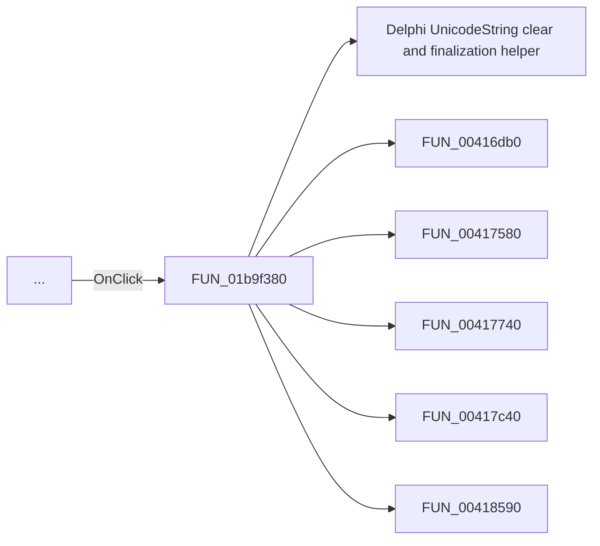

# ...

> Analysis status: Pending individual source review.

## Control

| Property | Recovered value |
| --- | --- |
| Form | frmSchematicReconciliation |
| Component path | frmSchematicReconciliation.Panel2.PickBtn |
| Control class | TButton |
| Caption | ... |
| Hint | Not present in the recovered resource. |
| Text | Not present in the recovered resource. |
| Handler name | PickBtnClick |
| Handler address | 01b9f380 |
| Graph node | `resource:dfm:frmSchematicReconciliation/frmSchematicReconciliation.Panel2.PickBtn` |
| Handler node | `function:01b9f380` |
| Graph layer | UI |

## What happens when clicked

Pending individual analysis. An agent must read the recovered handler source and its relevant callees before it replaces this text.

## Click flow

## Handler evidence

- Source: [DecompiledSources/Tina16/functions/0000000001B9F380__FUN_01b9f380.c](../../../DecompiledSources/Tina16/functions/0000000001B9F380__FUN_01b9f380.c)
- Recovered role: Not present in the recovered resource.
- Current graph summary: Handles 1 Delphi UI event: frmSchematicReconciliation.Panel2.PickBtn.OnClick.
- Current graph behavior: Not present in the recovered resource.
- Current graph evidence: Not present in the recovered resource.
- Complexity: complex
- Distinct outgoing calls: 13

## Direct calls

- `function:00414480` — Delphi UnicodeString clear and finalization helper
- `function:00416db0` — FUN_00416db0
- `function:00417580` — FUN_00417580
- `function:00417740` — FUN_00417740
- `function:00417c40` — FUN_00417c40
- `function:00418590` — FUN_00418590
- `function:0065b870` — FUN_0065b870
- `function:0068bd10` — FUN_0068bd10
- `function:00724270` — FUN_00724270
- `function:014a7fd0` — FUN_014a7fd0
- `function:019a57f0` — FUN_019a57f0
- `function:01b9f220` — FUN_01b9f220
- `function:01d0e500` — FUN_01d0e500

## Resource evidence

- Kind: Not present in the recovered resource.
- Modal result: Not present in the recovered resource.
- Checked state: Not present in the recovered resource.
- List items: Not present in the recovered resource.
- Image reference: Not present in the recovered resource.
- Extracted glyph: None.

## Nearby label candidates

Nearby labels are layout candidates only. They are not proof of behavior.

- No same-parent label candidate is available.

## Analysis limits

- Do not infer behavior from the control class, caption, hint, glyph, or nearby label alone.
- Do not replace the pending status until the handler source and relevant call path provide enough evidence.
