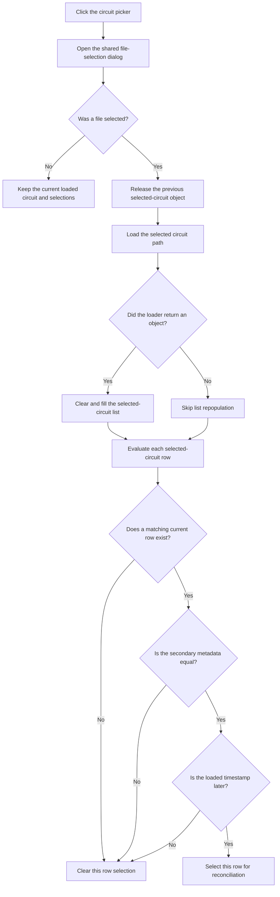

# ...

> Analysis status: Reviewed from the recovered handler, file-dialog path, circuit loader, row-matching helpers, and list selection setter.

## Control

| Property | Recovered value |
| --- | --- |
| Form | frmSchematicReconciliation |
| Component path | frmSchematicReconciliation.Panel2.PickBtn |
| Control class | TButton |
| Caption | ... |
| Hint | Not present in the recovered resource. |
| Text | Not present in the recovered resource. |
| Handler name | PickBtnClick |
| Handler address | 01b9f380 |
| Graph node | `resource:dfm:frmSchematicReconciliation/frmSchematicReconciliation.Panel2.PickBtn` |
| Handler node | `function:01b9f380` |
| Graph layer | UI |

## What happens when clicked

This button opens the application's shared file-open dialog to select another circuit. Cancel is a no-op: the handler keeps the loaded circuit, both lists, and all row selections.

After an accepted selection, the handler frees the previous selected-circuit object at form offset `+0x708`. It reads the selected path and passes it to the recovered circuit loader. It preserves and restores one recovered global record around the load. If the loader returns an object, the handler stores it at `+0x708`, clears `lbSelected`, and fills that list with eligible blocks from the loaded circuit.

The handler then evaluates every row in `lbSelected`. It finds a current-circuit row with the same reconciliation key. A row is automatically selected only when a match exists, the secondary metadata string at nested offset `+0x30` is equal, and the loaded block timestamp at nested offset `+0x88` is later than the current block timestamp. A missing match, unequal metadata, or an equal or older timestamp clears the row selection. The displayed row formatter uses the same `+0x88` value with the recovered date-and-time format, which supports the timestamp interpretation.

If the loader returns null, the handler does not repopulate `lbSelected`, but it still reaches the row-selection loop. It has no local message, fallback, catch, or retry for that result. The file loader and list-selection functions can also raise errors. This handler has no rollback after it frees the prior selected-circuit object.

## Click flow

## Handler evidence

- Source: [DecompiledSources/Tina16/functions/0000000001B9F380__FUN_01b9f380.c](../../../DecompiledSources/Tina16/functions/0000000001B9F380__FUN_01b9f380.c)
- Recovered role: Load a comparison circuit and select its newer matching blocks.
- Current graph summary: Handles 1 Delphi UI event: frmSchematicReconciliation.Panel2.PickBtn.OnClick.
- Current graph behavior: Loads an accepted circuit path, fills the selected list, and selects only rows with a matching key, equal secondary metadata, and a later timestamp.
- Current graph evidence: The handler executes the shared open dialog, frees `+0x708`, reads its selected path with `FUN_00724270`, calls `FUN_014a7fd0`, populates `lbSelected` at `+0x6f0`, finds current rows with `FUN_01b9f220`, compares nested fields `+0x30` and `+0x88`, and sets each row through `FUN_0068bd10`.
- Complexity: complex
- Distinct outgoing calls: 13

## Direct calls

- `function:00414480` — Delphi UnicodeString clear and finalization helper
- `function:00416db0` — FUN_00416db0
- `function:00417580` — FUN_00417580
- `function:00417740` — FUN_00417740
- `function:00417c40` — FUN_00417c40
- `function:00418590` — FUN_00418590
- `function:0065b870` — FUN_0065b870
- `function:0068bd10` — FUN_0068bd10
- `function:00724270` — FUN_00724270
- `function:014a7fd0` — FUN_014a7fd0
- `function:019a57f0` — FUN_019a57f0
- `function:01b9f220` — FUN_01b9f220
- `function:01d0e500` — FUN_01d0e500

## Related source evidence

- [Open-dialog file-name reader](../../../DecompiledSources/Tina16/functions/0000000000724270__FUN_00724270.c) returns the selected path.
- [Circuit loader wrapper](../../../DecompiledSources/Tina16/functions/00000000014A7FD0__FUN_014a7fd0.c) rejects an empty path through the recovered runtime error path, changes the shared load-state controls, and calls the circuit-file loader.
- [Circuit-file loader](../../../DecompiledSources/Tina16/functions/00000000014A74D0__FUN_014a74d0.c) returns the loaded circuit object or null. It tests file existence and includes no control-specific dialog behavior.
- [List population helper](../../../DecompiledSources/Tina16/functions/00000000019A57F0__FUN_019a57f0.c) clears the target list and adds eligible circuit blocks.
- [Row display formatter](../../../DecompiledSources/Tina16/functions/00000000019A5590__FUN_019a5590.c) formats nested value `+0x88` as `d-mmm-yyyy, hh:mm` when it builds a row.
- [Current-row match helper](../../../DecompiledSources/Tina16/functions/0000000001B9F220__FUN_01b9f220.c) returns the first current-list row with the same reconciliation key.
- [List selection setter](../../../DecompiledSources/Tina16/functions/000000000068BD10__FUN_0068bd10.c) changes one row's selected state and raises an indexed-list exception on native-control failure.

## Resource evidence

- Kind: Not present in the recovered resource.
- Modal result: Not present in the recovered resource.
- Checked state: Not present in the recovered resource.
- List items: Not present in the recovered resource.
- Image reference: Not present in the recovered resource.
- Extracted glyph: None.

## Nearby label candidates

Nearby labels are layout candidates only. They are not proof of behavior.

- No same-parent label candidate is available.

## Analysis limits

- The recovered global record that the handler saves, changes, and restores around the load has no Delphi name. This article does not assign a purpose to that record.
- The shared file-open dialog's filter and title are not present in this form's resource evidence.
