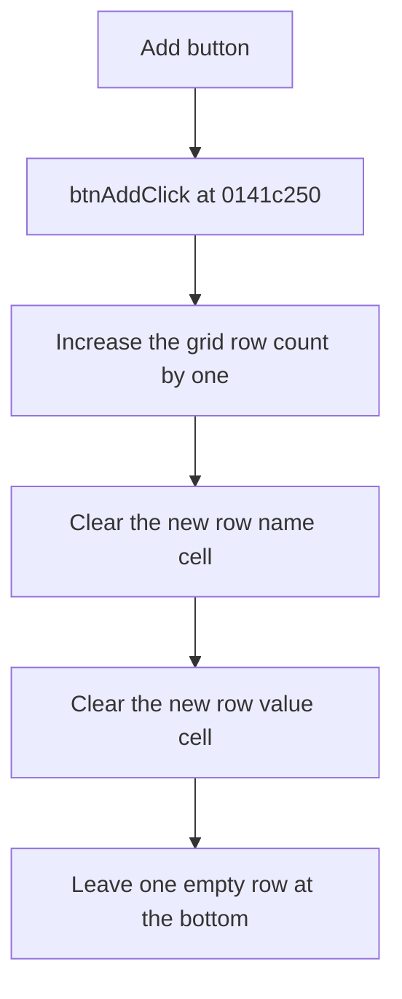

# Add

> Analysis status: Reviewed from recovered source and UI evidence.

## Control

| Property | Recovered value |
| --- | --- |
| Component path | `frmSchMacroParamEditor.pnlButtons.btnAdd` |
| Control class | `TButton` |
| Caption | `Add` |
| Handler | `btnAddClick` at `0141c250` |

## What happens when clicked

The handler increases the parameter grid row count by one. It then clears columns 0 and 1 in the new last row. This creates one empty name/value row at the bottom of the grid. The handler does not validate the row, select it, save the parameter text, or show an error.

## Click flow

## Evidence

- [Recovered btnAddClick source](../../../DecompiledSources/Tina16/functions/000000000141C250__FUN_0141c250.c)
- [Recovered grid row-count setter](../../../DecompiledSources/Tina16/functions/0000000000848A70__FUN_00848a70.c)
- [Recovered grid cell setter](../../../DecompiledSources/Tina16/functions/000000000084E3E0__FUN_0084e3e0.c)
- The DFM resource identifies `ParamEditor` as the form's `TStringGrid`.

## Analysis limits

- The recovered handler does not move keyboard focus or the current grid selection to the new row.
