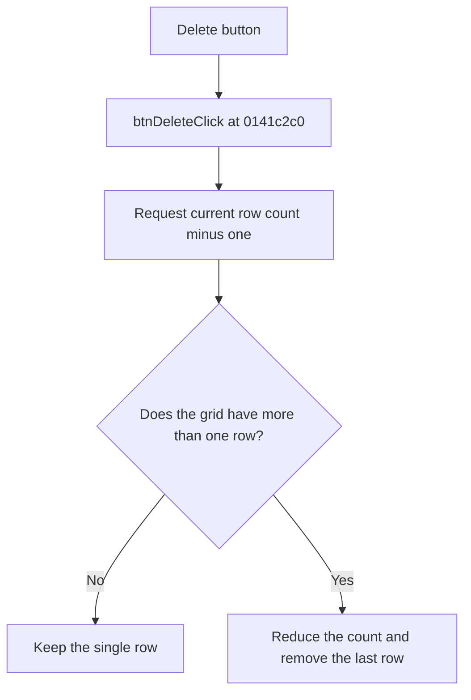

# Delete

> Analysis status: Reviewed from recovered source and UI evidence.

## Control

| Property | Recovered value |
| --- | --- |
| Component path | `frmSchMacroParamEditor.pnlButtons.btnDelete` |
| Control class | `TButton` |
| Caption | `Delete` |
| Handler | `btnDeleteClick` at `0141c2c0` |

## What happens when clicked

The handler reduces the parameter grid row count by one. The row-count helper keeps a minimum of one row, so a one-row grid does not change. For a larger grid, reducing the count removes the last row. The handler does not read the current row or cell selection. Therefore, this button does not specifically delete the selected row. It also does not ask for confirmation, save the parameter text, or show an error.

## Click flow

## Evidence

- [Recovered btnDeleteClick source](../../../DecompiledSources/Tina16/functions/000000000141C2C0__FUN_0141c2c0.c)
- [Recovered grid row-count setter](../../../DecompiledSources/Tina16/functions/0000000000848A70__FUN_00848a70.c)
- The handler reads only the grid row count at offset `+0x4E0`; it does not read a selection index.

## Analysis limits

- The lower-level grid code performs the physical row removal. The handler itself only requests the smaller row count.
