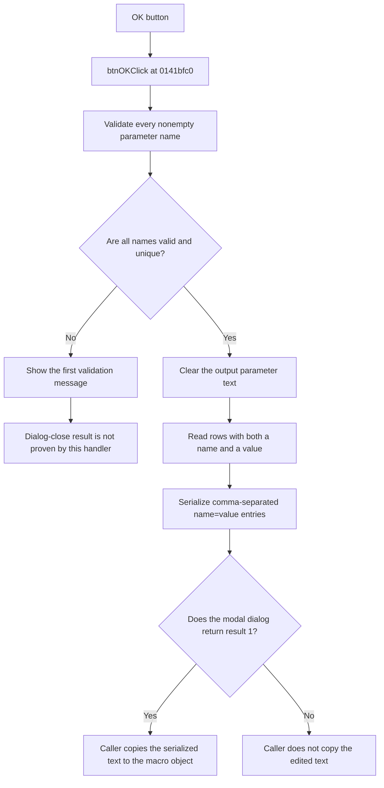

# OK

> Analysis status: Reviewed from recovered source and UI evidence.

## Control

| Property | Recovered value |
| --- | --- |
| Component path | `frmSchMacroParamEditor.pnlButton1.btnOK` |
| Control class | `TBitBtn` |
| Button kind | `bkOK` |
| Handler | `btnOKClick` at `0141bfc0` |

## What happens when clicked

The handler first validates all nonempty names in the two-column parameter grid. It stops at the first invalid row and shows a localized message.

The validation rejects these cases:

- a reserved name, including `TEMP`, `TIME`, `GMIN`, `RNDR`, and `RNDC`;
- a duplicate name;
- a name whose first character is not a letter;
- a name that contains a character other than a letter, digit, or underscore.

Four additional reserved tokens are present in the recovered comparison table, but their text is not recovered. Empty name cells are skipped.

If validation succeeds, the handler clears the output text and reads all grid rows. It includes only rows that have both a name and a value. It serializes each included row as a comma-separated `name=value` entry. It quotes an entry when its value contains a comma or quote, and it removes the final comma. The modal caller copies this output back to the schematic macro object only when the dialog returns result 1.

If validation fails, the handler shows the relevant message and does not rebuild the output text. The `bkOK` resource establishes standard OK behavior, but the recovered handler does not explicitly clear the modal result. Therefore, this click path alone does not prove whether a validation error keeps the editor open.

## Click flow

## Evidence

- [Recovered btnOKClick source](../../../DecompiledSources/Tina16/functions/000000000141BFC0__FUN_0141bfc0.c)
- [Recovered name-validation helper](../../../DecompiledSources/Tina16/functions/000000000141C2F0__FUN_0141c2f0.c)
- [Recovered modal caller and accepted-result commit](../../../DecompiledSources/Tina16/functions/00000000014365E0__FUN_014365e0.c)
- [Recovered grid loader](../../../DecompiledSources/Tina16/functions/000000000141BE80__FUN_0141be80.c)
- The DFM resource identifies `ParamEditor` as a `TStringGrid` and the control as a `bkOK` button.

## Analysis limits

- Four reserved-name strings do not have recovered text.
- The handler does not expose an explicit modal-result reset on validation failure.
