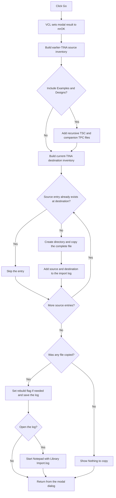

# Go!

> Analysis status: Source reviewed. The library and example import path is documented.

## Control

| Property | Recovered value |
| --- | --- |
| Form | frmSelectTinaFolder |
| Component path | frmSelectTinaFolder.btnOK |
| Control class | TBitBtn |
| Caption | Go! |
| Hint | Not present in the recovered resource. |
| Text | Not present in the recovered resource. |
| Handler name | btnOKClick |
| Handler address | 01c454f0 |
| Graph node | `resource:dfm:frmSelectTinaFolder/frmSelectTinaFolder.btnOK` |
| Handler node | `function:01c454f0` |
| Graph layer | UI |

## What happens when clicked

`btnOK` imports supported files from the selected earlier TINA installation.
The list contains detected installations and a final browse entry. The form's
idle handler enables `btnOK` for a detected installation or after the browse
entry contains a selected folder. The browse path accepts only a folder that
contains `tina.exe` and reports a recovered major version of at least 8.

The click handler reads the selected row's private metadata. This metadata
provides the earlier installation, settings, and catalog folders. It then
builds two unique file inventories:

- The source inventory contains `.ddb`, `.fpl`, `.3dl`, `.tcr`, `.pdb`,
  `.lib`, and `.tld` files from the earlier catalog folders.
- If **Include Examples and Designs** is selected, it also scans the earlier
  `User Examples` folder recursively for `.tsc` files. When a matching `.tpc`
  companion exists, it includes that file too.
- The destination inventory scans the equivalent current TINA folders with
  the same filters.

Each inventory entry uses a destination template with `<TINADIR>`,
`<SETTINGSDIR>`, or `<CATALOGDIR>`. For each source entry that is absent from
the destination inventory, the handler expands the old and current folder
templates, creates the destination directory when necessary, and copies the
complete file through input and output streams. It does not overwrite a path
that the destination scan already found. The comparison uses the inventory
path, not file content or modification time.

The handler shows a modeless **Copy in progress** form and drains queued
application messages once before the copy loop. It records one localized log
line for each copied source and destination path, then destroys the progress
form.

If no file was copied, it shows the localized **Nothing to copy** message. It
does not save a log or set the rebuild flag. If one or more files were copied,
it performs these final actions:

1. If a copied destination has the `.lib` extension, it writes
   `ForceReBuildLibrary = true` under **Analysis Setup** in `TINA.INI`.
2. It saves `Library Import.log` in the current TINA temporary folder.
3. It shows a success message and asks whether to open the log.
4. Only the `mrYes` result, value `6`, starts `notepad.exe` with the log path.

The button has kind `bkOK`. The VCL writes modal result `1` before it dispatches
the handler. The Schematic Editor **Import User Libraries** command shows this
form modally and destroys it after the handler returns. The handler completes
the import before the modal loop can return; it does not call `Close` itself.

There is no per-file retry, rollback, or local exception handler. A directory
or stream failure can leave files that were copied earlier in the loop. Files
that already exist in the destination inventory are normal skip cases and do
not add a log line.

## Click flow

## Handler evidence

- Source: [DecompiledSources/Tina16/functions/0000000001C454F0__FUN_01c454f0.c](../../../DecompiledSources/Tina16/functions/0000000001C454F0__FUN_01c454f0.c)
- Recovered role: Imports missing libraries, examples, and designs from an earlier TINA installation.
- Current graph summary: Handles 1 Delphi UI event: frmSelectTinaFolder.btnOK.OnClick.
- Behavior: Builds source and destination inventories, copies only missing
  supported files, records the copied paths, requests a library rebuild when
  needed, saves the import log, and optionally opens that log in Notepad.
- Evidence: `FUN_01c454f0` parses the selected private-list entry, calls
  `FUN_01c46ed0` for the earlier and current catalog and example roots, skips
  source entries found in the current inventory, expands folder tokens through
  `FUN_01c470b0`, creates directories, copies streams, and records log lines.
  It tests copied destination extensions for `.LIB`, calls `FUN_00f06730` with
  `ForceReBuildLibrary`, saves `Library Import.log`, and launches Notepad only
  after message result `6`.
- Complexity: complex
- Distinct outgoing calls: 29

## Relevant calls

- [`FUN_01c46ed0`](../../../DecompiledSources/Tina16/functions/0000000001C46ED0__FUN_01c46ed0.c)
  configures one inventory scan and delegates recursive file discovery to
  `FUN_01c469c0`.
- [`FUN_01c470b0`](../../../DecompiledSources/Tina16/functions/0000000001C470B0__FUN_01c470b0.c)
  expands `<TINADIR>`, `<SETTINGSDIR>`, or `<CATALOGDIR>` at the start of an
  inventory path.
- `function:004b9860` creates the input and output file streams.
- `function:004b8ba0` copies the complete input stream to the output stream.
- `function:008059a0` shows and activates the copy-progress form.
- `function:0080cc70` drains queued VCL application messages.
- `function:00f06730` writes the named **Analysis Setup** Boolean to
  `TINA.INI`.
- `function:0072d440` shows the success and open-log dialogs.
- `function:0072d730` shows the **Nothing to copy** message.
- The remaining direct calls implement Delphi string, list, directory, stream,
  localization, form-construction, and cleanup operations.

## Resource evidence

- Kind: bkOK
- Modal result: Not present in the recovered resource.
- Checked state: Not present in the recovered resource.
- Form caption: `Select Tina folder`.
- Selection list: `lbxInstalledTinas`; double-clicking its browse row can add a
  manually selected earlier installation.
- Optional input: `chkbxImportExamples`, captioned `Include Examples and Designs`.
- Dialog instruction: `Select an earlier version of TINA to import Libraries, Examples and Designs`.
- List items: Not present in the recovered resource.
- Image reference: Not present in the recovered resource.
- Extracted glyph: None.

## Nearby label candidates

Nearby labels are layout candidates only. They are not proof of behavior.

- Rank 1: Select an earlier version of TINA to import Libraries, Examples and Designs at distance 396.

## Analysis limits

- The exact localized success, prompt, and nothing-to-copy text depends on the
  runtime language resources. Their lookup keys and control-flow roles are
  recovered.
- The name stored in global `PTR_DAT_02004C08` for the catalog subfolder that
  contains `.pdb` files is not recovered. The source and destination use the
  same subfolder value.
- The handler compares inventory paths and does not compare file contents,
  sizes, timestamps, or versions. A matching destination path is skipped even
  if its data differs.
- The source has no local exception-to-message conversion for directory or
  stream failures. The application-level exception path is outside this
  handler.
- The knowledge-graph JSON export was absent during review. The same graph node,
  edge, layer, annotation, and resource checks used the canonical DuckDB graph.
