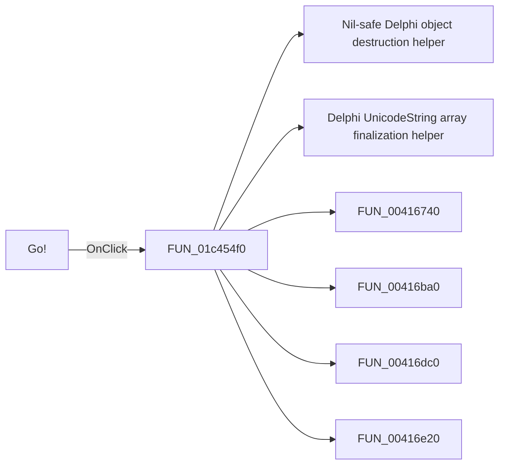

# Go!

> Analysis status: Pending individual source review.

## Control

| Property | Recovered value |
| --- | --- |
| Form | frmSelectTinaFolder |
| Component path | frmSelectTinaFolder.btnOK |
| Control class | TBitBtn |
| Caption | Go! |
| Hint | Not present in the recovered resource. |
| Text | Not present in the recovered resource. |
| Handler name | btnOKClick |
| Handler address | 01c454f0 |
| Graph node | `resource:dfm:frmSelectTinaFolder/frmSelectTinaFolder.btnOK` |
| Handler node | `function:01c454f0` |
| Graph layer | UI |

## What happens when clicked

Pending individual analysis. An agent must read the recovered handler source and its relevant callees before it replaces this text.

## Click flow

## Handler evidence

- Source: [DecompiledSources/Tina16/functions/0000000001C454F0__FUN_01c454f0.c](../../../DecompiledSources/Tina16/functions/0000000001C454F0__FUN_01c454f0.c)
- Recovered role: Not present in the recovered resource.
- Current graph summary: Handles 1 Delphi UI event: frmSelectTinaFolder.btnOK.OnClick.
- Current graph behavior: Not present in the recovered resource.
- Current graph evidence: Not present in the recovered resource.
- Complexity: complex
- Distinct outgoing calls: 29

## Direct calls

- `function:00410f20` — Nil-safe Delphi object destruction helper
- `function:00414560` — Delphi UnicodeString array finalization helper
- `function:00416740` — FUN_00416740
- `function:00416ba0` — FUN_00416ba0
- `function:00416dc0` — FUN_00416dc0
- `function:00416e20` — FUN_00416e20
- `function:004170c0` — FUN_004170c0
- `function:0041ddd0` — FUN_0041ddd0
- `function:0043e420` — FUN_0043e420
- `function:00441640` — FUN_00441640
- `function:00441a10` — FUN_00441a10
- `function:00442f70` — FUN_00442f70
- `function:004b5390` — Delphi string-list value getter
- `function:004b6930` — FUN_004b6930
- `function:004b8ba0` — FUN_004b8ba0
- `function:004b9860` — Delphi file-stream constructor wrapper
- `function:0072d440` — FUN_0072d440
- `function:0072d730` — FUN_0072d730
- `function:007fc180` — FUN_007fc180
- `function:008059a0` — FUN_008059a0
- `function:0080cc70` — FUN_0080cc70
- `function:00b89270` — FUN_00b89270
- `function:00b8e650` — FUN_00b8e650
- `function:00b96de0` — FUN_00b96de0
- `function:00b96df0` — FUN_00b96df0
- `function:00c54370` — FUN_00c54370
- `function:00f06730` — FUN_00f06730
- `function:01c46ed0` — FUN_01c46ed0
- `function:01c470b0` — FUN_01c470b0

## Resource evidence

- Kind: bkOK
- Modal result: Not present in the recovered resource.
- Checked state: Not present in the recovered resource.
- List items: Not present in the recovered resource.
- Image reference: Not present in the recovered resource.
- Extracted glyph: None.

## Nearby label candidates

Nearby labels are layout candidates only. They are not proof of behavior.

- Rank 1: Select an earlier version of TINA to import Libraries, Examples and Designs at distance 396.

## Analysis limits

- Do not infer behavior from the control class, caption, hint, glyph, or nearby label alone.
- Do not replace the pending status until the handler source and relevant call path provide enough evidence.
