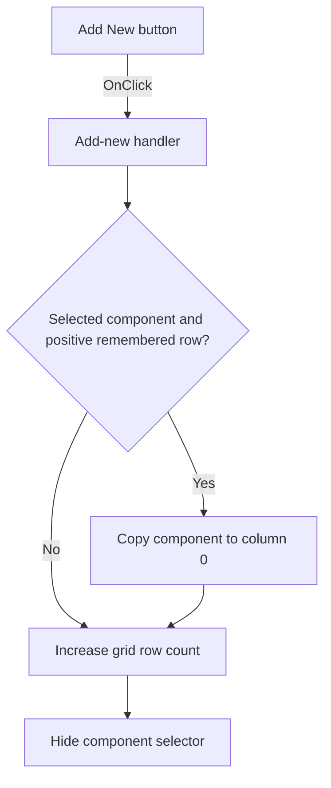

# A&dd New

> Analysis status: Individually reviewed from recovered source.

## Control

| Property | Recovered value |
| --- | --- |
| Form | frmSetCompMainValueLimits |
| Component path | frmSetCompMainValueLimits.AddNew |
| Control class | TBitBtn |
| Caption | A&dd New |
| Hint | Not present in the recovered resource. |
| Text | Not present in the recovered resource. |
| Handler name | AddNewClick |
| Handler address | 01c48760 |
| Graph node | `resource:dfm:frmSetCompMainValueLimits/frmSetCompMainValueLimits.AddNew` |
| Handler node | `function:01c48760` |
| Graph layer | UI |

## What happens when clicked

The handler first preserves a pending component choice when the hidden component selector has a selected item and the remembered grid row is positive. It copies the selected item to column 0 of that row. It then increases the string-grid row count by one and hides the component selector. The row is added even when there is no selected component or no positive remembered row. The recovered handler does not initialize the new row or move the grid selection.

## Click flow

## Handler evidence

- Source: [DecompiledSources/Tina16/functions/0000000001C48760__FUN_01c48760.c](../../../DecompiledSources/Tina16/functions/0000000001C48760__FUN_01c48760.c)
- Recovered role: Appends a limit row after preserving a pending component choice.
- Current graph summary: Handles 1 Delphi UI event: frmSetCompMainValueLimits.AddNew.OnClick.
- Current graph behavior: Conditionally copies the selected component to the remembered row, appends one grid row, and hides the component selector.
- Current graph evidence: The handler tests the selector item index and form field `+0x6F8`, reads the selected item, writes grid cell `(0, +0x6F8)`, calls the row-count setter with `RowCount + 1`, and passes false to the selector visibility setter.
- Complexity: complex
- Distinct outgoing calls: 4

## Direct calls

- `function:00414480` — finalizes the temporary selected-item string.
- `function:0064dbe0` — sets the component selector visibility to false.
- `function:00848a70` — updates the grid row count and enforces its internal minimum.
- `function:0084e3e0` — writes the selected component text to a grid cell and refreshes the grid structures.

## Resource evidence

- Kind: Not present in the recovered resource.
- Modal result: Not present in the recovered resource.
- Checked state: Not present in the recovered resource.
- List items: Not present in the recovered resource.
- Image reference: Not present in the recovered resource.
- Extracted glyph: None.

## Nearby label candidates

Nearby labels are layout candidates only. They are not proof of behavior.

- No same-parent label candidate is available.

## Analysis limits

- The recovered source does not identify the Delphi field name for form offset `+0x6F8`. The grid selection handler proves that it stores the current row.
- The click handler does not initialize the appended row's cells, change the grid selection, or validate limit values.
