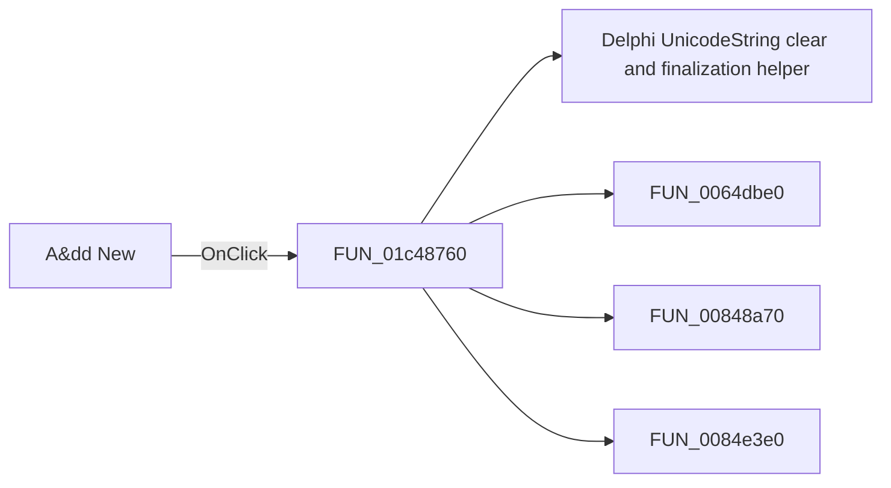

# A&dd New

> Analysis status: Pending individual source review.

## Control

| Property | Recovered value |
| --- | --- |
| Form | frmSetCompMainValueLimits |
| Component path | frmSetCompMainValueLimits.AddNew |
| Control class | TBitBtn |
| Caption | A&dd New |
| Hint | Not present in the recovered resource. |
| Text | Not present in the recovered resource. |
| Handler name | AddNewClick |
| Handler address | 01c48760 |
| Graph node | `resource:dfm:frmSetCompMainValueLimits/frmSetCompMainValueLimits.AddNew` |
| Handler node | `function:01c48760` |
| Graph layer | UI |

## What happens when clicked

Pending individual analysis. An agent must read the recovered handler source and its relevant callees before it replaces this text.

## Click flow

## Handler evidence

- Source: [DecompiledSources/Tina16/functions/0000000001C48760__FUN_01c48760.c](../../../DecompiledSources/Tina16/functions/0000000001C48760__FUN_01c48760.c)
- Recovered role: Not present in the recovered resource.
- Current graph summary: Handles 1 Delphi UI event: frmSetCompMainValueLimits.AddNew.OnClick.
- Current graph behavior: Not present in the recovered resource.
- Current graph evidence: Not present in the recovered resource.
- Complexity: complex
- Distinct outgoing calls: 4

## Direct calls

- `function:00414480` — Delphi UnicodeString clear and finalization helper
- `function:0064dbe0` — FUN_0064dbe0
- `function:00848a70` — FUN_00848a70
- `function:0084e3e0` — FUN_0084e3e0

## Resource evidence

- Kind: Not present in the recovered resource.
- Modal result: Not present in the recovered resource.
- Checked state: Not present in the recovered resource.
- List items: Not present in the recovered resource.
- Image reference: Not present in the recovered resource.
- Extracted glyph: None.

## Nearby label candidates

Nearby labels are layout candidates only. They are not proof of behavior.

- No same-parent label candidate is available.

## Analysis limits

- Do not infer behavior from the control class, caption, hint, glyph, or nearby label alone.
- Do not replace the pending status until the handler source and relevant call path provide enough evidence.
