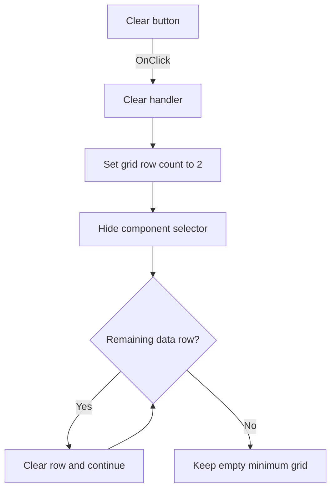

# &Clear

> Analysis status: Individually reviewed from recovered source.

## Control

| Property | Recovered value |
| --- | --- |
| Form | frmSetCompMainValueLimits |
| Component path | frmSetCompMainValueLimits.Clear |
| Control class | TButton |
| Caption | &Clear |
| Hint | Not present in the recovered resource. |
| Text | Not present in the recovered resource. |
| Handler name | ClearClick |
| Handler address | 01c489a0 |
| Graph node | `resource:dfm:frmSetCompMainValueLimits/frmSetCompMainValueLimits.Clear` |
| Handler node | `function:01c489a0` |
| Graph layer | UI |

## What happens when clicked

The handler sets the string grid row count to 2 and hides the component selector. It then clears every remaining data row from `FixedRows` through `RowCount - 1`. This keeps the fixed header area and the minimum editable-row layout but removes the current limit data. The handler does not change the attached limit list. That list is rebuilt only by the OK handler.

## Click flow

## Handler evidence

- Source: [DecompiledSources/Tina16/functions/0000000001C489A0__FUN_01c489a0.c](../../../DecompiledSources/Tina16/functions/0000000001C489A0__FUN_01c489a0.c)
- Recovered role: Clears limit rows while preserving the grid's minimum layout.
- Current graph summary: Handles 1 Delphi UI event: frmSetCompMainValueLimits.Clear.OnClick.
- Current graph behavior: Sets the grid to two rows, hides the component selector, and clears all remaining rows after the fixed header rows.
- Current graph evidence: The handler calls the row-count setter with 2, passes false to the selector visibility setter, then loops from the grid `FixedRows` value at `+0x4C0` through `RowCount - 1` and clears each returned row object through virtual slot `+0x90`.
- Complexity: complex
- Distinct outgoing calls: 3

## Direct calls

- `function:0064dbe0` — sets the component selector visibility to false.
- `function:00848a70` — sets the grid row count to 2 and applies the grid's internal minimum.
- `function:0084e3c0` — obtains each grid row object that the handler clears.

## Resource evidence

- Kind: Not present in the recovered resource.
- Modal result: Not present in the recovered resource.
- Checked state: Not present in the recovered resource.
- List items: Not present in the recovered resource.
- Image reference: Not present in the recovered resource.
- Extracted glyph: None.

## Nearby label candidates

Nearby labels are layout candidates only. They are not proof of behavior.

- No same-parent label candidate is available.

## Analysis limits

- The row-object virtual call is recovered, but its Delphi method name is not.
- This click changes the editor grid only. It does not clear the attached limit list until the user clicks OK.
