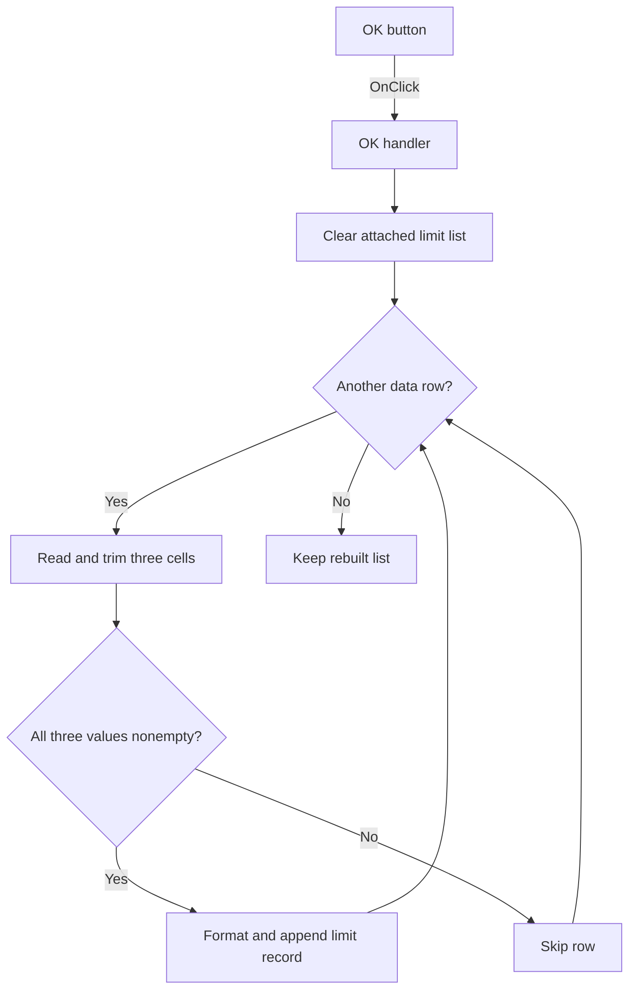

# OKBtn

> Analysis status: Individually reviewed from recovered source.

## Control

| Property | Recovered value |
| --- | --- |
| Form | frmSetCompMainValueLimits |
| Component path | frmSetCompMainValueLimits.OKBtn |
| Control class | TBitBtn |
| Caption | Not present in the recovered resource. |
| Hint | Not present in the recovered resource. |
| Text | Not present in the recovered resource. |
| Handler name | OKBtnClick |
| Handler address | 01c48530 |
| Graph node | `resource:dfm:frmSetCompMainValueLimits/frmSetCompMainValueLimits.OKBtn` |
| Handler node | `function:01c48530` |
| Graph layer | UI |

## What happens when clicked

The handler clears the attached limit string list, then scans grid rows from `FixedRows` through `RowCount - 1`. For each row, it reads the component, minimum, and maximum cells and removes leading and trailing whitespace. It accepts the row only when all three trimmed values are nonempty. It joins the accepted values with fixed recovered wrapper and separator data and appends the result to the destination list. Empty or incomplete rows are skipped. The handler does not validate that the minimum and maximum values are numeric, and it has no rollback if processing stops after the list is cleared. The button's `bkOK` kind supplies the modal acceptance behavior outside this function.

## Click flow

## Handler evidence

- Source: [DecompiledSources/Tina16/functions/0000000001C48530__FUN_01c48530.c](../../../DecompiledSources/Tina16/functions/0000000001C48530__FUN_01c48530.c)
- Recovered role: Rebuilds the attached component-limit list from complete grid rows.
- Current graph summary: Handles 1 Delphi UI event: frmSetCompMainValueLimits.OKBtn.OnClick.
- Current graph behavior: Clears the destination list, trims three grid cells per data row, and appends only complete component, minimum, and maximum records.
- Current graph evidence: The handler clears the string list at attached object field `+0x448`, reads grid columns 0 through 2 from `FixedRows` through `RowCount - 1`, trims each value, tests all three for nonempty strings, formats them with fixed data, and appends each result through virtual slot `+0x78`.
- Complexity: complex
- Distinct outgoing calls: 4

## Direct calls

- `function:00414560` — finalizes the eight temporary UnicodeString values.
- `function:00416cd0` — joins the component and limit values with the fixed recovered wrapper and separator data.
- `function:0043ea00` — removes leading and trailing whitespace from each cell value.
- `function:0084e320` — reads text from one grid cell.

## Resource evidence

- Kind: bkOK
- Modal result: Not present in the recovered resource.
- Checked state: Not present in the recovered resource.
- List items: Not present in the recovered resource.
- Image reference: Not present in the recovered resource.
- Extracted glyph: None.

## Nearby label candidates

Nearby labels are layout candidates only. They are not proof of behavior.

- No same-parent label candidate is available.

## Analysis limits

- The fixed data at `DAT_01C48748` and `LAB_01C48758` is not decoded in the exported source, so the exact wrapper and separator text remains unknown.
- The source checks only for nonempty trimmed text. It does not validate numeric ranges, report row errors, or provide rollback.
