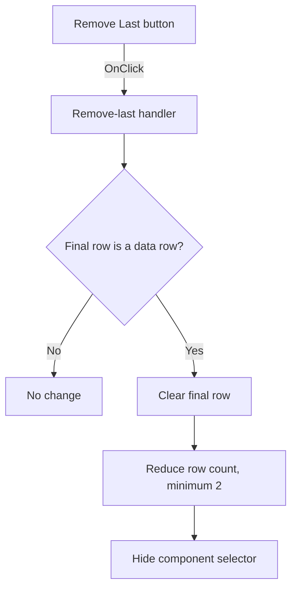

# &Remove Last

> Analysis status: Individually reviewed from recovered source.

## Control

| Property | Recovered value |
| --- | --- |
| Form | frmSetCompMainValueLimits |
| Component path | frmSetCompMainValueLimits.RemoveLast |
| Control class | TBitBtn |
| Caption | &Remove Last |
| Hint | Not present in the recovered resource. |
| Text | Not present in the recovered resource. |
| Handler name | RemoveLastClick |
| Handler address | 01c48860 |
| Graph node | `resource:dfm:frmSetCompMainValueLimits/frmSetCompMainValueLimits.RemoveLast` |
| Handler node | `function:01c48860` |
| Graph layer | UI |

## What happens when clicked

The handler targets the final grid row, not the selected row. If the final row is at or after `FixedRows`, it clears that row, reduces the row count by one with a minimum of 2, and hides the component selector. At the two-row minimum, the click clears the final editable row but keeps the same row count. If no data row exists after the fixed rows, the click makes no change.

## Click flow

## Handler evidence

- Source: [DecompiledSources/Tina16/functions/0000000001C48860__FUN_01c48860.c](../../../DecompiledSources/Tina16/functions/0000000001C48860__FUN_01c48860.c)
- Recovered role: Removes the final limit row while preserving the grid's minimum layout.
- Current graph summary: Handles 1 Delphi UI event: frmSetCompMainValueLimits.RemoveLast.OnClick.
- Current graph behavior: Clears the final data row, reduces the row count with a minimum of two, and hides the component selector.
- Current graph evidence: The handler compares `RowCount - 1` at grid offset `+0x4E0` with `FixedRows` at `+0x4C0`, clears the returned row object through virtual slot `+0x90`, calls the row-count setter with `max(RowCount - 1, 2)`, and passes false to the selector visibility setter.
- Complexity: complex
- Distinct outgoing calls: 3

## Direct calls

- `function:0064dbe0` — sets the component selector visibility to false.
- `function:00848a70` — updates the grid row count and enforces its internal minimum.
- `function:0084e3c0` — obtains the final grid row object that the handler clears.

## Resource evidence

- Kind: Not present in the recovered resource.
- Modal result: Not present in the recovered resource.
- Checked state: Not present in the recovered resource.
- List items: Not present in the recovered resource.
- Image reference: Not present in the recovered resource.
- Extracted glyph: None.

## Nearby label candidates

Nearby labels are layout candidates only. They are not proof of behavior.

- No same-parent label candidate is available.

## Analysis limits

- The row-object virtual call is recovered, but its Delphi method name is not.
- The source proves removal from the end of the grid only. It does not use the current cell or selected row.
