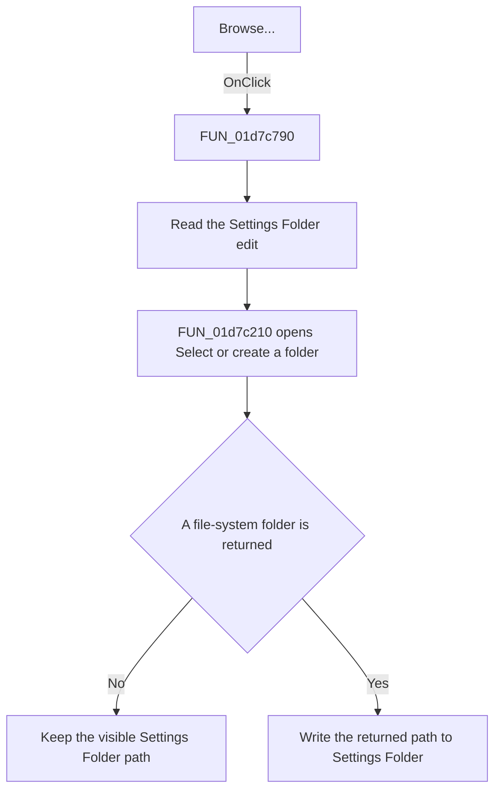

# Browse...

> Analysis status: Source reviewed. The folder selection and cancel paths are
> supported by the handler and shared shell-folder helper.

## Control

| Property | Recovered value |
| --- | --- |
| Form | frmSetEnvVars |
| Component path | frmSetEnvVars.btnBrowseSettingsDir |
| Control class | TButton |
| Caption | Browse... |
| Hint | Not present in the recovered resource. |
| Text | Not present in the recovered resource. |
| Handler name | btnBrowseSettingsDirClick |
| Handler address | 01d7c790 |
| Graph node | `resource:dfm:frmSetEnvVars/frmSetEnvVars.btnBrowseSettingsDir` |
| Handler node | `function:01d7c790` |
| Graph layer | UI |

## What happens when clicked

The click reads the current `Settings Folder` edit and opens the shared folder
picker with title `Select or create a folder`. If the current text names an
existing directory, the helper uses it as the initial folder. If it is not an
existing directory, the helper clears only its temporary input before it opens
the picker.

If the user selects a file-system folder, the handler writes the returned path
to the Settings Folder edit. If the user cancels or the shell call fails, it
does not write the edit, so the visible path stays unchanged. The click does
not create the settings directory. `Create Folders` performs that operation.

## Click flow

## Handler evidence

- Source: [DecompiledSources/Tina16/functions/0000000001D7C790__FUN_01d7c790.c](../../../DecompiledSources/Tina16/functions/0000000001D7C790__FUN_01d7c790.c)
- Recovered role: Settings-folder browse handler.
- Current graph summary: Handles 1 Delphi UI event: frmSetEnvVars.btnBrowseSettingsDir.OnClick.
- Current graph behavior: The checked-in graph does not yet contain a curated behavior description for this function.
- Current graph evidence: The resource trigger resolves to this handler. Its body reads and conditionally writes form field `+0x6B0` around the shared shell-folder helper.
- Complexity: complex
- Distinct outgoing calls: 4

## Direct calls

- `function:00414480` — Delphi UnicodeString clear and finalization helper
- `function:0064dd90` — VCL control Unicode text reader
- `function:0064de00` — VCL control text setter with change suppression
- `function:01d7c210` — [FUN_01d7c210](../../../DecompiledSources/Tina16/functions/0000000001D7C210__FUN_01d7c210.c), the shared shell-folder picker.

## Resource evidence

- Kind: Not present in the recovered resource.
- Modal result: Not present in the recovered resource.
- Checked state: Not present in the recovered resource.
- List items: Not present in the recovered resource.
- Image reference: Not present in the recovered resource.
- Extracted glyph: None.

## Nearby label candidates

Nearby labels are layout candidates only. They are not proof of behavior.

- Rank 1: Private Catalog Folder at distance 317.
- Rank 2: Settings Folder at distance 348.
- Rank 3: Temporary Folder at distance 390.

## Analysis limits

- The handler does not validate write access or create the selected folder.
- Shell errors and cancellation both return false from the shared helper. The
  handler intentionally gives them the same no-change result.
