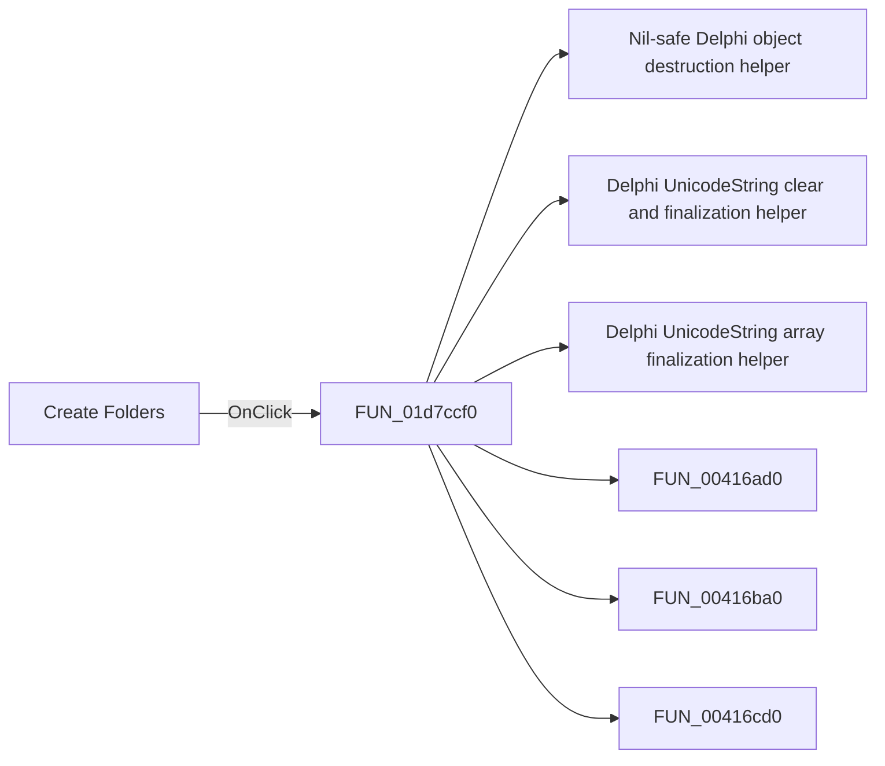

# Create Folders

> Analysis status: Pending individual source review.

## Control

| Property | Recovered value |
| --- | --- |
| Form | frmSetEnvVars |
| Component path | frmSetEnvVars.btnCreateEnvVars |
| Control class | TButton |
| Caption | Create Folders |
| Hint | Not present in the recovered resource. |
| Text | Not present in the recovered resource. |
| Handler name | btnCreateEnvVarsClick |
| Handler address | 01d7ccf0 |
| Graph node | `resource:dfm:frmSetEnvVars/frmSetEnvVars.btnCreateEnvVars` |
| Handler node | `function:01d7ccf0` |
| Graph layer | UI |

## What happens when clicked

Pending individual analysis. An agent must read the recovered handler source and its relevant callees before it replaces this text.

## Click flow

## Handler evidence

- Source: [DecompiledSources/Tina16/functions/0000000001D7CCF0__FUN_01d7ccf0.c](../../../DecompiledSources/Tina16/functions/0000000001D7CCF0__FUN_01d7ccf0.c)
- Recovered role: Not present in the recovered resource.
- Current graph summary: Handles 1 Delphi UI event: frmSetEnvVars.btnCreateEnvVars.OnClick.
- Current graph behavior: Not present in the recovered resource.
- Current graph evidence: Not present in the recovered resource.
- Complexity: complex
- Distinct outgoing calls: 14

## Direct calls

- `function:00410f20` — Nil-safe Delphi object destruction helper
- `function:00414480` — Delphi UnicodeString clear and finalization helper
- `function:00414560` — Delphi UnicodeString array finalization helper
- `function:00416ad0` — FUN_00416ad0
- `function:00416ba0` — FUN_00416ba0
- `function:00416cd0` — FUN_00416cd0
- `function:005ea3c0` — FUN_005ea3c0
- `function:005ea630` — FUN_005ea630
- `function:005ea670` — FUN_005ea670
- `function:005ea880` — FUN_005ea880
- `function:005eb630` — FUN_005eb630
- `function:0064dd90` — VCL control Unicode text reader
- `function:00b96df0` — FUN_00b96df0
- `function:01d7ca00` — FUN_01d7ca00

## Resource evidence

- Kind: Not present in the recovered resource.
- Modal result: 1
- Checked state: Not present in the recovered resource.
- List items: Not present in the recovered resource.
- Image reference: Not present in the recovered resource.
- Extracted glyph: None.

## Nearby label candidates

Nearby labels are layout candidates only. They are not proof of behavior.

- Rank 1: Temporary Folder at distance 202.
- Rank 2: Private Catalog Folder at distance 275.
- Rank 3: Settings Folder at distance 348.

## Analysis limits

- Do not infer behavior from the control class, caption, hint, glyph, or nearby label alone.
- Do not replace the pending status until the handler source and relevant call path provide enough evidence.
