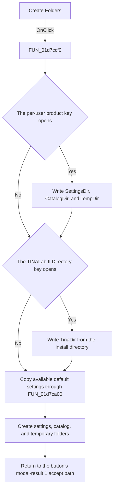

# Create Folders

> Analysis status: Source reviewed. The registry writes, folder creation, and
> default-settings copy are supported by the handler and helper source.

## Control

| Property | Recovered value |
| --- | --- |
| Form | frmSetEnvVars |
| Component path | frmSetEnvVars.btnCreateEnvVars |
| Control class | TButton |
| Caption | Create Folders |
| Hint | Not present in the recovered resource. |
| Text | Not present in the recovered resource. |
| Handler name | btnCreateEnvVarsClick |
| Handler address | 01d7ccf0 |
| Graph node | `resource:dfm:frmSetEnvVars/frmSetEnvVars.btnCreateEnvVars` |
| Handler node | `function:01d7ccf0` |
| Graph layer | UI |

## What happens when clicked

The click applies the three displayed directory paths. It first opens or
creates this per-user registry key under `HKEY_CURRENT_USER`:

`SOFTWARE\DesignSoft\<product>`

If that key opens, the handler writes `SettingsDir`, `CatalogDir`, and
`TempDir` from the three edits. It then opens or creates
`SOFTWARE\DesignSoft\TINALab II\Directory`. If that key opens, it writes the
application install directory as `TinaDir`. A failed key open skips only the
values for that key. The handler continues with folder creation.

The handler creates these directory roots and subdirectories:

- The selected Settings Folder.
- `User Examples` and `Macrolib` below the Settings Folder.
- `Buttons`, `Spicelib`, `Templates`, `VHDL\MCU\Include`, and
  `VHDL\Packages` below the Private Catalog Folder.
- One additional catalog subdirectory whose global string is not decoded in
  the recovered source.
- The selected Temporary Folder.

Before it creates the settings subdirectories, `FUN_01d7ca00` checks for the
corresponding `.bak` defaults in the application install directory and copies
each available default to the selected Settings Folder. The requested live
settings files are:

- `fpeditor.ini`
- `layers.ini`
- `meas.ini`
- `3D Viewer.ini`
- `pcb.ini`
- `shapeDefs.ini`
- `TINA.INI`
- `tsuper.ini`
- `fpga_pinout.txt`
- `Edison5.ini`
- `VHDL\vhdl_95_global.ini`

The recovered handler does not check the return value of a directory-create
or file-copy call. It has no local catch, retry, rollback, or user-message
branch. The button resource has modal result `1`, so a normal handler return
continues through the dialog's accept path.

## Click flow

## Handler evidence

- Source: [DecompiledSources/Tina16/functions/0000000001D7CCF0__FUN_01d7ccf0.c](../../../DecompiledSources/Tina16/functions/0000000001D7CCF0__FUN_01d7ccf0.c)
- Recovered role: Per-user directory registration and folder-setup handler.
- Current graph summary: Handles 1 Delphi UI event: frmSetEnvVars.btnCreateEnvVars.OnClick.
- Current graph behavior: The checked-in graph does not yet contain a curated behavior description for this function.
- Current graph evidence: The resource trigger resolves to this handler. Its call tree contains registry-key open and string-value writes, VCL text reads, repeated directory creation, and the default-settings copy helper.
- Complexity: complex
- Distinct outgoing calls: 14

## Direct calls

- `function:00410f20` — Nil-safe Delphi object destruction helper
- `function:00414480` — Delphi UnicodeString clear and finalization helper
- `function:00414560` — Delphi UnicodeString array finalization helper
- `function:00416ad0` — FUN_00416ad0
- `function:00416ba0` — FUN_00416ba0
- `function:00416cd0` — FUN_00416cd0
- `function:005ea3c0` — FUN_005ea3c0
- `function:005ea630` — FUN_005ea630
- `function:005ea670` — FUN_005ea670
- `function:005ea880` — FUN_005ea880
- `function:005eb630` — FUN_005eb630
- `function:0064dd90` — VCL control Unicode text reader
- `function:00b96df0` — FUN_00b96df0
- `function:01d7ca00` — FUN_01d7ca00

The application-relevant calls are:

- [FUN_01d7ca00](../../../DecompiledSources/Tina16/functions/0000000001D7CA00__FUN_01d7ca00.c)
  checks for each install-directory `.bak` default and copies available files
  to their live path below the Settings Folder.
- [FUN_00b96df0](../../../DecompiledSources/Tina16/functions/0000000000B96DF0__FUN_00b96df0.c)
  wraps the recovered recursive directory-creation path used for every root
  and subdirectory.
- [FUN_005eb630](../../../DecompiledSources/Tina16/functions/00000000005EB630__FUN_005eb630.c)
  writes each Unicode directory string as a registry value.

## Resource evidence

- Kind: Not present in the recovered resource.
- Modal result: 1
- Checked state: Not present in the recovered resource.
- List items: Not present in the recovered resource.
- Image reference: Not present in the recovered resource.
- Extracted glyph: None.

## Nearby label candidates

Nearby labels are layout candidates only. They are not proof of behavior.

- Rank 1: Temporary Folder at distance 202.
- Rank 2: Private Catalog Folder at distance 275.
- Rank 3: Settings Folder at distance 348.

## Analysis limits

- The product-specific registry-key suffix comes from global
  `PTR_DAT_020018e0`; its text is not decoded in the recovered source.
- The catalog subdirectory from `PTR_DAT_02004c08` is not decoded. This article
  does not invent its name.
- `FUN_00427810` is recovered as an indirect file-operation thunk. Its use in
  `FUN_01d7ca00` proves the source and destination data flow, but its overwrite
  policy and error reporting are not recovered.
- The Create Folders caption does not describe the registry writes. Those
  writes are explicit in the handler source.
