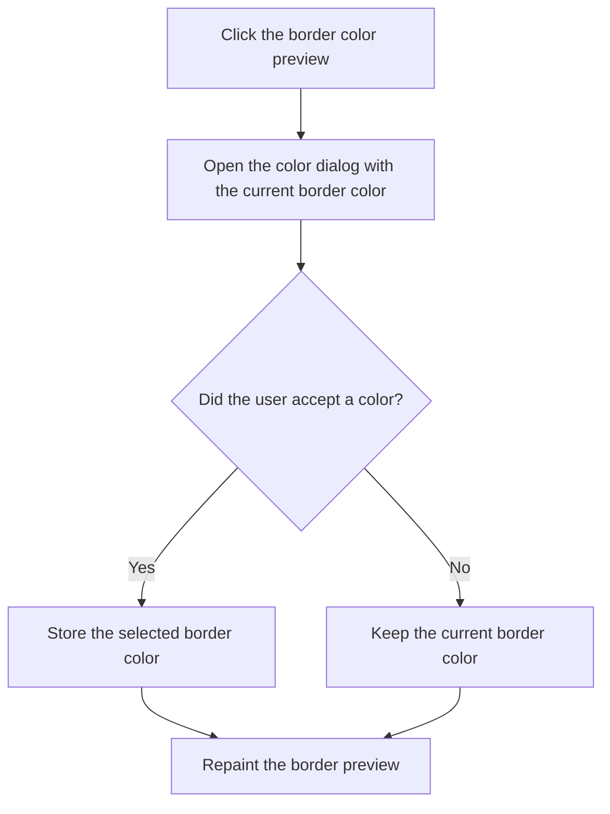

# pbFrColor

> Analysis status: Reviewed against the recovered shared handler, sender branch, and paint path.

## Control

| Property | Recovered value |
| --- | --- |
| Form | frmShapeProps |
| Component path | frmShapeProps.gbBorder.pbFrColor |
| Control class | TPaintBox |
| Caption | Not present in the recovered resource. |
| Hint | Not present in the recovered resource. |
| Text | Not present in the recovered resource. |
| Handler name | EditColor |
| Handler address | 00c5b7e0 |
| Graph node | `resource:dfm:frmShapeProps/frmShapeProps.gbBorder.pbFrColor` |
| Handler node | `function:00c5b7e0` |
| Graph layer | UI |

## What happens when clicked

The paint box opens a color dialog for the border color. The dialog starts with the current border color. If the user accepts the dialog, the handler stores the selected color. If the user cancels it, the stored color stays unchanged. The handler then repaints the border preview.

## Click flow

## Handler evidence

- Source: [DecompiledSources/Tina16/functions/0000000000C5B7E0__FUN_00c5b7e0.c](../../../DecompiledSources/Tina16/functions/0000000000C5B7E0__FUN_00c5b7e0.c)
- Recovered role: Edits the border color or the shared background and arrow-head color according to Sender.
- Current graph summary: Handles 6 Delphi UI events: frmShapeProps.gbBorder.pbFrColor.OnClick, frmShapeProps.gbBorder.sbFrColor.OnClick, frmShapeProps.gbBackground.pbBdColor.OnClick.
- Current graph behavior: Opens a VCL color dialog with the applicable stored color. Dialog acceptance replaces the value; cancellation keeps it. Border senders update the border field and repaint one preview. Background and arrow-head senders update their shared field and repaint both previews.
- Current graph evidence: The handler treats senders at form offsets `0x6d0` and `0x6d8` as the border branch and all other bound senders as the shared branch. It initializes the dialog color at offset `0xd0`, replaces the local value only when virtual Execute returns nonzero, destroys the dialog, writes form offset `0x7e0` or `0x7e4`, and invalidates the applicable paint boxes through VMT slot `0x180`. `PaintColor` reads `0x7e0` only for `pbFrColor`; the other two previews read `0x7e4`.
- Complexity: moderate
- Distinct outgoing calls: 2

## Direct calls

- `function:00410f20` — Nil-safe Delphi object destruction helper
- `function:00724d70` — FUN_00724d70

## Resource evidence

- Kind: Not present in the recovered resource.
- Modal result: Not present in the recovered resource.
- Checked state: Not present in the recovered resource.
- List items: Not present in the recovered resource.
- Image reference: Not present in the recovered resource.
- Extracted glyph: None.

## Nearby label candidates

Nearby labels are layout candidates only. They are not proof of behavior.

- Rank 1: &Color: at distance 105.
- Rank 2: &Thickness: at distance 130.

## Analysis limits

- This handler stages the form value. The caller that applies an accepted Shape Properties dialog is not part of this click path.
