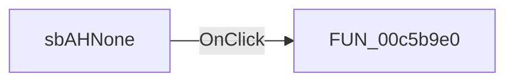

# sbAHNone

> Analysis status: Pending individual source review.

## Control

| Property | Recovered value |
| --- | --- |
| Form | frmShapeProps |
| Component path | frmShapeProps.gbArrowHead.sbAHNone |
| Control class | TSpeedButton |
| Caption | Not present in the recovered resource. |
| Hint | Not present in the recovered resource. |
| Text | Not present in the recovered resource. |
| Handler name | NoColor |
| Handler address | 00c5b9e0 |
| Graph node | `resource:dfm:frmShapeProps/frmShapeProps.gbArrowHead.sbAHNone` |
| Handler node | `function:00c5b9e0` |
| Graph layer | UI |

## What happens when clicked

Pending individual analysis. An agent must read the recovered handler source and its relevant callees before it replaces this text.

## Click flow

## Handler evidence

- Source: [DecompiledSources/Tina16/functions/0000000000C5B9E0__FUN_00c5b9e0.c](../../../DecompiledSources/Tina16/functions/0000000000C5B9E0__FUN_00c5b9e0.c)
- Recovered role: Not present in the recovered resource.
- Current graph summary: Handles 3 Delphi UI events: frmShapeProps.gbBorder.sbFrNone.OnClick, frmShapeProps.gbBackground.sbBdNone.OnClick, frmShapeProps.gbArrowHead.sbAHNone.OnClick.
- Current graph behavior: Not present in the recovered resource.
- Current graph evidence: Not present in the recovered resource.
- Complexity: simple
- Distinct outgoing calls: 0

## Direct calls

- No direct call edge is present in the recovered graph.

## Resource evidence

- Kind: Not present in the recovered resource.
- Modal result: Not present in the recovered resource.
- Checked state: Not present in the recovered resource.
- List items: Not present in the recovered resource.
- Image reference: Not present in the recovered resource.
- Extracted glyph: [`0193_frmShapeProps_frmShapeProps_gbArrowHead_sbAHNone_Glyph_Data.png`](../../../glyph/0193_frmShapeProps_frmShapeProps_gbArrowHead_sbAHNone_Glyph_Data.png)

## Nearby label candidates

Nearby labels are layout candidates only. They are not proof of behavior.

- Rank 1: (X = same as border color) at distance 159.
- Rank 2: &Head color: at distance 198.
- Rank 3: &Start head type: at distance 241.

## Analysis limits

- Do not infer behavior from the control class, caption, hint, glyph, or nearby label alone.
- Do not replace the pending status until the handler source and relevant call path provide enough evidence.
