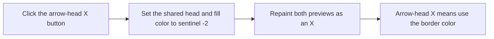

# sbAHNone

> Analysis status: Reviewed against the recovered shared handler, sender branch, paint path, glyph, and nearby label.

## Control

| Property | Recovered value |
| --- | --- |
| Form | frmShapeProps |
| Component path | frmShapeProps.gbArrowHead.sbAHNone |
| Control class | TSpeedButton |
| Caption | Not present in the recovered resource. |
| Hint | Not present in the recovered resource. |
| Text | Not present in the recovered resource. |
| Handler name | NoColor |
| Handler address | 00c5b9e0 |
| Graph node | `resource:dfm:frmShapeProps/frmShapeProps.gbArrowHead.sbAHNone` |
| Handler node | `function:00c5b9e0` |
| Graph layer | UI |

## What happens when clicked

The button sets the shared arrow-head and background color field to sentinel `-2`. It then repaints both previews as an X. The nearby recovered label states that the arrow-head X means **same as border color**. The extracted red-X glyph agrees with this state. The handler does not open a dialog and has no failure branch.

## Click flow

## Handler evidence

- Source: [DecompiledSources/Tina16/functions/0000000000C5B9E0__FUN_00c5b9e0.c](../../../DecompiledSources/Tina16/functions/0000000000C5B9E0__FUN_00c5b9e0.c)
- Recovered role: Clears the border color or shared background and arrow-head color according to Sender.
- Current graph summary: Handles 3 Delphi UI events: frmShapeProps.gbBorder.sbFrNone.OnClick, frmShapeProps.gbBackground.sbBdNone.OnClick, frmShapeProps.gbArrowHead.sbAHNone.OnClick.
- Current graph behavior: The border None sender writes sentinel -2 to the border field and repaints the border preview. The background and arrow-head None senders write the same sentinel to their shared field and repaint both previews. There is no dialog or conditional failure path.
- Current graph evidence: The handler compares Sender with the field at form offset `0x6e0`, which DFM field order and the adjacent EditColor sender offsets identify as `sbFrNone`. That branch writes `0xfffffffe` to `0x7e0` and invalidates `pbFrColor`. The other bound senders write `0xfffffffe` to `0x7e4` and invalidate `pbBdColor` and `pbAHColor`. `PaintColor` draws two diagonals instead of a solid fill when its selected value equals -2. The DFM label below the arrow-head color says `(X = same as border color)`.
- Complexity: simple
- Distinct outgoing calls: 0

## Direct calls

- No direct call edge is present in the recovered graph.

## Resource evidence

- Kind: Not present in the recovered resource.
- Modal result: Not present in the recovered resource.
- Checked state: Not present in the recovered resource.
- List items: Not present in the recovered resource.
- Image reference: Not present in the recovered resource.
- Extracted glyph: [`0193_frmShapeProps_frmShapeProps_gbArrowHead_sbAHNone_Glyph_Data.png`](../../../glyph/0193_frmShapeProps_frmShapeProps_gbArrowHead_sbAHNone_Glyph_Data.png)

## Nearby label candidates

Nearby labels are layout candidates only. They are not proof of behavior.

- Rank 1: (X = same as border color) at distance 159.
- Rank 2: &Head color: at distance 198.
- Rank 3: &Start head type: at distance 241.

## Analysis limits

- The recovered code proves one shared background and arrow-head color field. It does not show whether that coupling is a product rule or a legacy limitation.
