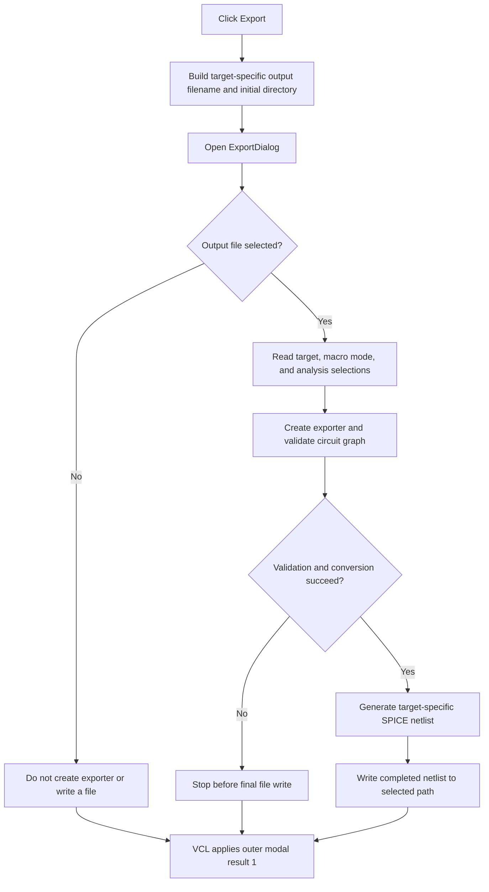

# Export

> Analysis status: Complete. The recovered handler configures a target-specific Save dialog and starts SPICE netlist generation only after the user selects an output file.

## Control

| Property | Recovered value |
| --- | --- |
| Form | frmSpiceExportDlg |
| Component path | frmSpiceExportDlg.btnExport |
| Control class | TButton |
| Caption | Export |
| Hint | Not present in the recovered resource. |
| Text | Not present in the recovered resource. |
| Handler name | btnExportClick |
| Handler address | 01bae230 |
| Graph node | `resource:dfm:frmSpiceExportDlg/frmSpiceExportDlg.btnExport` |
| Handler node | `function:01bae230` |
| Graph layer | UI |

## What happens when clicked

The handler reads the selected target from `cbxMode`. The recovered target list is **Tina**, **PSpice**, **LTSpice**, **SIMetrix**, **SIMPLIS**, and **Xyce**. `FUN_01bae0d0` maps indexes `0` through `5` to the filename infixes `.tina.`, `.pspice.`, `.ltspice.`, `.simetrix.`, `.simplis.`, and `.xyce.`. The handler combines the selected infix with the Save dialog's configured extension and replaces the source filename extension. It uses the source directory as the initial directory when that directory exists. Otherwise, it uses the application's `User Examples` directory.

The handler then executes `ExportDialog`. Cancel stops the handler before it creates an exporter or writes an output file. After acceptance, it builds an analysis bit mask from the three checkboxes:

- **Transient** sets bit `1`.
- **DC Transfer** sets bit `4`.
- **AC Transfer** sets bit `2`.

It also passes the selected target index and a Boolean that is true when the **Spice macros exported by** radio group selects item `1`, **content**, instead of item `0`, **reference**. The form-create handler preselects analysis checkboxes whose active settings differ from the reference settings. If none differ, it selects **Transient**. When the `ExtendedSpiceExport` feature is not available, form creation removes target items `2` through `5`; this leaves only Tina and PSpice.

After file selection, the handler creates the recovered exporter and passes it the selected file, the current circuit graph, the current analysis settings, the selected target, the analysis mask, the macro option, and the caller-supplied export object. `FUN_01a1f1b0` shows an **Exporting...** progress form, validates the graph, generates target-specific SPICE text, includes `.DC`, `.AC`, and `.TRAN` directives only for their selected bits, emits target-specific library and end records, and writes the completed text to the selected path. It can stop before the final file write when graph validation or conversion fails. The click handler does not retry the export or test a success result from the exporter.

The button resource declares modal result `1`. This VCL result belongs to the outer Spice export option dialog; it is separate from acceptance or cancellation of the nested Save dialog. Thus, nested Save-dialog Cancel produces no export even though the Export button is the outer dialog's accepted-result button.

## Click flow

## Handler evidence

- Source: [DecompiledSources/Tina16/functions/0000000001BAE230__FUN_01bae230.c](../../../DecompiledSources/Tina16/functions/0000000001BAE230__FUN_01bae230.c)
- Recovered role: Configure and run target-specific SPICE netlist export.
- Current graph summary: Handles 1 Delphi UI event: frmSpiceExportDlg.btnExport.OnClick.
- Current graph behavior: The checked-in graph has no imported behavior annotation yet. The reviewed source behavior is described above.
- Current graph evidence: The DFM, handler, form-create path, filename mapper, and exporter source support this article.
- Complexity: complex
- Distinct outgoing calls: 16

## Direct calls

- `function:00410f20` — Nil-safe Delphi object destruction helper
- `function:00414480` — Delphi UnicodeString clear and finalization helper
- `function:00414560` — Delphi UnicodeString array finalization helper
- `function:00414b50` — FUN_00414b50
- `function:00416ad0` — FUN_00416ad0
- `function:00416ba0` — FUN_00416ba0
- `function:004414c0` — FUN_004414c0
- `function:00441640` — FUN_00441640
- `function:00441920` — FUN_00441920
- `function:00724270` — FUN_00724270
- `function:00724380` — FUN_00724380
- `function:00724420` — FUN_00724420
- `function:01a1efc0` — FUN_01a1efc0
- `function:01a1f1b0` — FUN_01a1f1b0
- `function:01b22cb0` — FUN_01b22cb0
- `function:01bae0d0` — FUN_01bae0d0

## Resource evidence

- Kind: Not present in the recovered resource.
- Modal result: 1
- Checked state: Not present in the recovered resource.
- List items: Not present in the recovered resource.
- Image reference: Not present in the recovered resource.
- Extracted glyph: None.

## Nearby label candidates

Nearby labels are layout candidates only. They are not proof of behavior.

- Rank 1: Target at distance 188.

## Analysis limits

- The nearby **Target** label is only a layout candidate for this button. The `cbxMode` item list and handler data flow establish the target input.
- The Save dialog's existing extension text is not present in the extracted DFM properties. The handler proves that it appends that value after the selected target infix, but this article does not invent the final suffix.
- The recovered exporter contains many target-specific conversion branches. This article documents the option routing and final write boundary; it does not claim that all SPICE constructs convert without loss.
- The handler has no local exception handler or rollback. An exception can propagate after the Save dialog returns.
