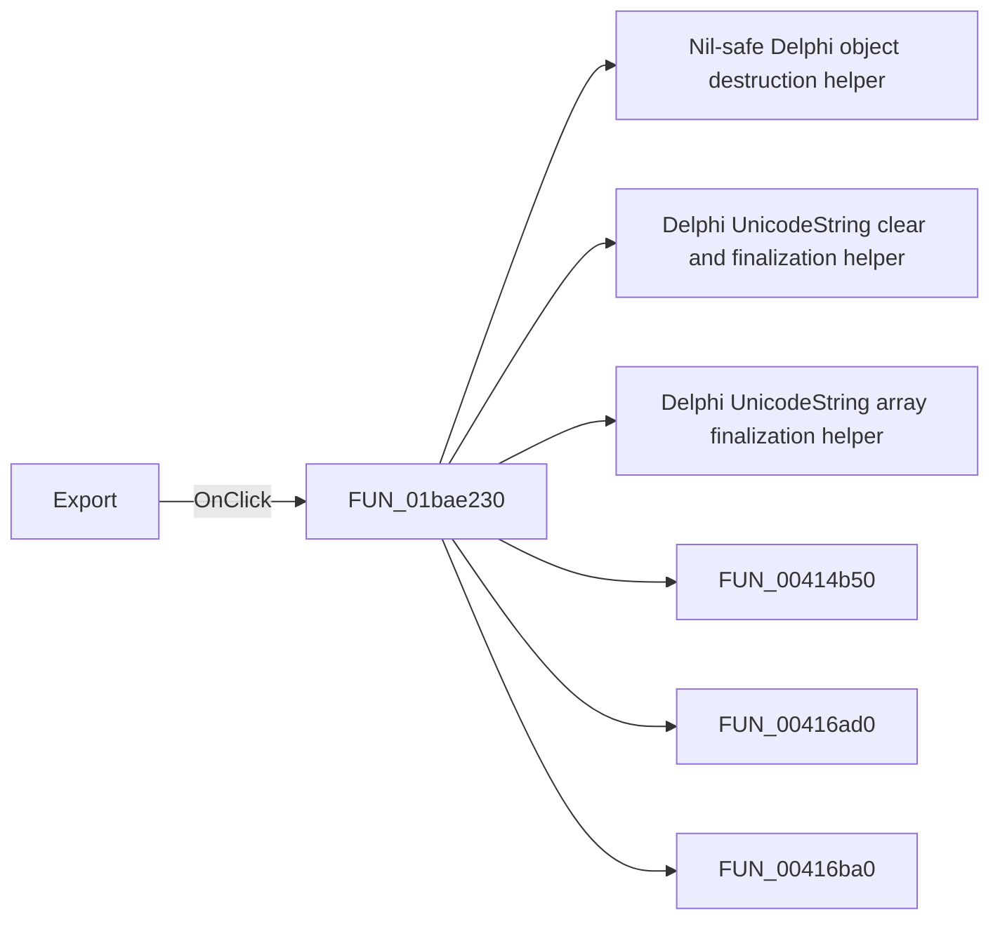

# Export

> Analysis status: Pending individual source review.

## Control

| Property | Recovered value |
| --- | --- |
| Form | frmSpiceExportDlg |
| Component path | frmSpiceExportDlg.btnExport |
| Control class | TButton |
| Caption | Export |
| Hint | Not present in the recovered resource. |
| Text | Not present in the recovered resource. |
| Handler name | btnExportClick |
| Handler address | 01bae230 |
| Graph node | `resource:dfm:frmSpiceExportDlg/frmSpiceExportDlg.btnExport` |
| Handler node | `function:01bae230` |
| Graph layer | UI |

## What happens when clicked

Pending individual analysis. An agent must read the recovered handler source and its relevant callees before it replaces this text.

## Click flow

## Handler evidence

- Source: [DecompiledSources/Tina16/functions/0000000001BAE230__FUN_01bae230.c](../../../DecompiledSources/Tina16/functions/0000000001BAE230__FUN_01bae230.c)
- Recovered role: Not present in the recovered resource.
- Current graph summary: Handles 1 Delphi UI event: frmSpiceExportDlg.btnExport.OnClick.
- Current graph behavior: Not present in the recovered resource.
- Current graph evidence: Not present in the recovered resource.
- Complexity: complex
- Distinct outgoing calls: 16

## Direct calls

- `function:00410f20` — Nil-safe Delphi object destruction helper
- `function:00414480` — Delphi UnicodeString clear and finalization helper
- `function:00414560` — Delphi UnicodeString array finalization helper
- `function:00414b50` — FUN_00414b50
- `function:00416ad0` — FUN_00416ad0
- `function:00416ba0` — FUN_00416ba0
- `function:004414c0` — FUN_004414c0
- `function:00441640` — FUN_00441640
- `function:00441920` — FUN_00441920
- `function:00724270` — FUN_00724270
- `function:00724380` — FUN_00724380
- `function:00724420` — FUN_00724420
- `function:01a1efc0` — FUN_01a1efc0
- `function:01a1f1b0` — FUN_01a1f1b0
- `function:01b22cb0` — FUN_01b22cb0
- `function:01bae0d0` — FUN_01bae0d0

## Resource evidence

- Kind: Not present in the recovered resource.
- Modal result: 1
- Checked state: Not present in the recovered resource.
- List items: Not present in the recovered resource.
- Image reference: Not present in the recovered resource.
- Extracted glyph: None.

## Nearby label candidates

Nearby labels are layout candidates only. They are not proof of behavior.

- Rank 1: Target at distance 188.

## Analysis limits

- Do not infer behavior from the control class, caption, hint, glyph, or nearby label alone.
- Do not replace the pending status until the handler source and relevant call path provide enough evidence.
