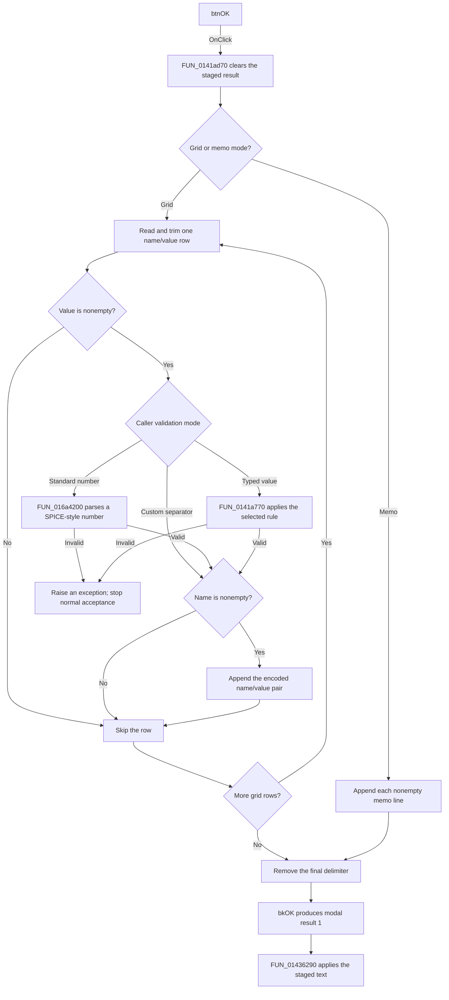

# btnOK

> Analysis status: Reviewed from the recovered resource, handler, validation helper, and modal caller.

## Control

| Property | Recovered value |
| --- | --- |
| Form | frmSpiceMacroParamEditor |
| Component path | frmSpiceMacroParamEditor.btnOK |
| Control class | TBitBtn |
| Caption | Not present in the recovered resource. |
| Hint | Not present in the recovered resource. |
| Text | Not present in the recovered resource. |
| Handler name | btnOKClick |
| Handler address | 0141ad70 |
| Graph node | `resource:dfm:frmSpiceMacroParamEditor/frmSpiceMacroParamEditor.btnOK` |
| Handler node | `function:0141ad70` |
| Graph layer | UI |

## What happens when clicked

The button builds the parameter text that the dialog returns to its caller. It does not update the caller's object directly.

The recovered launcher initializes the dialog in grid mode. In this mode, the handler clears the staged result and reads each row from `strgrdParamList`. It removes leading and trailing white space from the parameter name and value. It skips a row when the value is empty. It also skips the output for a row when the trimmed name is empty.

For a nonempty value, the validation depends on flags that the launcher copies from the caller:

- In the standard numeric mode without a custom separator, the handler converts the value to uppercase and parses it as a SPICE-style number. An invalid value raises the recovered `not a number` exception.
- In the typed mode, `FUN_0141a770` selects a validation rule. Recovered rules include an engineering-number parse, a nonnegative number check, a nonnegative integer check, and a token check. The decompiler does not expose the type-index argument at the call site, so the analysis cannot map a rule to a specific grid row.
- In the non-typed mode with a custom separator, the recovered handler does not call either value validator.

After validation, the handler appends each complete name/value pair to the staged result. It uses either the standard recovered separators or the caller-supplied separator. In the custom-separator path, one special composite value form is enclosed in quotation marks, and embedded quotation marks are doubled. The exported source does not recover the literal standard separators or the special prefixes.

The handler also contains a memo mode. This mode appends each nonempty line from the hidden `memoParamList` control. The known launcher selects grid mode, so the recovered caller does not use this branch. Both branches remove the last added delimiter. If there is no complete grid pair or nonempty memo line, the staged result stays empty.

`btnOK` has VCL kind `bkOK`. After the handler completes, the modal result is 1. `FUN_01436290` copies the staged text back through the caller object's setter only for this result. A validation exception interrupts the handler. The handler has no local catch, retry, fallback, or rollback block, and the normal acceptance path does not finish.

## Click flow

## Handler evidence

- Source: [DecompiledSources/Tina16/functions/000000000141AD70__FUN_0141ad70.c](../../../DecompiledSources/Tina16/functions/000000000141AD70__FUN_0141ad70.c)
- Typed validator: [DecompiledSources/Tina16/functions/000000000141A770__FUN_0141a770.c](../../../DecompiledSources/Tina16/functions/000000000141A770__FUN_0141a770.c)
- Dialog loader: [DecompiledSources/Tina16/functions/000000000141AB10__FUN_0141ab10.c](../../../DecompiledSources/Tina16/functions/000000000141AB10__FUN_0141ab10.c)
- Modal caller: [DecompiledSources/Tina16/functions/0000000001436290__FUN_01436290.c](../../../DecompiledSources/Tina16/functions/0000000001436290__FUN_01436290.c)
- Recovered role: Validate and serialize macro parameter rows for modal acceptance.
- Current graph summary: Handles 1 Delphi UI event: frmSpiceMacroParamEditor.btnOK.OnClick.
- Current graph behavior: The checked-in graph has no manual annotation for this function. The source analysis in this article supplies the recovered behavior.
- Current graph evidence: The DFM binding, handler data flow, form-specific validator, loader, and modal caller agree on the staged parameter-edit workflow.
- Complexity: complex
- Distinct outgoing calls: 13

## Direct calls

- `function:00414480` — Delphi UnicodeString clear and finalization helper
- `function:00414560` — Delphi UnicodeString array finalization helper
- `function:00416780` — FUN_00416780
- `function:00416910` — FUN_00416910
- `function:00416cd0` — FUN_00416cd0
- `function:00416e20` — FUN_00416e20
- `function:004170c0` — FUN_004170c0
- `function:0043e130` — FUN_0043e130
- `function:0043ea00` — FUN_0043ea00
- `function:0043eca0` — FUN_0043eca0
- `function:0084e320` — FUN_0084e320
- `function:0141a770` — FUN_0141a770
- `function:016a4200` — FUN_016a4200

## Resource evidence

- Kind: bkOK
- Modal result: Not present in the recovered resource.
- Checked state: Not present in the recovered resource.
- List items: Not present in the recovered resource.
- Image reference: Not present in the recovered resource.
- Extracted glyph: None.

## Nearby label candidates

Nearby labels are layout candidates only. They are not proof of behavior.

- No same-parent label candidate is available.

## Analysis limits

- The exported source does not expose the literal standard separators or the two special value prefixes.
- The decompiler does not expose the type-index argument passed to `FUN_0141a770`. The recovered rules cannot be assigned to specific grid rows from this call site.
- The exact Delphi class and method names for `FUN_0141a770` and `FUN_01436290` are not recovered.
- The resource supplies no caption, hint, image, glyph, or nearby label for this button. The VCL `bkOK` kind and the recovered modal caller establish the acceptance path.
