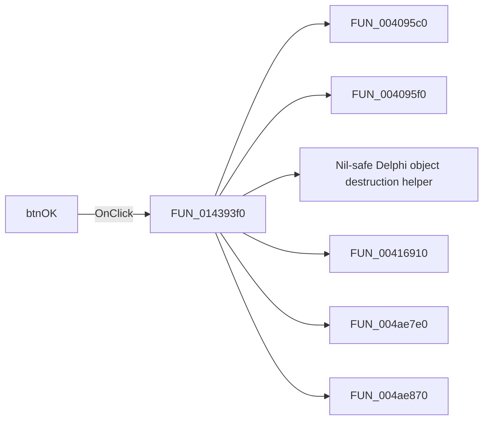

# btnOK

> Analysis status: Pending individual source review.

## Control

| Property | Recovered value |
| --- | --- |
| Form | frmSteppingParams |
| Component path | frmSteppingParams.btnOK |
| Control class | TBitBtn |
| Caption | Not present in the recovered resource. |
| Hint | Not present in the recovered resource. |
| Text | Not present in the recovered resource. |
| Handler name | btnOKClick |
| Handler address | 014393f0 |
| Graph node | `resource:dfm:frmSteppingParams/frmSteppingParams.btnOK` |
| Handler node | `function:014393f0` |
| Graph layer | UI |

## What happens when clicked

Pending individual analysis. An agent must read the recovered handler source and its relevant callees before it replaces this text.

## Click flow

## Handler evidence

- Source: [DecompiledSources/Tina16/functions/00000000014393F0__FUN_014393f0.c](../../../DecompiledSources/Tina16/functions/00000000014393F0__FUN_014393f0.c)
- Recovered role: Not present in the recovered resource.
- Current graph summary: Handles 1 Delphi UI event: frmSteppingParams.btnOK.OnClick.
- Current graph behavior: Not present in the recovered resource.
- Current graph evidence: Not present in the recovered resource.
- Complexity: complex
- Distinct outgoing calls: 7

## Direct calls

- `function:004095c0` — FUN_004095c0
- `function:004095f0` — FUN_004095f0
- `function:00410f20` — Nil-safe Delphi object destruction helper
- `function:00416910` — FUN_00416910
- `function:004ae7e0` — FUN_004ae7e0
- `function:004ae870` — FUN_004ae870
- `function:014386d0` — FUN_014386d0

## Resource evidence

- Kind: bkOK
- Modal result: Not present in the recovered resource.
- Checked state: Not present in the recovered resource.
- List items: Not present in the recovered resource.
- Image reference: Not present in the recovered resource.
- Extracted glyph: None.

## Nearby label candidates

Nearby labels are layout candidates only. They are not proof of behavior.

- No same-parent label candidate is available.

## Analysis limits

- Do not infer behavior from the control class, caption, hint, glyph, or nearby label alone.
- Do not replace the pending status until the handler source and relevant call path provide enough evidence.
