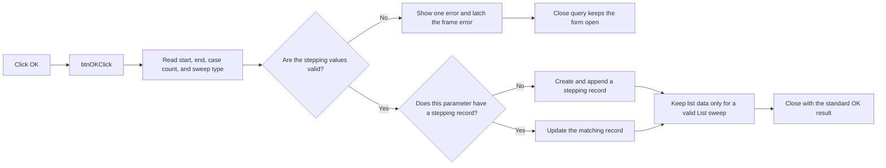

# btnOK

> Analysis status: Reviewed from recovered source.

## Control

| Property | Recovered value |
| --- | --- |
| Form | frmSteppingParams |
| Component path | frmSteppingParams.btnOK |
| Control class | TBitBtn |
| Caption | Not present in the recovered resource. |
| Hint | Not present in the recovered resource. |
| Text | Not present in the recovered resource. |
| Handler name | btnOKClick |
| Handler address | 014393f0 |
| Graph node | `resource:dfm:frmSteppingParams/frmSteppingParams.btnOK` |
| Handler node | `function:014393f0` |
| Graph layer | UI |

## What happens when clicked

The handler reads the embedded stepping frame. The frame supplies a start value,
an end value, a number of cases, and a sweep type: Linear, Logarithmic, or List.
It copies these values to a working record and validates them. Linear stepping
requires different start and end values. Logarithmic stepping also requires
both values to be greater than zero. List stepping uses the list data prepared
by the frame. An editor conversion error or a range error displays one error
message and sets the frame error latch.

The handler copies that error state to the form. When an error exists, it does
not add, update, or remove a stepping record. The built-in `bkOK` action requests
an accepted modal close, but the form's close-query handler detects the latch
and keeps the form open. A later valid OK click replaces the form latch with the
new clear frame state.

When validation succeeds and no matching record exists, the handler allocates
a stepping record, copies the frame values and parameter name, and appends the
record to the stepping collection. When a matching record exists, it updates
that record in place. If the selected type is List but no list-data object
exists, the stored type changes to Linear. A non-list selection releases old
list data. The recovered handler also contains a third mode that deletes the
matching record, but no recovered form path writes that mode; the separate
Remove handler implements the supported delete action.

The handler does not save a file or refresh the schematic. On success, the
standard OK result closes the form. The calling parameter editor then rebuilds
its list of parameter names from the changed stepping collection.

## Click flow

## Handler evidence

- Source: [DecompiledSources/Tina16/functions/00000000014393F0__FUN_014393f0.c](../../../DecompiledSources/Tina16/functions/00000000014393F0__FUN_014393f0.c)
- Recovered role: Validates and adds or updates a global-parameter stepping record.
- Current graph summary: Handles 1 Delphi UI event: frmSteppingParams.btnOK.OnClick.
- Current graph behavior: Reads and validates the stepping frame, blocks close on error, and otherwise creates or updates the matching parameter's stepping record, including optional list-sweep data.
- Current graph evidence: `FUN_014393f0` calls `FUN_014386d0`, copies the frame error byte at `+0xE38` to form offset `+0x6D8`, and performs collection work only when that byte is zero. Mode 0 allocates a `0x23A`-byte record and appends it through `FUN_004ae7e0`; mode 1 updates the record at `+0x6F0`. Both paths copy values at frame-result offsets `+0x10C`, `+0x114`, `+0x11C`, `+0x11E`, and optional list data at `+0x11F`.
- Frame validation: [DecompiledSources/Tina16/functions/00000000014386D0__FUN_014386d0.c](../../../DecompiledSources/Tina16/functions/00000000014386D0__FUN_014386d0.c) reads the frame editors, applies the Linear and Logarithmic range checks, and copies the working record.
- Form setup: [DecompiledSources/Tina16/functions/0000000001439620__FUN_01439620.c](../../../DecompiledSources/Tina16/functions/0000000001439620__FUN_01439620.c) finds an existing record by parameter name and loads it into the frame.
- Close query: [DecompiledSources/Tina16/functions/0000000001439600__FUN_01439600.c](../../../DecompiledSources/Tina16/functions/0000000001439600__FUN_01439600.c) vetoes close while the form error latch is set.
- UI resources: [DecompiledSources/Tina16/resources/dfm/ui-evidence.json](../../../DecompiledSources/Tina16/resources/dfm/ui-evidence.json) identifies the frame labels, sweep-type items, built-in OK kind, and event binding.
- Complexity: complex
- Distinct outgoing calls: 7

## Direct calls

- `function:004095c0` — Allocates the new stepping record for add mode.
- `function:004095f0` — Destroys the current stepping record on the unrecovered mode-2 branch.
- `function:00410f20` — Nil-safe Delphi object destruction helper
- `function:00416910` — Copies the parameter name to the new stepping record.
- `function:004ae7e0` — Appends the new record to the stepping collection.
- `function:004ae870` — Removes the current record index on the unrecovered mode-2 branch.
- `function:014386d0` — Reads and validates the embedded stepping frame and copies its working record.

## Resource evidence

- Kind: bkOK
- Modal result: Not present in the recovered resource.
- Checked state: Not present in the recovered resource.
- List items: Not present in the recovered resource.
- Image reference: Not present in the recovered resource.
- Extracted glyph: None.

## Nearby label candidates

Nearby labels are layout candidates only. They are not proof of behavior.

- No same-parent label candidate is available.

## Analysis limits

- The recovered Delphi name of the stepping-record type is not available.
- The handler's mode-2 delete branch has no recovered form-state writer. Remove uses its own handler instead.
- No glyph or nearby-label evidence is available for this control.
