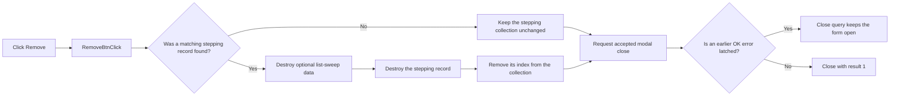

# Remove

> Analysis status: Reviewed from recovered source.

## Control

| Property | Recovered value |
| --- | --- |
| Form | frmSteppingParams |
| Component path | frmSteppingParams.RemoveBtn |
| Control class | TBitBtn |
| Caption | Remove |
| Hint | Not present in the recovered resource. |
| Text | Not present in the recovered resource. |
| Handler name | RemoveBtnClick |
| Handler address | 01439890 |
| Graph node | `resource:dfm:frmSteppingParams/frmSteppingParams.RemoveBtn` |
| Handler node | `function:01439890` |
| Graph layer | UI |

## What happens when clicked

The form uses the parameter name to find its current stepping record when it
opens. The Remove handler checks that current-record pointer. When the pointer
is not null, it destroys the record's optional list-data object, destroys the
record, and removes the record's saved index from the stepping-record
collection.

When there is no matching record, the handler makes no model change. It does not
validate the start value, end value, case count, or sweep type. It also does not
save a file or refresh the schematic.

The resource gives Remove `ModalResult = 1`. A normal click therefore requests
an accepted modal close after the handler returns. The form's close-query
handler permits this when no prior OK validation error is latched. If such an
error is still latched, close query can keep the form open even though the
Remove handler has already deleted the record.

## Click flow

## Handler evidence

- Source: [DecompiledSources/Tina16/functions/0000000001439890__FUN_01439890.c](../../../DecompiledSources/Tina16/functions/0000000001439890__FUN_01439890.c)
- Recovered role: Removes the current global-parameter stepping record.
- Current graph summary: Handles 1 Delphi UI event: frmSteppingParams.RemoveBtn.OnClick.
- Current graph behavior: Destroys an existing matching stepping record and its optional list data, removes the record from the collection, and otherwise makes no model change.
- Current graph evidence: `FUN_01439890` tests the current record at form offset `+0x6F0`. On the non-null branch, it destroys the nested pointer at record offset `+0x11F`, destroys the record, and passes the collection at `+0x6F8` plus the saved index at `+0x6E8` to `FUN_004ae870`.
- Form setup: [DecompiledSources/Tina16/functions/0000000001439620__FUN_01439620.c](../../../DecompiledSources/Tina16/functions/0000000001439620__FUN_01439620.c) finds the record whose name matches the parameter name and stores its pointer and index.
- Close query: [DecompiledSources/Tina16/functions/0000000001439600__FUN_01439600.c](../../../DecompiledSources/Tina16/functions/0000000001439600__FUN_01439600.c) permits close only when the form error latch is clear.
- UI resources: [DecompiledSources/Tina16/resources/dfm/ui-evidence.json](../../../DecompiledSources/Tina16/resources/dfm/ui-evidence.json) supplies the caption, modal result, cancel state, and event binding.
- Complexity: complex
- Distinct outgoing calls: 3

## Direct calls

- `function:004095f0` — Destroys the selected stepping record after its owned list data is released.
- `function:00410f20` — Nil-safe Delphi object destruction helper
- `function:004ae870` — Removes the selected index from the stepping-record collection.

## Resource evidence

- Kind: Not present in the recovered resource.
- Modal result: 1
- Checked state: Not present in the recovered resource.
- List items: Not present in the recovered resource.
- Image reference: Not present in the recovered resource.
- Extracted glyph: None.

## Nearby label candidates

Nearby labels are layout candidates only. They are not proof of behavior.

- No same-parent label candidate is available.

## Analysis limits

- The recovered Delphi name of the stepping-record type is not available.
- No glyph or nearby-label evidence is available for this control.
