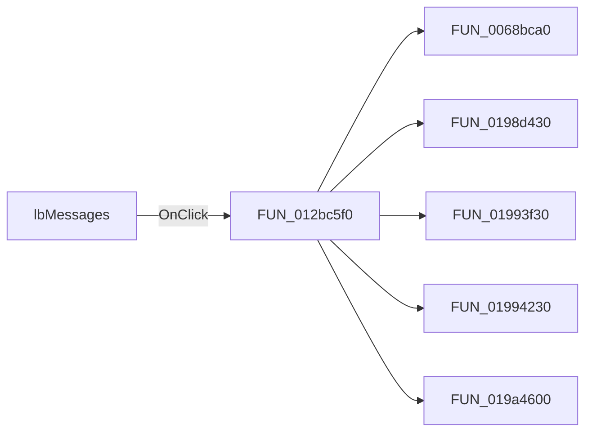

# lbMessages

> Analysis status: Pending individual source review.

## Control

| Property | Recovered value |
| --- | --- |
| Form | frmStressReport |
| Component path | frmStressReport.lbMessages |
| Control class | TListBox |
| Caption | Not present in the recovered resource. |
| Hint | Not present in the recovered resource. |
| Text | Not present in the recovered resource. |
| Handler name | lbMessagesClick |
| Handler address | 012bc5f0 |
| Graph node | `resource:dfm:frmStressReport/frmStressReport.lbMessages` |
| Handler node | `function:012bc5f0` |
| Graph layer | UI |

## What happens when clicked

Pending individual analysis. An agent must read the recovered handler source and its relevant callees before it replaces this text.

## Click flow

## Handler evidence

- Source: [DecompiledSources/Tina16/functions/00000000012BC5F0__FUN_012bc5f0.c](../../../DecompiledSources/Tina16/functions/00000000012BC5F0__FUN_012bc5f0.c)
- Recovered role: Not present in the recovered resource.
- Current graph summary: Handles 1 Delphi UI event: frmStressReport.lbMessages.OnClick.
- Current graph behavior: Not present in the recovered resource.
- Current graph evidence: Not present in the recovered resource.
- Complexity: complex
- Distinct outgoing calls: 5

## Direct calls

- `function:0068bca0` — FUN_0068bca0
- `function:0198d430` — FUN_0198d430
- `function:01993f30` — FUN_01993f30
- `function:01994230` — FUN_01994230
- `function:019a4600` — FUN_019a4600

## Resource evidence

- Kind: Not present in the recovered resource.
- Modal result: Not present in the recovered resource.
- Checked state: Not present in the recovered resource.
- List items: ("" (utf-16, 0 bytes))
- Image reference: Not present in the recovered resource.
- Extracted glyph: None.

## Nearby label candidates

Nearby labels are layout candidates only. They are not proof of behavior.

- No same-parent label candidate is available.

## Analysis limits

- Do not infer behavior from the control class, caption, hint, glyph, or nearby label alone.
- Do not replace the pending status until the handler source and relevant call path provide enough evidence.
