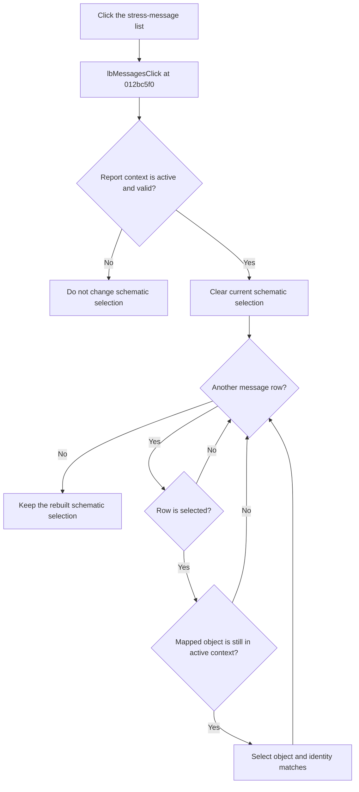

# lbMessages

> Analysis status: Evidence-backed source review complete.

## Control

| Property | Recovered value |
| --- | --- |
| Form | frmStressReport |
| Component path | frmStressReport.lbMessages |
| Control class | TListBox |
| Caption | Not present in the recovered resource. |
| Hint | Not present in the recovered resource. |
| Text | Not present in the recovered resource. |
| Handler name | lbMessagesClick |
| Handler address | 012bc5f0 |
| Graph node | `resource:dfm:frmStressReport/frmStressReport.lbMessages` |
| Handler node | `function:012bc5f0` |
| Graph layer | UI |

## What happens when clicked

`TfrmStressReport.lbMessagesClick` synchronizes schematic-object selection with the selected stress-message rows. It acts only when the form's stored schematic context at `+0x6f0` is still the active context and that context has a non-null current schematic object.

On that active-context path, the handler first clears every selected schematic object. It then scans all visible list rows. For each row that the list box reports as selected, it reads the corresponding object from the form's parallel mapping list at `+0x6f8`. If that object is still present in the active context, the handler selects it and other collection objects with the same recovered identity.

This order means that clicking the list with no selected message row clears the schematic selection. One or more selected message rows replace the previous schematic selection with the mapped report objects. The list selection itself is not changed by this handler.

[`FUN_012bc9f0`](../../../DecompiledSources/Tina16/functions/00000000012BC9F0__FUN_012bc9f0.c) builds the visible message list and its parallel object mapping together when it opens the report. The click handler uses the shared row index to connect each displayed message to its source object.

## Click flow

## Handler evidence

- Source: [DecompiledSources/Tina16/functions/00000000012BC5F0__FUN_012bc5f0.c](../../../DecompiledSources/Tina16/functions/00000000012BC5F0__FUN_012bc5f0.c)
- Recovered role: Replace schematic selection with objects mapped to selected stress messages.
- Current graph summary: Handles 1 Delphi UI event: frmStressReport.lbMessages.OnClick.
- Current graph behavior: The checked-in graph does not yet contain the annotation prepared by this review.
- Current graph evidence: The handler validates the active context, clears its selection, queries every list-box row with `GetSelected`, gets the parallel mapped object, confirms that object is still in the context, and applies selected state through the shared identity-matching selection routine.
- Complexity: complex
- Distinct outgoing calls: 5

## Direct calls

- [`function:0068bca0`](../../../DecompiledSources/Tina16/functions/000000000068BCA0__FUN_0068bca0.c) — implements indexed `TCustomListBox.GetSelected` and raises an indexed list error for `LB_ERR`.
- [`function:0198d430`](../../../DecompiledSources/Tina16/functions/000000000198D430__FUN_0198d430.c) — returns the context's current schematic object at offset `+0x210`.
- [`function:01993f30`](../../../DecompiledSources/Tina16/functions/0000000001993F30__FUN_01993f30.c) — applies selection state to one schematic object and collection objects with the same identity.
- [`function:01994230`](../../../DecompiledSources/Tina16/functions/0000000001994230__FUN_01994230.c) — clears every selected object in the active schematic collection.
- [`function:019a4600`](../../../DecompiledSources/Tina16/functions/00000000019A4600__FUN_019a4600.c) — obtains the current active schematic context for the guard.

## Resource evidence

- Kind: Not present in the recovered resource.
- Modal result: Not present in the recovered resource.
- Checked state: Not present in the recovered resource.
- List items: ("" (utf-16, 0 bytes))
- Image reference: Not present in the recovered resource.
- Extracted glyph: None.

## Nearby label candidates

Nearby labels are layout candidates only. They are not proof of behavior.

- No same-parent label candidate is available.

## Analysis limits

- If the report belongs to an inactive context, or the active context has no current schematic object, the handler can still query list state but does not clear or apply schematic selection.
- If a mapped object is no longer present in the active context, that row is skipped after the prior selection clear.
- A list-box `LB_ERR` result raises the recovered indexed list exception. A mapping-list index failure or selection-call failure also has no local catch, retry, or rollback.
- The handler does not open an object editor, scroll the schematic, navigate to a component, change report text, or write a file.
- The resource contains one empty bootstrap list item but no caption, hint, glyph, or nearby label. Runtime report construction replaces the visible items and supplies the object mapping.
