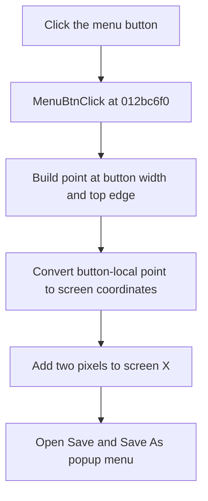

# MenuBtn

> Analysis status: Evidence-backed source review complete.

## Control

| Property | Recovered value |
| --- | --- |
| Form | frmStressReport |
| Component path | frmStressReport.MenuBtn |
| Control class | TBitBtn |
| Caption | Not present in the recovered resource. |
| Hint | Not present in the recovered resource. |
| Text | Not present in the recovered resource. |
| Handler name | MenuBtnClick |
| Handler address | 012bc6f0 |
| Graph node | `resource:dfm:frmStressReport/frmStressReport.MenuBtn` |
| Handler node | `function:012bc6f0` |
| Graph layer | UI |

## What happens when clicked

`TfrmStressReport.MenuBtnClick` opens the form's popup menu. It does not select a menu command itself.

The handler builds a button-local point at `(MenuBtn.Width, 0)`, converts that point to screen coordinates, adds two pixels to the screen X coordinate, and calls `TPopupMenu.Popup`. The menu therefore opens immediately to the right of the button's top-right edge.

The popup contains **Save** and **Save As...**. The handler does not inspect the report messages, a selected list row, or the current report file name before it displays those choices.

## Click flow

## Handler evidence

- Source: [DecompiledSources/Tina16/functions/00000000012BC6F0__FUN_012bc6f0.c](../../../DecompiledSources/Tina16/functions/00000000012BC6F0__FUN_012bc6f0.c)
- Recovered role: Open the report Save popup beside the menu button.
- Current graph summary: Handles 1 Delphi UI event: frmStressReport.MenuBtn.OnClick.
- Current graph behavior: The checked-in graph does not yet contain the annotation prepared by this review.
- Current graph evidence: The handler packs `(MenuBtn.Width, 0)`, converts it with `TControl.ClientToScreen`, adds two to X, and passes the resulting X and Y to the form-owned popup menu.
- Complexity: moderate
- Distinct outgoing calls: 2

## Direct calls

- [`function:00498310`](../../../DecompiledSources/Tina16/functions/0000000000498310__FUN_00498310.c) — packs two 32-bit coordinates into one point value.
- [`function:0064d1f0`](../../../DecompiledSources/Tina16/functions/000000000064D1F0__FUN_0064d1f0.c) — implements `TControl.ClientToScreen` for the local point.

## Resource evidence

- Kind: Not present in the recovered resource.
- Modal result: Not present in the recovered resource.
- Checked state: Not present in the recovered resource.
- List items: Not present in the recovered resource.
- Image reference: Not present in the recovered resource.
- Extracted glyph: [`0204_frmStressReport_frmStressReport_MenuBtn_Glyph_Data.png`](../../../glyph/0204_frmStressReport_frmStressReport_MenuBtn_Glyph_Data.png)

## Nearby label candidates

Nearby labels are layout candidates only. They are not proof of behavior.

- No same-parent label candidate is available.

## Analysis limits

- Opening the menu does not save, change the remembered file name, select a message, or modify the schematic.
- The embedded 32-by-16 glyph contains two frames of a pointing-hand image. It supports the control's menu-launch intent but does not establish the menu commands or popup coordinates.
- The popup call has no local error or fallback branch. VCL application-level handling remains the error boundary.
- The control has no recovered caption, hint, or nearby label.
