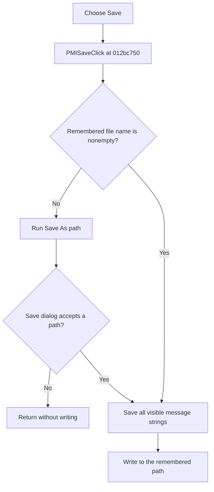

# Save

> Analysis status: Evidence-backed source review complete.

## Control

| Property | Recovered value |
| --- | --- |
| Form | frmStressReport |
| Component path | frmStressReport.PopupMenu.PMISave |
| Control class | TMenuItem |
| Caption | Save |
| Hint | Not present in the recovered resource. |
| Text | Not present in the recovered resource. |
| Handler name | PMISaveClick |
| Handler address | 012bc750 |
| Graph node | `resource:dfm:frmStressReport/frmStressReport.PopupMenu.PMISave` |
| Handler node | `function:012bc750` |
| Graph layer | UI |

## What happens when clicked

`TfrmStressReport.PMISaveClick` tests the report's remembered file-name string at form offset `+0x700`.

- If the string is empty, Save delegates to the same handler as **Save As...**. The Save dialog must accept a path before a file is written.
- If the string is nonempty, Save does not open the dialog. It writes directly to that remembered path.

The common writer reads `lbMessages.Items` and calls its one-argument `SaveToFile` method. It saves every visible stress-message string in list order. It does not save only the selected rows, the hidden message-to-component mapping, component objects, or schematic selection state.

The remembered path is form-local state. A successful Save does not change it. A new path is assigned only by **Save As...**, and the path is discarded when this report form is released.

## Click flow

## Handler evidence

- Source: [DecompiledSources/Tina16/functions/00000000012BC750__FUN_012bc750.c](../../../DecompiledSources/Tina16/functions/00000000012BC750__FUN_012bc750.c)
- Recovered role: Save all visible stress-report messages to the remembered file.
- Current graph summary: Handles 1 Delphi UI event: frmStressReport.PopupMenu.PMISave.OnClick.
- Current graph behavior: The checked-in graph does not yet contain the annotations prepared by this review.
- Current graph evidence: The handler branches on form string `+0x700`. It calls Save As when that string is empty and otherwise passes it to the common `lbMessages.Items.SaveToFile` wrapper.
- Complexity: moderate
- Distinct outgoing calls: 2

## Direct calls

- [`function:012bc780`](../../../DecompiledSources/Tina16/functions/00000000012BC780__FUN_012bc780.c) — executes Save As when no report file name is remembered.
- [`function:012bc820`](../../../DecompiledSources/Tina16/functions/00000000012BC820__FUN_012bc820.c) — passes `lbMessages.Items` and the target path to the VCL one-argument `SaveToFile` method.

## Resource evidence

- Kind: Not present in the recovered resource.
- Modal result: Not present in the recovered resource.
- Checked state: Not present in the recovered resource.
- List items: Not present in the recovered resource.
- Image reference: Not present in the recovered resource.
- Extracted glyph: None.

## Nearby label candidates

Nearby labels are layout candidates only. They are not proof of behavior.

- No same-parent label candidate is available.

## Analysis limits

- The handler does not test whether the visible list is empty. Saving an empty list can create an empty output file.
- The one-argument VCL [`SaveToFile`](../../../DecompiledSources/Tina16/functions/00000000004B4900__FUN_004b4900.c) call supplies no explicit encoding or byte-order-mark option. These details depend on the list-box Items object's current or default encoding.
- Direct Save does not perform a separate existence test or overwrite question. Any applicable file-system or VCL behavior remains outside this handler.
- A write error has no local message, retry, rollback, or alternate path. A failed save can leave a partial file.
- No hint, glyph, or nearby label supplies more behavior evidence.
