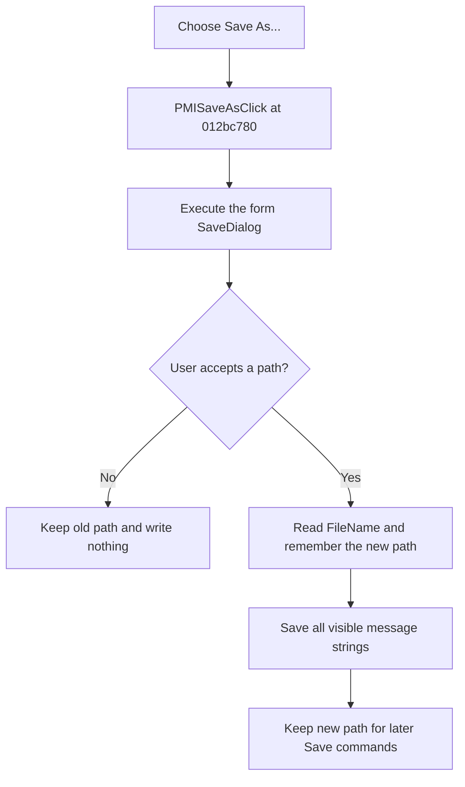

# Save As...

> Analysis status: Evidence-backed source review complete.

## Control

| Property | Recovered value |
| --- | --- |
| Form | frmStressReport |
| Component path | frmStressReport.PopupMenu.PMISaveAs |
| Control class | TMenuItem |
| Caption | Save As... |
| Hint | Not present in the recovered resource. |
| Text | Not present in the recovered resource. |
| Handler name | PMISaveAsClick |
| Handler address | 012bc780 |
| Graph node | `resource:dfm:frmStressReport/frmStressReport.PopupMenu.PMISaveAs` |
| Handler node | `function:012bc780` |
| Graph layer | UI |

## What happens when clicked

`TfrmStressReport.PMISaveAsClick` executes the form-owned `TSaveDialog`. It does not seed the dialog with the report's remembered file name before execution.

Cancel leaves the remembered path unchanged and writes no file. After acceptance, the handler reads `SaveDialog.FileName`, assigns that complete Unicode path to form field `+0x700`, and passes it to the common report writer. The writer saves every current `lbMessages.Items` string in list order.

The path assignment occurs before `SaveToFile`. If writing fails, the form still remembers the newly accepted path. A later **Save** retries that path while this report form remains open.

## Click flow

## Handler evidence

- Source: [DecompiledSources/Tina16/functions/00000000012BC780__FUN_012bc780.c](../../../DecompiledSources/Tina16/functions/00000000012BC780__FUN_012bc780.c)
- Recovered role: Choose a new path and save all visible stress-report messages.
- Current graph summary: Handles 1 Delphi UI event: frmStressReport.PopupMenu.PMISaveAs.OnClick.
- Current graph behavior: The checked-in graph does not yet contain the annotation prepared by this review.
- Current graph evidence: The accepted branch reads `SaveDialog.FileName`, assigns it to form field `+0x700`, and calls the common `lbMessages.Items.SaveToFile` wrapper. Cancel bypasses all three operations.
- Complexity: complex
- Distinct outgoing calls: 4

## Direct calls

- [`function:00414480`](../../../DecompiledSources/Tina16/functions/0000000000414480__FUN_00414480.c) — finalizes the temporary file-name string.
- [`function:00414ad0`](../../../DecompiledSources/Tina16/functions/0000000000414AD0__FUN_00414ad0.c) — assigns the accepted Unicode path to the form field.
- [`function:00724270`](../../../DecompiledSources/Tina16/functions/0000000000724270__FUN_00724270.c) — reads `SaveDialog.FileName`.
- [`function:012bc820`](../../../DecompiledSources/Tina16/functions/00000000012BC820__FUN_012bc820.c) — saves all visible message strings. Bead `.2025` owns its canonical annotation.

## Resource evidence

- Kind: Not present in the recovered resource.
- Modal result: Not present in the recovered resource.
- Checked state: Not present in the recovered resource.
- List items: Not present in the recovered resource.
- Image reference: Not present in the recovered resource.
- Extracted glyph: None.

## Nearby label candidates

Nearby labels are layout candidates only. They are not proof of behavior.

- No same-parent label candidate is available.

## Analysis limits

- The recovered DFM contains no Save-dialog filter, default extension, initial directory, title, file name, or options. The handler does not configure them. The available extensions and overwrite-prompt behavior are not established.
- The selected path is not written to application settings or a project. It remains only in this report form until the form is released.
- The common one-argument VCL `SaveToFile` path supplies no explicit encoding or byte-order-mark option.
- The handler does not test whether the message list is empty. An accepted path can receive an empty file.
- A write error has no local message, retry, rollback, or alternate path. The remembered-path assignment is not undone, and a partial file can remain.
- No hint, glyph, or nearby label supplies more behavior evidence.
