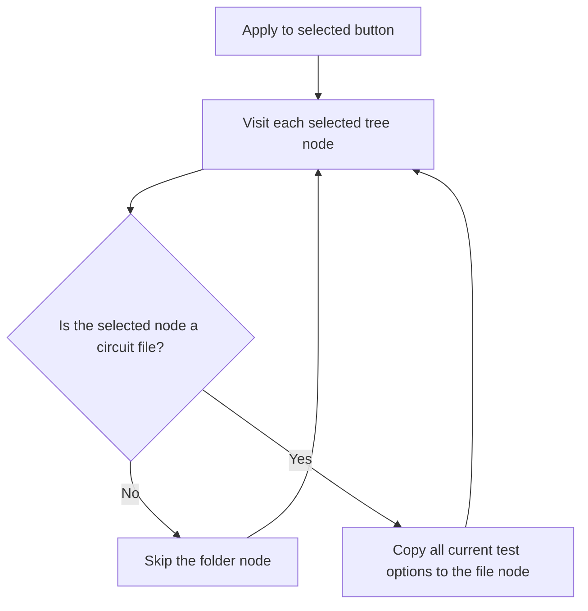

# Apply to selected

> Analysis status: Reviewed from recovered source and UI evidence.

## Control

| Property | Recovered value |
| --- | --- |
| Component path | `frmTestBenchEditor.pnlMain.pnlTestOptions.btnApplySelected` |
| Control class | `TButton` |
| Handler | `btnApplySelectedClick` at `012c69e0` |

## What happens when clicked

The handler visits the selected tree nodes and applies the current form options only to selected nodes marked as circuit files. The applied data includes transient, AC, and DC run, mode, corner, curve, tolerance, and sample settings. Selected folder nodes are skipped. The handler has no confirmation, rollback, or error message.

## Click flow

## Evidence

- [Recovered btnApplySelectedClick source](../../../DecompiledSources/Tina16/functions/00000000012C69E0__FUN_012c69e0.c)
- [Recovered option-copy helper](../../../DecompiledSources/Tina16/functions/00000000012C7AE0__FUN_012c7ae0.c)
- The DFM resource supplies the control identity, caption or state, and event binding.
- No extracted glyph is present for this control.

## Analysis limits

- Private fields in the per-file settings record do not have recovered Delphi names; their control sources prove the option groups.
